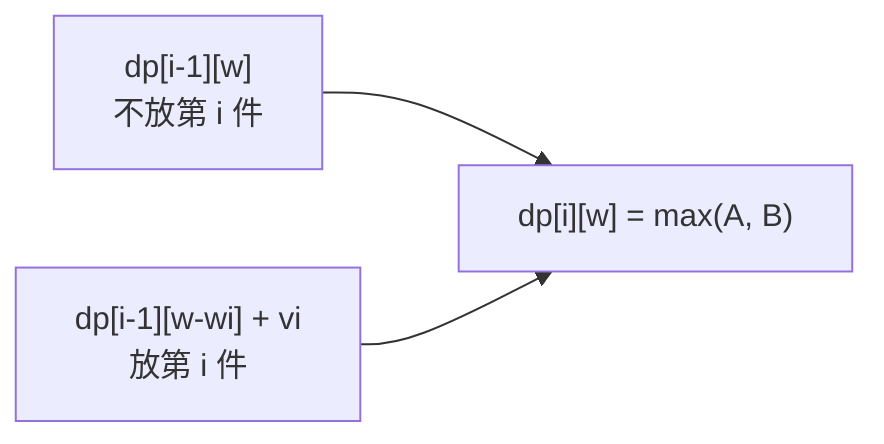

# [L3] 0/1 背包的状态转移方程如何建立？滚动数组如何优化空间？

#### 一句话结论

定义 `dp[i][w]` 为前 i 件物品放入容量 w 背包时的最大价值，逆序遍历可压缩到一维 O(W) 空间。

#### 体系讲解

**建模三步骤**

DP 建模的通用流程是：定状态 → 写转移 → 定边界，以 0/1 背包为示范：

1. **定状态**：`dp[i][w]` = 从前 i 件物品中任意选取、总重量不超过 w 时的最大价值
2. **写转移**：第 i 件物品重量 `wi`、价值 `vi`，对每个容量 w 有且仅有两个决策：
   - 不放第 i 件：`dp[i][w] = dp[i-1][w]`
   - 放第 i 件（要求 `w ≥ wi`）：`dp[i][w] = dp[i-1][w-wi] + vi`
   - 合并：`dp[i][w] = max(dp[i-1][w], dp[i-1][w-wi] + vi)`
3. **定边界**：`dp[0][*] = 0`（无物品可选），`dp[*][0] = 0`（容量为零）



**空间优化：滚动数组**

二维状态 `dp[i][w]` 的第 i 行只依赖第 i-1 行，可原地压缩为一维 `dp[w]`：

| 遍历方向 | 效果 | 适用 |
|---------|------|------|
| 逆序（W → wi） | `dp[w-wi]` 使用的仍是「上一行」值，每件只选一次 | **0/1 背包** |
| 正序（wi → W） | `dp[w-wi]` 已被本轮更新，相当于允许重复选取 | 完全背包 |

逆序遍历是 0/1 背包压缩的核心约束，本质是保持"当前物品还未被选入当前行"的不变量。

**复杂度对比**

| 版本 | 时间 | 空间 |
|------|------|------|
| 二维 DP | O(n·W) | O(n·W) |
| 滚动数组 | O(n·W) | O(W) |

#### 考察意图

考察候选人能否将组合优化问题抽象为 DP 状态空间，以及是否理解滚动数组背后的数据依赖原理。这是所有背包变体（完全背包、多重背包）的基础，也是"能否从原理推导出代码"的典型分水岭。

#### 追问链

1. **完全背包与 0/1 背包在代码上如何区分？**
   压缩后改为正向遍历（`w` 从 `wi` 到 `W`），使 `dp[w-wi]` 被当前轮更新后可再次使用，等价于允许同一物品无限选取。

2. **若要求恰好装满背包，初始化应如何调整？**
   将 `dp[0] = 0`，其余初始化为 `PHP_INT_MIN`（负无穷语义）；转移时跳过负无穷来源；若最终 `dp[W] < 0` 则无方案。

3. **多重背包（每件最多 k 次）如何处理？**
   朴素做法将每件拆成 k 个 0/1 物品，O(n·k·W)；二进制拆分（拆成 1、2、4…件）可降至 O(n·log k·W)；单调队列优化可达 O(n·W)。

4. **W 极大（如 10⁹）时数组无法分配，如何应对？**
   若物品数 n 极小，可转换维度：`dp[v]` = 达到总价值 v 所需最小重量，遍历价值而非容量，时间 O(n·V)，V 为价值总和上限。

#### 易错点

1. **逆序 vs 正序混淆**：一维压缩时若写成正序，同一物品会被多次选入，悄悄变成完全背包语义，不报错只是结果偏大。
2. **"恰好装满"与"至多装满"初始化混淆**：前者非零格须初始化为 `-∞`，后者全 0 即可；两者题干微小差异极易导致初始化方式写错。
3. **循环上界漏等号**：内层循环应为 `$w >= $weights[$i]`（含等号），写成 `>` 会跳过恰好等于物品重量的容量格。

#### 代码示例

```php
<?php

/**
 * 0/1 背包（一维滚动数组）
 *
 * @param int[] $weights 物品重量数组
 * @param int[] $values  物品价值数组
 * @param int   $W       背包最大容量
 * @return int 可获得的最大价值
 */
function knapsack01(array $weights, array $values, int $W): int
{
    $n  = count($weights);
    $dp = array_fill(0, $W + 1, 0); // dp[w] = 容量 w 时的最大价值

    for ($i = 0; $i < $n; $i++) {
        // 逆序遍历：保证 dp[w - weights[i]] 仍是放入第 i 件之前的状态
        for ($w = $W; $w >= $weights[$i]; $w--) {
            $dp[$w] = max($dp[$w], $dp[$w - $weights[$i]] + $values[$i]);
        }
    }

    return $dp[$W];
}

// 示例：3 件物品，背包容量 5
// 物品0：重2价3，物品1：重3价4，物品2：重4价5
$weights = [2, 3, 4];
$values  = [3, 4, 5];

echo knapsack01($weights, $values, 5); // 输出 7（选物品0+物品1：重量5，价值7）
```
