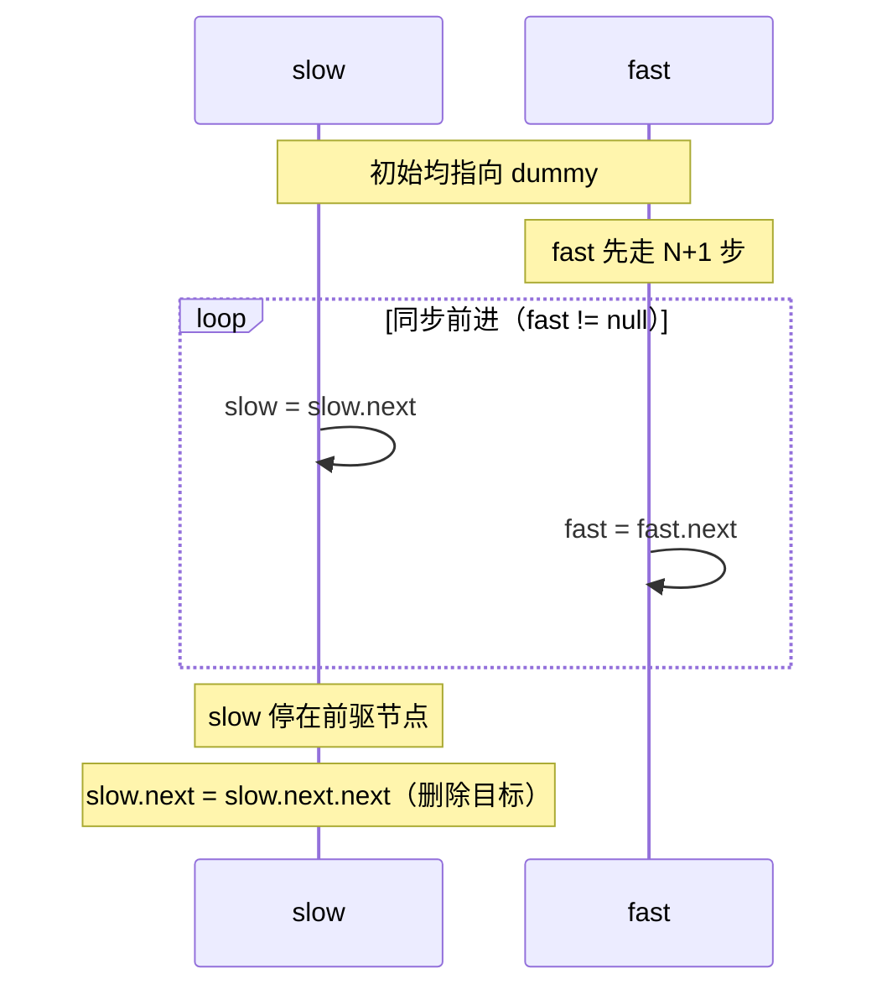

# [L2] 如何用一次遍历删除链表倒数第 N 个节点？

#### 一句话结论

哑节点 + 快慢双指针保持间距 N+1，单趟扫描定位前驱节点后断开，时间 O(n)，空间 O(1)。

#### 体系讲解

**为什么需要哑节点？**

删除操作需要操控目标节点的**前驱**，而非目标节点本身。若删除的是头节点（N = 链表长度），头节点没有前驱，需要单独处理。引入哑节点 `dummy->head` 后，头节点也有了前驱，删除逻辑完全统一。

**快慢双指针原理**

设链表长度为 L，目标是找到倒数第 N 个节点的**前驱**（正序第 L-N 个节点）。

核心思路：让快指针 `$fast` 比慢指针 `$slow` 多走 N+1 步，随后两者同步前进。当 `$fast` 到达 null 时，`$slow` 恰好停在前驱位置。

```
链表（6个节点，N=2）：
dummy → 1 → 2 → 3 → 4 → 5 → 6 → null

步骤：
1. fast 从 dummy 先走 N+1=3 步：
   dummy(slow)  1  2  3(fast)
                         ↑
2. fast 和 slow 同步前进，直到 fast = null：
   移动3次后：
   dummy  1  2  3(slow)  4  5  6  null(fast)
                  ↑
3. slow.next 就是目标节点（5）的前驱？
   等等，slow 在 3，slow.next = 4，slow.next.next = 5
   删除：slow.next = slow.next.next → 跳过 5

   倒数第2个节点是 5 ✓
```

**为什么是 N+1 而不是 N？**

操作目标是删除，需要 `slow` 停在**前驱**而非目标节点本身。若 `fast` 先走 N 步，`slow` 最终停在目标节点，无法执行 `slow.next = slow.next.next`。



**边界情况**

| 场景 | 表现 | 哑节点的作用 |
|---|---|---|
| 删除头节点（N = L） | fast 走 N+1 步后已到 null，slow 仍在 dummy | dummy.next = dummy.next.next，正确删头 |
| 单节点链表（N=1） | fast 走 2 步直接到 null，slow 在 dummy | dummy.next = null，正确清空 |
| 删除尾节点（N=1） | slow 停在倒数第二个节点 | slow.next = null，正确删尾 |

#### 考察意图

考查候选人能否将「倒数定位」问题转化为「正向间距」问题，体现对双指针间距技巧的理解；追问边界处理时可区分是否真正理解哑节点的价值，而非机械背代码。

#### 追问链

1. **为什么 fast 要先走 N+1 步而不是 N 步？**  
   简答：删除节点需要操控前驱（`prev.next = prev.next.next`），slow 必须停在目标节点的**前驱**。先走 N+1 步能保证 fast 到达 null 时 slow 恰好在前驱；若先走 N 步，slow 会停在目标节点本身，无法删除。

2. **如果 N 大于链表长度（非法输入），代码会怎样？**  
   简答：fast 在先走 N+1 步的过程中会提前越过 null，访问 `null->next` 导致错误。生产代码应在先行阶段检测 `$fast === null`，提前返回错误或抛异常。

3. **如果要删除倒数第 N 个节点并返回它的值，如何修改？**  
   简答：在执行 `$slow->next = $slow->next->next` 之前，先保存 `$val = $slow->next->val`，删除后返回 `$val`。主逻辑不变，仅多一次读值操作。

4. **两次遍历（先算长度再定位）与一次遍历（快慢指针）在实际工程中哪个更好？**  
   简答：两次遍历逻辑更直观，在链表可多次遍历的场景（如内存链表）无明显性能差异。一次遍历在流式数据（只能单次读取）或超长链表中有优势。面试中通常要求一次遍历以考查双指针思维。

#### 易错点

1. **fast 先走步数写成 N 而非 N+1**：最常见的实现错误。N 步让 slow 停在目标节点，N+1 步让 slow 停在前驱——必须明确「需要前驱」才能推导出 N+1。
2. **不用哑节点时删头节点崩溃**：若 N 等于链表长度，目标是头节点，其无前驱，需要特判 `$slow === null`（原始写法）。哑节点统一了这一边界，彻底消除特判。
3. **循环条件写成 `$fast->next !== null` 而非 `$fast !== null`**：使得 fast 停在最后一个节点而非 null，slow 会少走一步，最终停在目标节点而非前驱，删除逻辑出错。

#### 代码示例

```php
<?php

class ListNode
{
    public function __construct(
        public int $val,
        public ?ListNode $next = null,
    ) {}
}

function removeNthFromEnd(?ListNode $head, int $n): ?ListNode
{
    $dummy = new ListNode(0, $head);  // 哑节点，next 指向原头
    $slow  = $dummy;
    $fast  = $dummy;

    // fast 先走 N+1 步
    for ($i = 0; $i <= $n; $i++) {
        if ($fast === null) {
            // N 超出链表长度，非法输入
            return $head;
        }
        $fast = $fast->next;
    }

    // 同步前进，直到 fast 到达 null
    while ($fast !== null) {
        $slow = $slow->next;
        $fast = $fast->next;
    }

    // slow 停在前驱，执行删除
    $slow->next = $slow->next->next;

    return $dummy->next;
}
```
