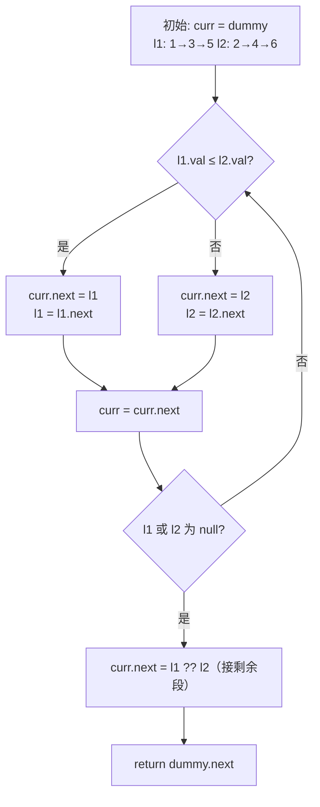

# [L2] 如何合并两条有序链表？

#### 一句话结论

用哑节点统一头部逻辑，双指针逐步接入较小节点，最后拼接剩余段，时间 O(m+n)，空间 O(1)。

#### 体系讲解

**核心技法：哑节点（dummy node）+ 双指针**

哑节点是链表题中消除「结果链表初始为空」边界判断的通用模式：创建一个值任意的虚拟头节点，合并完成后返回 `dummy->next` 即得到真实头节点，整个过程无需对「第一个节点」做特殊处理。

**迭代合并流程**

设两条有序链表头指针为 `$l1`、`$l2`，维护 `$curr` 指向结果链表的当前尾部：

```
初始：dummy → (curr 指向 dummy)
      l1: 1→3→5
      l2: 2→4→6

每轮取较小节点接入 curr.next，对应指针前移：
  1(l1) < 2(l2) → 接 1，l1 前移
  3(l1) > 2(l2) → 接 2，l2 前移
  3(l1) < 4(l2) → 接 3，l1 前移
  5(l1) > 4(l2) → 接 4，l2 前移
  5(l1) < 6(l2) → 接 5，l1 = null → 结束循环
  curr.next = l2（接上剩余段 6）
```

时间 O(m+n)，空间 O(1)（直接复用原有节点，仅移动指针）。



**递归写法（代码简洁，但空间 O(m+n)）**

每次递归选更小的头节点，将其 `next` 指向递归合并结果：

```
merge(l1, l2):
  if l1 == null → return l2
  if l2 == null → return l1
  if l1.val ≤ l2.val: l1.next = merge(l1.next, l2); return l1
  else:               l2.next = merge(l1, l2.next); return l2
```

递归深度 = m+n，调用栈 O(m+n)；链表超长时有栈溢出风险，生产代码应优先选迭代。

**复杂度汇总**

| 方法 | 时间 | 空间 | 适用场景 |
|---|---|---|---|
| 迭代（哑节点 + 双指针） | O(m+n) | O(1) | 生产代码首选 |
| 递归 | O(m+n) | O(m+n) | 面试展示简洁性 |

#### 考察意图

考查候选人对哑节点这一链表通用模式的掌握程度，以及能否清晰分析迭代 vs 递归的时空权衡；追问「K 路合并」可区分出是否理解堆/优先队列的应用场景。

#### 追问链

1. **不用哑节点可以吗？**  
   简答：可以，但要对「结果链表初始为空」单独判断头节点赋值，代码分支增多、易遗漏。哑节点将第一个节点与后续节点的插入逻辑统一，是链表题的标准工程写法。

2. **如何合并 K 条有序链表？**  
   简答：暴力两两合并为 O(kN)（N 为总节点数）；优化方案是用最小堆维护 K 个链表当前头节点，每次取最小节点接入结果链表，总复杂度 O(N log k)。PHP 中可用 `SplMinHeap` 实现。

3. **如果两条链表长度差距极大（如 1 vs 10000），迭代法最优吗？**  
   简答：是的。短链表遍历完毕后，直接将长链表剩余段接上（`curr->next = $l1 ?? $l2`），不会逐一比较剩余节点，时间仍为 O(m+n)。

4. **合并时能复用原有节点吗？**  
   简答：迭代法直接修改 `next` 指针，完全复用原节点，无需申请新内存，空间 O(1)。代价是原链表结构被破坏；若业务需要保留原链表，需先深拷贝。

#### 易错点

1. **忘记接上剩余段**：两指针之一先到 null 后，另一侧剩余节点不会自动接入结果链表。必须在循环后执行 `$curr->next = $l1 ?? $l2`，否则丢失节点。
2. **没用哑节点导致头节点特判**：不用 dummy 时需先比较 `$l1`、`$l2` 谁更小再初始化头节点，分支增加且易出错；哑节点是消除该特判的标准手法。
3. **递归在超长链表中栈溢出**：PHP 默认调用栈深度有限（通常几千至几万层），递归写法在链表节点数极多时存在栈溢出风险；面试展示完递归后应主动补充「生产代码用迭代」。

#### 代码示例

```php
<?php

class ListNode
{
    public function __construct(
        public int $val,
        public ?ListNode $next = null,
    ) {}
}

// ===== 迭代法（哑节点 + 双指针）=====
function mergeTwoLists(?ListNode $l1, ?ListNode $l2): ?ListNode
{
    $dummy = new ListNode(0);   // 哑节点，值任意
    $curr  = $dummy;

    while ($l1 !== null && $l2 !== null) {
        if ($l1->val <= $l2->val) {
            $curr->next = $l1;
            $l1 = $l1->next;
        } else {
            $curr->next = $l2;
            $l2 = $l2->next;
        }
        $curr = $curr->next;
    }

    $curr->next = $l1 ?? $l2;   // 接上剩余段

    return $dummy->next;
}

// ===== 递归法（简洁，栈深度 O(m+n)，超长链表慎用）=====
function mergeTwoListsRecursive(?ListNode $l1, ?ListNode $l2): ?ListNode
{
    if ($l1 === null) return $l2;
    if ($l2 === null) return $l1;

    if ($l1->val <= $l2->val) {
        $l1->next = mergeTwoListsRecursive($l1->next, $l2);
        return $l1;
    }

    $l2->next = mergeTwoListsRecursive($l1, $l2->next);
    return $l2;
}
```
