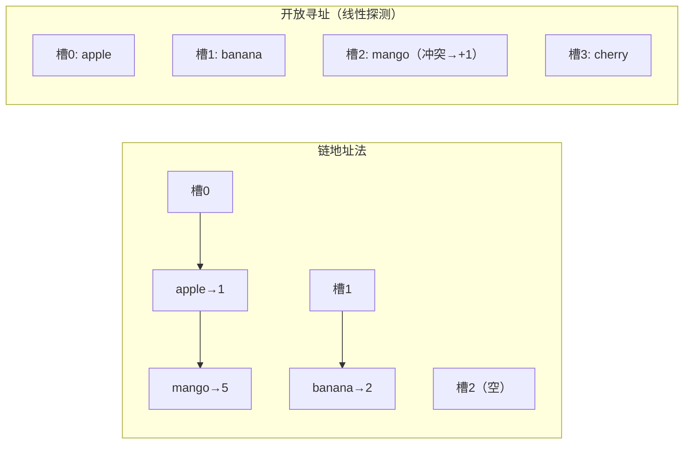

# [L2] 哈希冲突的解决策略有哪些？如何用哈希表实现 LRU 缓存？

#### 一句话结论

链地址法拉链冲突；开放寻址表内探测空位；LRU 用哈希表 + 双向链表同时保证 O(1) 存取与顺序淘汰。

#### 体系讲解

**哈希冲突的本质**

哈希函数将无限键域映射到有限槽位，不同键映射到同一槽位时发生冲突。任何哈希表在负载因子（元素数/槽位数）升高时冲突概率增大，需通过冲突解决策略保证操作效率。

**策略一：链地址法（Chaining / 拉链法）**

每个槽位维护一个链表（或其他集合），冲突的元素都存入同一链表：

```
槽 0: → [key="apple", val=1] → [key="mango", val=5]
槽 1: → [key="banana", val=2]
槽 2: （空）
槽 3: → [key="cherry", val=3]
```

- 查询：hash(key) 找槽，链表顺序搜索
- 平均时间 O(1 + α)，α = 负载因子（元素数/槽位数）
- 负载因子过高时触发扩容（rehash），通常阈值为 0.75

**策略二：开放寻址法（Open Addressing）**

冲突时在哈希表内部探测下一个空位，主要探测序列：

| 探测方式 | 序列 | 优点 | 缺点 |
|---|---|---|---|
| 线性探测 | h, h+1, h+2, ... | 缓存友好，实现简单 | 主聚集（Primary Clustering）：连续被占的槽越来越长 |
| 二次探测 | h, h+1², h+2², ... | 缓解主聚集 | 次聚集（Secondary Clustering） |
| 双重哈希 | h₁(k), h₁(k)+h₂(k), ... | 探测序列更均匀 | 实现复杂，计算成本略高 |

开放寻址法要求负载因子更低（通常 < 0.7），删除元素时不能直接清空（需标记「已删除」墓碑位，否则破坏探测链）。



**策略对比**

| 维度 | 链地址法 | 开放寻址法 |
|---|---|---|
| 空间利用 | 指针开销，允许 α > 1 | 无额外指针，α 必须 < 1 |
| 缓存性能 | 差（链表散落内存） | 好（数据连续，CPU 缓存友好）|
| 删除 | 直接从链表移除 | 需要墓碑标记，实现复杂 |
| 典型应用 | Java HashMap、PHP HashTable | Python dict（开放寻址变体）|

**LRU 缓存（Least Recently Used）**

LRU 淘汰策略：容量满时淘汰**最久未使用**的元素。要求：

- `get(key)`：O(1)
- `put(key, val)`：O(1)，容量满时淘汰最久未用的键

**数据结构：哈希表 + 双向链表**

- **哈希表**：key → 链表节点的引用，实现 O(1) 定位
- **双向链表**：维护使用顺序，头部 = 最近使用，尾部 = 最久未用
  - 每次访问/更新：将节点移至头部
  - 淘汰：直接删除尾部节点

```
初始（容量=3）：
  哈希表: {a→Node_a, b→Node_b}
  链表: dummy_head ↔ Node_a ↔ Node_b ↔ dummy_tail

get("a")：Node_a 移至头部
  链表: dummy_head ↔ Node_a ↔ Node_b ↔ dummy_tail

put("c", 3)：容量未满，Node_c 插头部
  链表: dummy_head ↔ Node_c ↔ Node_a ↔ Node_b ↔ dummy_tail

put("d", 4)：容量已满，淘汰尾部 Node_b，插入 Node_d
  链表: dummy_head ↔ Node_d ↔ Node_c ↔ Node_a ↔ dummy_tail
  哈希表: {a→Node_a, c→Node_c, d→Node_d}（b 已删除）
```

使用**哑头尾节点（dummy head/tail）** 统一链表边界操作，避免空链表判断。

#### 考察意图

考查候选人对哈希表底层实现的理解深度，以及能否将「O(1) 存取」与「顺序维护」两个看似矛盾的需求通过数据结构组合来解决；LRU 是系统设计和缓存策略的高频题，也是双向链表 + 哈希表组合应用的经典范例。

#### 追问链

1. **PHP 的数组底层是哈希表，它用链地址法还是开放寻址法？**  
   简答：PHP 的 `HashTable`（Zend HashTable）使用**链地址法**（⚠️ 需查证：Zend Engine 内部结构细节），冲突键通过桶内链表串联。PHP 数组可以混用整数键和字符串键，本质都是哈希表操作，`isset()` 的 O(1) 特性由此保证。

2. **LRU 中为什么必须用双向链表而不是单向链表？**  
   简答：节点移到头部或从任意位置删除时，需要修改前驱节点的 `next` 指针。单向链表定位前驱需 O(n)，双向链表通过 `prev` 指针 O(1) 定位前驱，才能保证整体 O(1) 操作。

3. **PHP 中实现 LRU，直接用 SplDoublyLinkedList + array 还是手写节点？**  
   简答：可以用 PHP 关联数组模拟哈希表（key → node 引用），配合手写 `DoublyLinkedList` 节点实现，或直接用 PHP 的 `SplDoublyLinkedList`（但它不支持 O(1) 随机定位节点）。工程上常直接用 Redis 的 `LMOVE` + `expire` 实现 LRU，而非在 PHP 层手写。

4. **LFU（Least Frequently Used）和 LRU 有什么区别？**  
   简答：LRU 按**最后访问时间**淘汰；LFU 按**访问频率**淘汰，频率相同时再按时间排序。LFU 实现更复杂（需维护频率桶），对「偶发高频访问但长期不用」的键有更好的保护，Redis 4.0+ 的 `maxmemory-policy allkeys-lfu` 即此策略。

#### 易错点

1. **开放寻址删除后直接清空导致查询断链**：线性探测中删除槽 i 若直接置空，后续探测在 i 处停止，i 之后的冲突元素将无法被找到。必须标记「墓碑（DELETED）」，查询时跳过墓碑，插入时可复用墓碑位。
2. **LRU 忘记更新 get 时的节点顺序**：只做了读操作但没有把节点移到链表头部，导致刚访问的节点仍在尾部，可能被错误淘汰。LRU 的核心语义是「每次访问都刷新使用时间」，`get` 和 `put` 都要移节点。
3. **负载因子过高时未触发扩容**：固定大小的哈希表若不扩容，链地址法的链表会越来越长，最坏退化为 O(n)。实际实现需在负载因子超阈值时执行 rehash（重新分配更大的槽位数组并重新散列所有元素）。

#### 代码示例

```php
<?php

// ===== LRU 缓存（哈希表 + 双向链表，PHP 实现）=====

class LRUNode
{
    public ?LRUNode $prev = null;
    public ?LRUNode $next = null;

    public function __construct(
        public int|string $key,
        public mixed $val,
    ) {}
}

class LRUCache
{
    private array $map = [];          // key => LRUNode
    private LRUNode $head;            // 哑头节点（最近使用端）
    private LRUNode $tail;            // 哑尾节点（最久未用端）

    public function __construct(private int $capacity) {
        $this->head = new LRUNode('', null);
        $this->tail = new LRUNode('', null);
        $this->head->next = $this->tail;
        $this->tail->prev = $this->head;
    }

    public function get(int|string $key): mixed
    {
        if (!isset($this->map[$key])) return -1;
        $node = $this->map[$key];
        $this->moveToHead($node);     // 刷新使用时间
        return $node->val;
    }

    public function put(int|string $key, mixed $val): void
    {
        if (isset($this->map[$key])) {
            $this->map[$key]->val = $val;
            $this->moveToHead($this->map[$key]);
            return;
        }
        if (count($this->map) >= $this->capacity) {
            $lru = $this->tail->prev;   // 最久未用节点
            $this->removeNode($lru);
            unset($this->map[$lru->key]);
        }
        $node = new LRUNode($key, $val);
        $this->map[$key] = $node;
        $this->addToHead($node);
    }

    private function addToHead(LRUNode $node): void
    {
        $node->prev = $this->head;
        $node->next = $this->head->next;
        $this->head->next->prev = $node;
        $this->head->next = $node;
    }

    private function removeNode(LRUNode $node): void
    {
        $node->prev->next = $node->next;
        $node->next->prev = $node->prev;
    }

    private function moveToHead(LRUNode $node): void
    {
        $this->removeNode($node);
        $this->addToHead($node);
    }
}
```
