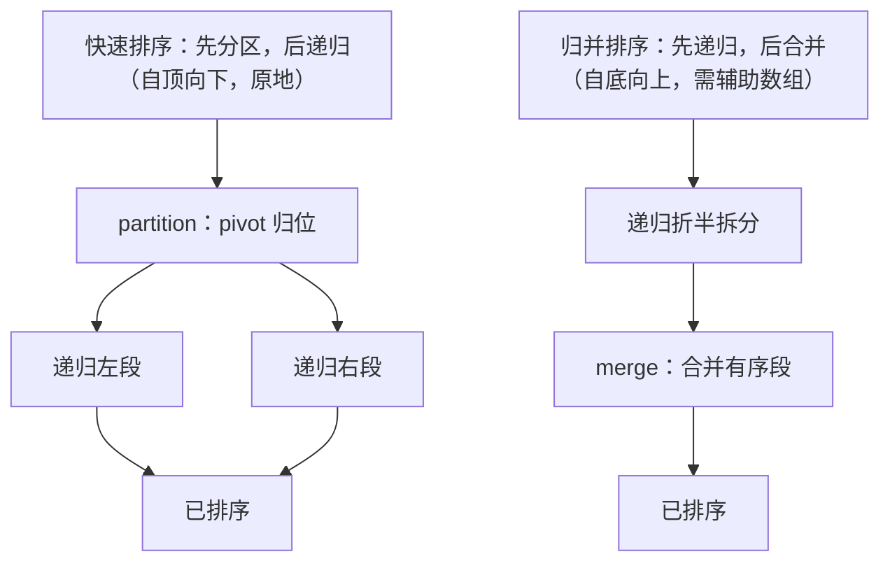

# [L2] 快速排序与归并排序的原理、稳定性和复杂度如何比较？

#### 一句话结论

快排原地分区、平均 O(n log n) 但不稳定，最坏 O(n²)；归并稳定、始终 O(n log n)，代价是 O(n) 额外空间。

#### 体系讲解

**快速排序（Quick Sort）**

核心操作是 **partition（分区）**：选定一个 pivot，将数组分为「≤ pivot」和「> pivot」两段，pivot 归位后对两段递归排序。

```
partition（Lomuto 方案，pivot = 末尾元素）：

arr = [3, 1, 4, 1, 5, 9, 2, 6]  pivot = 6
      ↑i=-1（边界指针）

i 向右扩展「≤ pivot」区域：
  j=0: arr[0]=3 ≤ 6 → i=0, swap(arr[0],arr[0])
  j=1: arr[1]=1 ≤ 6 → i=1, swap(arr[1],arr[1])
  ...
  j=6: arr[6]=2 ≤ 6 → i=6, swap(arr[6],arr[6])
  j=7: arr[7]=6（pivot，跳过）

最后 swap(arr[i+1], pivot) → 6 落到索引 7 的正确位置
```

递归对 `[3,1,4,1,5,2]` 和 `[9]` 继续排序。

**pivot 选取策略与最坏情况**

| 策略 | 最坏触发条件 | 时间复杂度 |
|---|---|---|
| 末尾/首元素 | 输入已近乎有序（升序/降序） | O(n²) |
| 随机选取 | 概率极低，期望 O(n log n) | O(n log n) 期望 |
| 三数取中（首/中/尾的中位数） | 工程中最常用，显著降低最坏概率 | O(n log n) 期望 |

最坏情况 O(n²) 发生在每次 partition 都极度不均衡（一侧为 0，另一侧 n-1），递归树退化为链，深度 n。

**归并排序（Merge Sort）**

核心操作是 **merge（合并）**：递归拆分至单元素（天然有序），再两两合并有序段。

```
merge_sort([3, 1, 4, 1]):
  split → [3, 1] + [4, 1]
  split → [3] + [1] | [4] + [1]
  merge → [1, 3]  | [1, 4]
  merge → [1, 1, 3, 4]
```

每层合并总工作量 O(n)，树高 O(log n)，总复杂度恒为 O(n log n)，无最坏情况退化。



**稳定性分析**

稳定性指：**相等元素的相对顺序在排序前后不变**。

- **归并排序：稳定**。merge 时遇到相等元素，优先取左段（`left[i] <= right[j]`），保持原相对顺序。
- **快速排序：不稳定**。partition 的交换操作可能改变相等元素的相对位置（如 Lomuto 方案中相等元素可能被交换至 pivot 两侧）。

**整体对比**

| 维度 | 快速排序 | 归并排序 |
|---|---|---|
| 平均时间 | O(n log n) | O(n log n) |
| 最坏时间 | O(n²)（已有序输入） | O(n log n) |
| 空间 | O(log n)（调用栈）| O(n)（辅助数组）|
| 稳定性 | 不稳定 | 稳定 |
| 适用场景 | 内存排序首选（缓存友好，常数因子小）| 外部排序、要求稳定的场景 |
| PHP `sort()` | 底层使用快排变体（Introsort） | 不直接使用，但 PHP `usort()` 需稳定时可手动实现 |

> PHP 7.0+ 的 `usort()` 不保证稳定性（⚠️ 需查证：PHP 8.0 起是否改变）；需要稳定排序时应使用 `array_multisort()` 配合额外键，或自行实现归并排序。

#### 考察意图

考查候选人是否能从「分治策略差异」角度理解两种算法（而非死背代码），能否定量比较稳定性、时间/空间复杂度，并说明工程选型依据；追问外部排序可进一步区分深度。

#### 追问链

1. **快排最坏情况 O(n²) 如何避免？**  
   简答：三种手段：① 随机选 pivot（打乱输入相关性）；② 三数取中（首、中、尾元素的中位数作为 pivot）；③ 双路/三路 partition（处理大量重复元素时将等于 pivot 的元素单独分区，避免退化）。实际工程中常用 Introsort（快排 + 堆排切换）作为最终保底。

2. **为什么外部排序（超大文件排序）用归并排序而不是快排？**  
   简答：外部排序需要将数据分块读入内存，分别排序后再多路合并。归并排序天然适合「分块有序 + 多路合并」模型，且顺序读写磁盘（IO 友好）；快排的随机访问模式在磁盘上 IO 代价极高，不适合外部排序。

3. **PHP 的 sort() 底层用了什么算法？**  
   简答：PHP 的 `sort()` 系列函数底层使用 **Introsort**（内省排序）——快排 + 堆排的混合策略：递归深度超过 2log n 时切换为堆排，保证最坏 O(n log n)，兼顾快排的平均性能和堆排的最坏保证。

4. **什么场景下必须用稳定排序？**  
   简答：当排序字段只是对象的其中一个属性时，相等元素的原始顺序往往有意义（如先按「部门」排序，再按「工资」排序，需保留同工资员工的部门顺序）。数据库 ORDER BY 多列、UI 列表多次排序均要求稳定性。

#### 易错点

1. **把「平均 O(n log n)」误解为「总是 O(n log n)」**：快排只在随机或均匀输入下期望 O(n log n)，已有序输入（常见于数据库查询结果）会触发最坏 O(n²)，不选 pivot 优化策略的实现在生产中存在安全风险（可通过构造特殊输入发动 DoS）。
2. **认为「不稳定」只是学术问题**：多字段排序场景中，不稳定排序会产生难以复现的 bug（相等元素顺序随机变化），这是选择算法时的实际工程考量。
3. **混淆空间复杂度来源**：快排「原地」是指不需要 O(n) 辅助数组，但调用栈本身占 O(log n)（最坏 O(n)）；归并排序的 O(n) 来自辅助数组，不是调用栈。两者的空间来源不同。

#### 代码示例

```php
<?php

// ===== 快速排序（随机 pivot + Lomuto partition）=====
function quickSort(array &$arr, int $low, int $high): void
{
    if ($low >= $high) return;              // 终止条件

    $pivotIdx = partition($arr, $low, $high);
    quickSort($arr, $low, $pivotIdx - 1);   // 递归左段
    quickSort($arr, $pivotIdx + 1, $high);  // 递归右段
}

function partition(array &$arr, int $low, int $high): int
{
    // 随机 pivot，交换到末尾
    $randIdx = random_int($low, $high);
    [$arr[$randIdx], $arr[$high]] = [$arr[$high], $arr[$randIdx]];

    $pivot = $arr[$high];
    $i     = $low - 1;                      // ≤pivot 区域右边界

    for ($j = $low; $j < $high; $j++) {
        if ($arr[$j] <= $pivot) {
            $i++;
            [$arr[$i], $arr[$j]] = [$arr[$j], $arr[$i]];
        }
    }
    [$arr[$i + 1], $arr[$high]] = [$arr[$high], $arr[$i + 1]];
    return $i + 1;                          // pivot 最终落点
}

$arr = [3, 1, 4, 1, 5, 9, 2, 6];
quickSort($arr, 0, count($arr) - 1);
// $arr → [1, 1, 2, 3, 4, 5, 6, 9]
```
