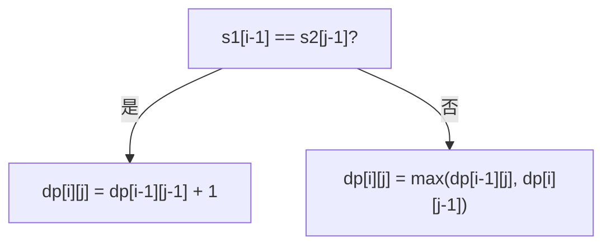

# [L3] 如何用动态规划求最长公共子序列并还原具体路径？

#### 一句话结论

`dp[i][j]` 表示 s1 前 i 字符与 s2 前 j 字符的 LCS 长度，从右下角逐步回溯即可还原序列。

#### 体系讲解

**状态定义与转移**

设字符串 `s1` 长度 m，`s2` 长度 n，定义：

- `dp[i][j]` = `s1[0..i-1]` 与 `s2[0..j-1]` 的最长公共子序列长度

转移方程（1-indexed）：

```
若 s1[i-1] == s2[j-1]：dp[i][j] = dp[i-1][j-1] + 1
否则：             dp[i][j] = max(dp[i-1][j], dp[i][j-1])
```

边界：`dp[0][*] = 0`，`dp[*][0] = 0`（任一字符串为空时 LCS 为 0）

**状态转移的直觉**：当前字符相同则"共同前进一步"；不同则取"去掉 s1 末尾"或"去掉 s2 末尾"中较优的结果。



**填表示例**

`s1 = "ABCBD"`，`s2 = "ACDB"`（LCS 长度为 3，合法序列包括 "ACB"、"ADB"、"ACD" 等）：

|   | ε | A | C | D | B |
|---|---|---|---|---|---|
| **ε** | 0 | 0 | 0 | 0 | 0 |
| **A** | 0 | 1 | 1 | 1 | 1 |
| **B** | 0 | 1 | 1 | 1 | 2 |
| **C** | 0 | 1 | 2 | 2 | 2 |
| **B** | 0 | 1 | 2 | 2 | 3 |
| **D** | 0 | 1 | 2 | 3 | 3 |

**路径还原**

从 `dp[m][n]` 出发，按以下规则回溯至 `dp[0][0]`：

1. 若 `s1[i-1] == s2[j-1]`：记录该字符，`i--`、`j--`
2. 否则若 `dp[i-1][j] > dp[i][j-1]`：`i--`
3. 否则：`j--`

回溯收集的字符逆序即为一条 LCS（存在多条等长解时，此法返回其中一条）。

**复杂度**

| 指标 | 值 |
|------|-----|
| 时间 | O(m·n) |
| 空间（含还原表） | O(m·n) |
| 空间（仅求长度） | O(min(m,n))（滚动数组） |

#### 考察意图

LCS 是二维 DP 的经典入门题，同时考察候选人能否从"长度"进一步实现"路径回溯"——后者要求理解 DP 表的决策指向，而非仅背结论。此题也是 diff/patch 工具、基因序列比对等工程场景的核心子问题。

#### 追问链

1. **LCS 与编辑距离（Edit Distance）有何关联？**
   编辑距离允许插入、删除、替换；若只允许插入和删除（无替换），则 `editDistance(s1, s2) = m + n - 2 * LCS(s1, s2)`。两题共享相同的二维 DP 骨架，转移方程略有差异。

2. **如何在 O(min(m,n)) 空间内只求 LCS 长度？**
   用滚动数组（保留两行或一行）：因第 i 行只依赖第 i-1 行，压缩为一维时需用临时变量保存 `dp[i-1][j-1]` 的旧值（对角线值），否则会被覆盖。

3. **若存在多条等长 LCS，如何枚举全部？**
   回溯时遇到相等路径分叉则递归两条分支，时间复杂度在最坏情况下为指数级；实际工程中通常只需一条，或用差异化剪枝输出 top-k。

4. **LCS 能直接扩展到求最长公共子串（连续）吗？**
   不能直接复用，子串要求连续：改为 `dp[i][j]` = 以 `s1[i-1]`、`s2[j-1]` 结尾的公共子串长度，字符相同则 `dp[i-1][j-1]+1`，不同则 `0`；答案为全表最大值。

#### 易错点

1. **下标偏移混淆**：`dp` 数组下标比字符串下标多 1（i=0 表示空前缀），访问字符时应写 `s1[i-1]` 而非 `s1[i]`，否则越界或逻辑错误。
2. **路径还原方向写反**：回溯收集的字符需要逆序（用栈或最后 `array_reverse`），直接顺序拼接会得到反向结果。
3. **空间压缩时对角线值被覆盖**：一维滚动时，执行 `dp[j] = dp[j-1] + 1` 之前必须先保存旧的 `dp[j-1]`（即上一行的对角值），否则会用本行已更新的值计算，导致结果偏大。

#### 代码示例

```php
<?php

/**
 * 求两字符串的最长公共子序列长度，并还原一条 LCS 字符串
 *
 * @return array{length: int, sequence: string}
 */
function lcs(string $s1, string $s2): array
{
    $m  = strlen($s1);
    $n  = strlen($s2);

    // 构建 (m+1) x (n+1) 的 DP 表
    $dp = array_fill(0, $m + 1, array_fill(0, $n + 1, 0));

    for ($i = 1; $i <= $m; $i++) {
        for ($j = 1; $j <= $n; $j++) {
            if ($s1[$i - 1] === $s2[$j - 1]) {
                $dp[$i][$j] = $dp[$i - 1][$j - 1] + 1;
            } else {
                $dp[$i][$j] = max($dp[$i - 1][$j], $dp[$i][$j - 1]);
            }
        }
    }

    // 路径还原：从右下角回溯
    $seq = [];
    $i   = $m;
    $j   = $n;

    while ($i > 0 && $j > 0) {
        if ($s1[$i - 1] === $s2[$j - 1]) {
            $seq[] = $s1[$i - 1];
            $i--;
            $j--;
        } elseif ($dp[$i - 1][$j] > $dp[$i][$j - 1]) {
            $i--;
        } else {
            $j--;
        }
    }

    return [
        'length'   => $dp[$m][$n],
        'sequence' => implode('', array_reverse($seq)),
    ];
}

$result = lcs('ABCBD', 'ACDB');
echo $result['length'];   // 3
// 当 dp[i-1][j] == dp[i][j-1] 时取 else 分支（j--），此路径回溯得 ACD
// 若将 else 分支改为 i--，则得到 ACB；两者均为合法 LCS
echo $result['sequence']; // ACD
```
