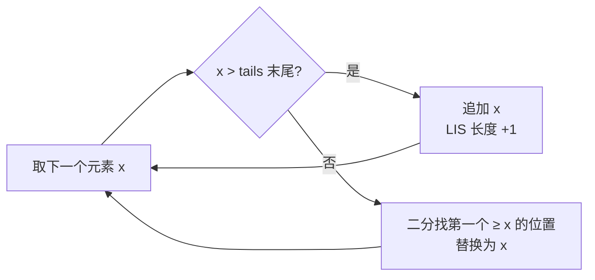

# [L3] 最长递增子序列（LIS）的 O(n²) 与 O(n log n) 算法有何区别？

#### 一句话结论

O(n²) 用标准 DP 逐位枚举前驱，O(n log n) 用贪心维护「最小尾元素」数组配合二分，只提升时间复杂度、空间不变。

#### 体系讲解

**问题定义**

给定整数序列，求最长严格递增子序列（子序列不要求连续）的长度。

---

**算法一：标准 DP（O(n²)）**

- **状态**：`dp[i]` = 以 `a[i]` 结尾的 LIS 长度
- **转移**：遍历所有 `j < i`，若 `a[j] < a[i]`，则 `dp[i] = max(dp[i], dp[j] + 1)`
- **初始化**：`dp[i] = 1`（每个元素自身构成长度为 1 的子序列）
- **答案**：`max(dp[0..n-1])`

```
a = [3, 1, 4, 1, 5, 9, 2, 6]
dp = [1, 1, 2, 1, 3, 4, 2, 4]
                               → LIS 长度 = 4（如 1,4,5,9 或 1,4,5,6）
```

---

**算法二：贪心 + 二分（O(n log n)）**

维护辅助数组 `tails`，其中 `tails[k]` 表示**所有长度为 k+1 的递增子序列中，末尾元素的最小值**。

处理每个元素 `x` 时：
- 若 `x > tails` 所有元素：追加，LIS 长度 +1
- 否则：用二分找到第一个 `>= x` 的位置并替换（保持每位的尾值尽可能小）

`tails` 数组始终保持有序，因此二分查找有效。最终 `tails` 的长度即为 LIS 长度。



**关键理解**：替换操作不改变 `tails` 的长度，只让该位置的尾值更小，为后续更长子序列保留更大的空间。`tails` 本身不是一条合法的 LIS，但其长度等于 LIS 长度。

**示例追踪**：`a = [3, 1, 4, 1, 5, 9, 2, 6]`

| 步骤 | x | tails 状态 | 操作 |
|------|---|-----------|------|
| 1 | 3 | [3] | 追加 |
| 2 | 1 | [1] | 替换位置0 |
| 3 | 4 | [1, 4] | 追加 |
| 4 | 1 | [1, 4] | 替换位置0（无变化） |
| 5 | 5 | [1, 4, 5] | 追加 |
| 6 | 9 | [1, 4, 5, 9] | 追加 |
| 7 | 2 | [1, 2, 5, 9] | 替换位置1 |
| 8 | 6 | [1, 2, 5, 6] | 替换位置3 |

`tails` 长度 = **4**，与 O(n²) 结果一致。

---

**复杂度对比**

| 算法 | 时间 | 空间 | 能否还原序列 |
|------|------|------|------------|
| 标准 DP | O(n²) | O(n) | ✅ 通过 `dp` 回溯 |
| 贪心 + 二分 | O(n log n) | O(n) | 需额外记录前驱指针 |

#### 考察意图

此题考察两点：①能否从基础 DP 推导出正确状态定义，②能否理解"贪心地维护最小尾元素"这一非直觉性优化背后的正确性证明。两算法并存于面试中，O(n log n) 是常见的追问方向。

#### 追问链

1. **O(n log n) 中 `tails` 数组本身是一条 LIS 吗？**
   不是。`tails` 的元素来自不同位置，可能不构成原数组中的合法子序列。它只是保证**长度信息正确**的辅助结构，要还原具体序列需要在每步记录每个元素的前驱。

2. **如何将"严格递增"改为"非严格递增"（允许相等）？**
   O(n²) 的条件从 `a[j] < a[i]` 改为 `a[j] <= a[i]`；O(n log n) 中二分查找的目标从"第一个 >= x"改为"第一个 > x"（即 `upperBound`）。

3. **如何还原 O(n log n) 版本的具体序列？**
   在处理每个元素时额外记录 `parent[i]` = 前驱元素的下标，最后从最长序列末尾元素按 `parent` 链反向追踪，收集路径再逆序输出。

4. **LIS 问题与俄罗斯套娃信封（二维 LIS）有何关联？**
   先按宽度升序排序，宽度相同时按高度降序；之后对高度序列求一维 LIS 即可。降序处理同宽度的目的是防止同宽信封被误纳入同一子序列。

#### 易错点

1. **二分边界混淆**：严格递增用 `lowerBound`（找第一个 >= x），非严格递增用 `upperBound`（找第一个 > x）；搞反会导致重复元素被错误处理。
2. **误认为 `tails` 是答案序列**：面试中常有人直接输出 `tails` 作为最终 LIS，实际上它的元素来自不同位置，不构成合法子序列。
3. **O(n²) 忘记对 `dp` 全表取最大值**：LIS 不一定以最后一个元素结尾，答案是 `max(dp)` 而非 `dp[n-1]`。

#### 代码示例

```php
<?php

/** O(n²) 标准 DP：返回 LIS 长度 */
function lisNSquared(array $a): int
{
    $n  = count($a);
    $dp = array_fill(0, $n, 1);

    for ($i = 1; $i < $n; $i++) {
        for ($j = 0; $j < $i; $j++) {
            if ($a[$j] < $a[$i]) {
                $dp[$i] = max($dp[$i], $dp[$j] + 1);
            }
        }
    }

    return max($dp);
}

/** O(n log n) 贪心 + 二分：返回 LIS 长度 */
function lisNLogN(array $a): int
{
    $tails = [];

    foreach ($a as $x) {
        // 二分：找 tails 中第一个 >= x 的位置（lowerBound）
        $lo = 0;
        $hi = count($tails);

        while ($lo < $hi) {
            $mid = ($lo + $hi) >> 1;
            if ($tails[$mid] < $x) {
                $lo = $mid + 1;
            } else {
                $hi = $mid;
            }
        }

        $tails[$lo] = $x; // 追加或替换
    }

    return count($tails);
}

$a = [3, 1, 4, 1, 5, 9, 2, 6];
echo lisNSquared($a); // 4
echo lisNLogN($a);    // 4
```
