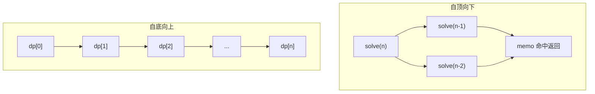

# [L3] 记忆化搜索（自顶向下）与自底向上 DP 在实现和性能上有何区别？

#### 一句话结论

两者本质等价，记忆化搜索按需计算子问题更自然，自底向上迭代无调用栈开销且对缓存更友好。

#### 体系讲解

动态规划有两种实现范式，核心差异在于**子问题的求解顺序**：

---

**自顶向下（记忆化搜索）**

从原问题出发，递归地拆解为子问题，用哈希表或数组缓存已计算的结果，再次访问时直接返回缓存值，不重复计算。

```
solve(n) {
    if (memo[n] 存在) return memo[n];
    结果 = solve(n-1) + solve(n-2);
    memo[n] = 结果;
    return 结果;
}
```

**特点**：
- 代码结构与递推关系同构，写起来接近"翻译数学定义"
- 只计算**实际被访问到**的子问题（对稀疏状态空间有优势）
- 递归深度过大时有栈溢出风险（PHP 默认栈约 8 MB）

---

**自底向上（填表 DP）**

从边界条件（最小子问题）出发，按确定的顺序依次填满整张 DP 表，最终答案在表末。

```
dp[0] = 0; dp[1] = 1;
for i from 2 to n:
    dp[i] = dp[i-1] + dp[i-2];
```

**特点**：
- 无函数调用开销，顺序写入内存，CPU Cache 命中率高
- 必须事先确定子问题的合法求解顺序（有时需要拓扑分析）
- 对状态空间稠密的问题，整体性能更优

---

**对比总结**

| 维度 | 记忆化搜索（自顶向下） | 自底向上 |
|------|----------------------|---------|
| 代码可读性 | 高（接近递推公式） | 中（需手动确定循环顺序） |
| 子问题计算量 | 按需，稀疏时更省 | 全量填表，哪怕部分不需要 |
| 调用栈开销 | 有（递归深度限制） | 无 |
| CPU 缓存友好性 | 较低（随机访问） | 较高（顺序写入） |
| 空间优化难度 | 难（缓存结构不易裁剪） | 易（滚动数组等） |
| 适用场景 | 状态转移关系复杂、状态稀疏、原型验证 | 状态稠密、对性能敏感、生产代码 |



**何时选哪种**

- 状态转移关系复杂、不易确定填表顺序（如图上 DAG 的最短路）→ **记忆化搜索**
- 状态空间稀疏（只访问少数状态）→ **记忆化搜索**
- 状态规模大、需要空间压缩（滚动数组）→ **自底向上**
- 对递归深度敏感（n 可达 10⁵+）→ **自底向上**（避免栈溢出）

#### 考察意图

两种范式本质等价，但候选人若只会"背模板"往往无法解释为何同一问题有两种写法，以及各自的取舍。此题考察对 DP 框架本质的理解深度，是从"会解题"迈向"能设计"的关键分水岭。

#### 追问链

1. **记忆化搜索一定与自底向上时间复杂度相同吗？**
   大多数情况下等价，但记忆化会有函数调用本身的常数开销（栈帧分配、参数传递）。对于 n=10⁵ 级别的深递归，自底向上的常数因子优势明显；在稀疏状态空间中，记忆化可能实际更快（跳过大量不访问的状态）。

2. **PHP 中递归深度有限制吗？如何应对？**
   PHP 默认调用栈受系统栈大小约束（通常几千层），深度超过约 5000~10000 层可能出现段错误。应对方式：①改写为自底向上；②用显式栈模拟递归；③通过 `ini_set('pcre.recursion_limit', ...)` 配置（仅对正则生效，通用递归无此配置项）。

3. **记忆化搜索如何处理"状态带多个维度"的场景？**
   用数组嵌套（`$memo[$i][$j]`）或将状态序列化为字符串键（`"$i,$j"`）。多维状态在 PHP 中序列化键的方案性能较差，优先考虑嵌套数组或改为自底向上填多维表。

4. **自底向上填表时，若存在多个子问题依赖（非线性拓扑），如何确定遍历顺序？**
   对 DAG 做拓扑排序，保证每个节点在其所有前驱节点计算完毕后再计算。背包、区间 DP（如矩阵链乘法）等需要按区间长度从小到大遍历，本质也是在满足拓扑顺序。

#### 易错点

1. **记忆化搜索忘记检查缓存**：写递归时直接调用子问题而未查 `memo`，退化为指数级暴力递归，是最常见的实现错误。
2. **自底向上循环顺序弄错**：若某状态依赖"右侧"或"下方"的值，却从左到右填表，会使用未初始化的格，需提前分析依赖方向再决定遍历顺序。
3. **将"记忆化搜索"与"普通递归 + 全局变量"混淆**：后者没有系统性地对所有子问题缓存，只是复用了某些中间变量，不具备 DP 的最优子结构保证。

#### 代码示例

```php
<?php

// 以「爬楼梯」（每次可走1或2步，n级楼梯有几种走法）为例对比两种实现

/** 自顶向下：记忆化搜索 */
function climbMemo(int $n, array &$memo = []): int
{
    if ($n <= 1) return 1;
    if (isset($memo[$n])) return $memo[$n];

    $memo[$n] = climbMemo($n - 1, $memo) + climbMemo($n - 2, $memo);
    return $memo[$n];
}

/** 自底向上：迭代填表（滚动变量，O(1) 空间） */
function climbBottomUp(int $n): int
{
    if ($n <= 1) return 1;

    $prev2 = 1; // dp[0]
    $prev1 = 1; // dp[1]

    for ($i = 2; $i <= $n; $i++) {
        $cur   = $prev1 + $prev2;
        $prev2 = $prev1;
        $prev1 = $cur;
    }

    return $prev1;
}

echo climbMemo(10);      // 89
echo climbBottomUp(10);  // 89
```
