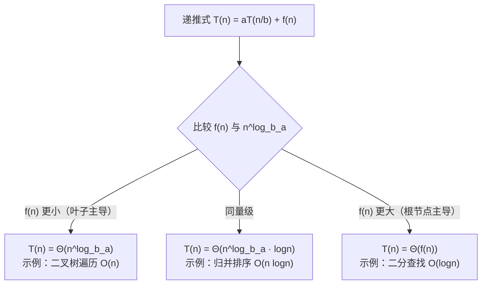

# [L2] 递归三要素是什么？如何分析递归的时间复杂度？

#### 一句话结论

递归三要素：终止条件、递归体、返回值；复杂度分析用递归树法或主定理，总代价 = 节点数 × 每层工作量。

#### 体系讲解

**递归三要素**

正确的递归函数必须同时具备以下三点，缺一则进入无限递归或返回错误结果：

| 要素 | 含义 | 常见缺失后果 |
|---|---|---|
| **终止条件（Base Case）** | 最小规模问题的直接答案，不再继续拆分 | 无限递归 → 栈溢出 |
| **递归体（Recursive Case）** | 将当前问题拆分为更小子问题，并组合子问题结果 | 逻辑错误或结果不正确 |
| **返回值（Return Value）** | 明确每层递归向上一层返回什么，语义需一致 | 返回 null 或丢失结果 |

以求斐波那契数为例：

```
fib(n):
  终止条件: n <= 1 → return n        // base case
  递归体:   return fib(n-1) + fib(n-2) // 拆成两个子问题
  返回值:   每层返回本层计算结果，逐层向上累加
```

**分治模板**

分治（Divide & Conquer）是递归的典型应用模式：

```
divideAndConquer(problem, params):
  1. 终止条件（问题已足够小，直接解决）
     if base_case: return base_solution

  2. 拆分（Divide）
     sub1, sub2 = split(problem)

  3. 递归求解（Conquer）
     result1 = divideAndConquer(sub1, params)
     result2 = divideAndConquer(sub2, params)

  4. 合并（Combine）
     return merge(result1, result2)
```

归并排序是分治模板最典型的实现：拆分（折半）→ 递归排序左右 → 合并有序段。

**时间复杂度分析：递归树法**

以归并排序 T(n) = 2T(n/2) + O(n) 为例：

```
递归树（n=8）：

层 0:           [8]         O(n)    工作量
层 1:      [4]     [4]      O(n)
层 2:   [2][2] [2][2]      O(n)
层 3: [1][1][1][1][1][1][1][1]  O(n)（叶子，终止条件）

树高 = log₂n
每层总工作量 = O(n)（合并操作）
总复杂度 = O(n log n)
```

**主定理（Master Theorem）**

对递推式 T(n) = aT(n/b) + f(n)，三种情况：

| 条件 | 结论 | 典型例子 |
|---|---|---|
| f(n) = O(n^(log_b a − ε)) | T(n) = Θ(n^(log_b a)) | 二叉树遍历：T(n)=2T(n/2)+O(1) → O(n) |
| f(n) = Θ(n^(log_b a)) | T(n) = Θ(n^(log_b a) · log n) | 归并排序：T(n)=2T(n/2)+O(n) → O(n log n) |
| f(n) = Ω(n^(log_b a + ε)) | T(n) = Θ(f(n)) | 二分查找：T(n)=T(n/2)+O(1) → O(log n) |

> ⚠️ 主定理仅适用于每层拆分规模均匀的情况（n/b 型），子问题规模不均等时（如快排最坏情况）需改用递归树逐层分析。



**空间复杂度**

递归的空间复杂度 = 调用栈深度 × 每帧空间。树高即调用栈最大深度：

- 归并排序：调用栈深度 O(log n)，每层 O(n) 辅助空间 → 总空间 O(n)
- 斐波那契（朴素递归）：调用栈深度 O(n) → 空间 O(n)

#### 考察意图

考查候选人能否系统性地构建递归函数（而非靠感觉），以及是否能定量分析递归算法的时间/空间代价；追问主定理三种情况可区分「会用」与「理解本质」的候选人。

#### 追问链

1. **为什么斐波那契朴素递归是 O(2ⁿ)？**  
   简答：每次调用产生 2 个子调用，递归树是完全二叉树，叶子节点数 = 2^n，每个叶子 O(1)，总代价 O(2^n)。大量子问题重复计算（如 fib(3) 被调用多次），可用记忆化（memo 数组）或迭代将其优化至 O(n)。

2. **递归树法和主定理什么时候选哪个？**  
   简答：子问题规模均匀（n/b）且符合主定理的三种形式时用主定理，速度快；子问题规模不均（如快排 k vs n-k-1 的分割）或需要看每层细节时用递归树，更灵活但计算量大。

3. **尾递归优化是什么？PHP 支持吗？**  
   简答：尾递归指递归调用是函数的最后一步操作，理论上编译器可将其转换为迭代，消除调用栈积压（O(n) 栈 → O(1) 栈）。PHP 的 Zend Engine 不支持尾递归优化，需手动将尾递归改写为迭代以避免栈溢出。

4. **分治和动态规划有什么本质区别？**  
   简答：两者都是将大问题拆解为子问题。区别在于子问题是否重叠：分治的子问题互相独立（归并左右两半互不影响），直接递归即可；动态规划的子问题存在大量重叠（斐波那契），需要记忆化存储避免重复计算。

#### 易错点

1. **终止条件写错（off-by-one）**：如斐波那契写成 `if ($n == 0)` 而漏掉 `$n == 1`，导致在 n=1 时继续递归并最终访问 `fib(-1)`，是初学者最高频的错误。
2. **混淆「层」的工作量与「总」复杂度**：每层 O(n) 不等于总复杂度 O(n)，还需乘以层数（树高）；归并排序每层 O(n)、共 log n 层，总复杂度 O(n log n)，不能仅看单层。
3. **忽略空间复杂度中的调用栈**：递归函数本身看似 O(1) 额外空间，但每帧调用都会压栈，递归深度 d 则空间 O(d)；在分析「原地算法」时不能忽略调用栈的开销。

#### 代码示例

```php
<?php

// ===== 递归三要素示范：归并排序 =====
function mergeSort(array $arr): array
{
    $n = count($arr);

    // 1. 终止条件：数组长度 ≤ 1，直接返回
    if ($n <= 1) {
        return $arr;
    }

    // 2. 递归体：折半拆分，递归排序左右两半
    $mid   = intdiv($n, 2);
    $left  = mergeSort(array_slice($arr, 0, $mid));
    $right = mergeSort(array_slice($arr, $mid));

    // 3. 返回值：合并有序段后返回（每层语义一致：返回已排序数组）
    return merge($left, $right);
}

function merge(array $left, array $right): array
{
    $result = [];
    $i = $j = 0;

    while ($i < count($left) && $j < count($right)) {
        if ($left[$i] <= $right[$j]) {
            $result[] = $left[$i++];
        } else {
            $result[] = $right[$j++];
        }
    }

    // 接上剩余段（与合并有序链表的 $curr->next = $l1 ?? $l2 同理）
    while ($i < count($left))  $result[] = $left[$i++];
    while ($j < count($right)) $result[] = $right[$j++];

    return $result;
}

// 复杂度：T(n) = 2T(n/2) + O(n) → 主定理情况二 → O(n log n)
// 空间：调用栈深度 O(log n)，合并辅助数组 O(n)
```
