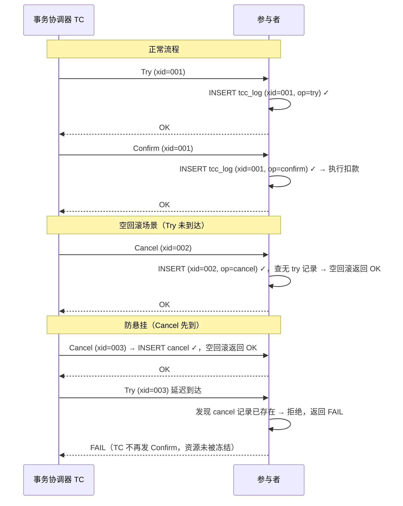

# [L4] TCC 方案落地：空回滚、悬挂与幂等三类问题的量化代价与防范

#### 一句话结论

统一 Barrier 表可同时防空回滚、悬挂与幂等重复执行。

---

#### 业务场景

支付平台，转账功能跨付款账户服务与收款账户服务两个微服务，现状如下：

| 指标 | 数值 |
|---|---|
| DAU | 200 万 |
| 峰值转账 QPS | 800 |
| 强一致需求 | 账户余额不可双扣（Confirm 必须恰好执行一次） |
| P99 延迟目标 | < 300ms |
| SLA | 99.95% |
| 故障容忍 | 每月宕机上限 ≈ 21 分钟 |

已在上一道题（[分布式事务选型](./单体拆分微服务后的分布式事务选型.md)）中确定采用 TCC，本题聚焦 **TCC 内部三类工程问题**的根因、量化代价与防范实现。

---

#### 体系讲解

**1. 三类问题根因**

TCC 由事务协调器（TC）驱动参与者执行 Try → Confirm/Cancel 三阶段。网络的不可靠性使以下三类异常成为必然：

| 问题 | 根因 | 触发条件 |
|---|---|---|
| **空回滚** | Try 请求因网络超时未到达参与者，TC 超时后发起 Cancel，参与者未找到任何冻结记录 | 网络分区、参与者重启、Try 响应超时 |
| **悬挂** | Try 因网络拥塞严重延迟到达，Cancel（空回滚）已先执行并返回成功，延迟的 Try 才到达并冻结资源，资源永久无法释放 | Try 比 Cancel 晚到达同一参与者（乱序） |
| **幂等缺失** | TC 超时重试 Confirm 或 Cancel，参与者缺少执行状态记录，导致重复扣款或重复释放冻结 | Confirm/Cancel 请求丢包或响应超时触发 TC 重试 |

**2. 量化代价（基于 800 QPS，P99=300ms，TC 超时阈值 5s 的估算）**

> ⚠️ 以下为工程估算数值，非 benchmark，实际值受网络抖动率影响。

| 问题 | 不防范时的代价 | 估算频率 |
|---|---|---|
| **空回滚** | Cancel 返回错误 → TC 重试 → 每次重试额外 1 次 DB 读 + 日志写；重试风暴放大 IO | 800 × 网络超时率（约 0.01%~0.1%）= 0.08~0.8 次/s |
| **悬挂** | 账户余额永久冻结，无法自动恢复，**必须人工介入**；违反 SLA 99.95% | 800 × 86400 × 乱序概率（约 0.001%）≈ 690 次/天（严重场景） |
| **幂等缺失** | 重复 Confirm → 账户双扣款，直接违反"余额不可双扣"业务约束 | 800 × TC 重试率（约 1%）= 8 次/s 额外操作 |

悬挂的代价远大于其他两类：不产生错误日志但造成资金静默冻结，是支付系统 SLA 崩溃的隐形炸弹。

**3. 统一防范方案：TCC 分支状态机日志表**

三类问题复用同一张 `tcc_log` 表（也称 Barrier 表），以状态机的方式解决，**无需为每类问题独立设计**：

```sql
CREATE TABLE tcc_log (
  xid        VARCHAR(64) NOT NULL,  -- 全局事务 ID
  branch_id  VARCHAR(64) NOT NULL,
  op         ENUM('try','confirm','cancel') NOT NULL,
  PRIMARY KEY (xid, branch_id, op)   -- 唯一约束是核心
);
```

**防空回滚**：Cancel 执行前先 INSERT `(xid, branch_id, 'cancel')`，若 `(xid, branch_id, 'try')` 不存在则空回滚（直接返回成功，TC 认为 Cancel 完成，不再重试）。

**防悬挂**：Cancel 写入 `'cancel'` 记录后，Try 请求到达时尝试 INSERT `(xid, branch_id, 'try')`，因 `'cancel'` 已存在不违反唯一约束，但通过业务逻辑检查 `'cancel'` 是否已存在来拒绝执行——让 TC 不再发起 Confirm。

**防幂等**：Confirm/Cancel 执行前通过 INSERT 唯一约束做 CAS；若 INSERT 影响行数为 0，说明已执行过，幂等跳过。



**4. 实现成本对比**

| 方案 | 额外 DB 操作/分支 | 运维复杂度 | 说明 |
|---|---|---|---|
| 统一状态机日志表 | 1 次 INSERT（唯一约束） | 低 | 三类问题一张表解决，`dtm-php` 的 Barrier 即此方案 |
| 分离三张表 | 2~3 次 SELECT + INSERT | 中 | 逻辑冗余，容易遗漏一类防护 |
| 无防护 | 0 | 极高（人工介入） | 悬挂 690 次/天，不可接受 |

800 QPS × 2 分支 × 1 次额外 INSERT ≈ 1600 次/s 额外写入，单实例 MySQL IOPS 开销 < 2%，代价可接受。

---

#### 考察意图

考察候选人能否超越"TCC = Try/Confirm/Cancel"的表层认知，针对支付强一致场景分析 TCC 三类工程缺陷的根因与量化影响，并设计出能同时解决三类问题的最小成本实现；同时考察是否熟悉工业级框架（dtm-php / Hyperf）中 Barrier 机制的设计思路。

---

#### 追问链

1. **Barrier 表磁盘增长问题**：`tcc_log` 长期运行会无限增大，如何清理？
   > 事务完成（Confirm/Cancel 执行完毕）后，由 TC 或异步任务以 `xid` 为单位删除对应行；也可按 `created_at` 保留 7 天滚动删除。清理需幂等（DELETE WHERE 安全）。

2. **TC 宕机恢复**：TC 在 Confirm 阶段崩溃，如何保证参与者最终 Confirm？
   > TC 持久化全局事务状态（WAL）。恢复后扫描处于 `TRYING` 状态超 X 秒的事务，逐一重新发起 Confirm 或 Cancel；参与者通过 Barrier 幂等保护，重复 Confirm 安全。若 TC 是单点，需做主从 HA（如 DTM Server 集群），否则 TC 宕机等于 SLA 单点故障。

3. **降级策略**：TCC 协调超时（TC 无响应），支付接口如何降级？
   > 主链路降级为"异步对账"：Try 成功的本地冻结记录落库，前端返回"处理中"；后台对账任务每 30s 扫描超时事务，查询 TC 最终状态后补偿执行 Confirm 或 Cancel。此策略将 P99 超时影响隔离在用户感知层，不破坏资金一致性。

4. **跨语言参与者**：付款服务 PHP，收款服务 Go，如何共用同一套 Barrier 机制？
   > DTM 的 Barrier 是协议层标准：HTTP 子事务通过请求头传递 `gid/branch_id/op`，参与者各自实现对 `dtm_barrier` 表的 INSERT 逻辑；DTM Server 无语言限制，PHP 用 `dtm-php/dtm-client`，Go 用 `dtm-labs/dtm`，Barrier 表结构相同。

---

#### 易错点

1. **认为空回滚返回错误能触发 TC 重试从而"自愈"**：TC 收到 Cancel 失败会无限重试，本质上是重试风暴，而非自愈。正确做法是空回滚时返回 **成功**，告知 TC "Cancel 已完成"，TC 关闭该事务分支。

2. **只做幂等、忽略悬挂**：悬挂无错误日志、无异常报警，资金冻结静默发生；在 800 QPS 的支付系统中每天可能出现数百次，累积到月度账对时才暴露，问题定位极难。必须在 Try 阶段检查 `cancel` 记录是否存在。

3. **Barrier 表未加唯一索引或使用 SELECT+INSERT 非原子实现**：并发 Confirm 重试时若用 `SELECT` 判断是否已执行再 `INSERT`，存在 TOCTOU 竞态条件（两个请求同时 SELECT 均未见记录，然后同时 INSERT）。正确实现必须依赖数据库唯一约束的原子性，让 INSERT 本身充当 CAS。

---

#### 代码示例

> ⚠️ 需查证：以下使用 `dtm-php/dtm-client` 的 Barrier API，接口签名以实际版本文档为准。

```php
<?php
// Hyperf + dtm-php：TCC 参与者实现（付款账户服务）
declare(strict_types=1);

namespace App\Payment\Tcc;

use DtmClient\Barrier\BranchBarrier;
use Hyperf\DbConnection\Db;

class DebitParticipant
{
    /**
     * Try：冻结金额（BranchBarrier 内部处理防悬挂逻辑）
     */
    public function tryDebit(BranchBarrier $barrier, int $userId, int $amount): void
    {
        $barrier->call(Db::connection(), function () use ($userId, $amount) {
            $affected = Db::table('accounts')
                ->where('id', $userId)
                ->where('balance', '>=', $amount)
                ->decrement('balance', $amount);  // 直接扣款冻结

            if ($affected === 0) {
                throw new \RuntimeException('余额不足，Try 失败');
            }
        });
        // BranchBarrier::call 内部：
        // 1. INSERT dtm_barrier(gid, branch_id, 'try')，唯一约束 CAS
        // 2. 若检测到 'cancel' 已存在（悬挂场景），抛出异常跳过业务逻辑
        // 3. 闭包内异常 → Rollback，TC 感知失败后发起 Cancel
    }

    /**
     * Confirm：幂等保护（BranchBarrier 通过唯一约束防重复执行）
     */
    public function confirmDebit(BranchBarrier $barrier, int $userId, int $amount): void
    {
        $barrier->call(Db::connection(), function () use ($userId, $amount) {
            // 实际业务：标记转账单为已完成，余额已在 Try 阶段扣减
            Db::table('transfer_records')
                ->where('gid', $barrier->gid)
                ->update(['status' => 'confirmed']);
        });
    }

    /**
     * Cancel：释放冻结（BranchBarrier 内部处理空回滚 + 幂等）
     */
    public function cancelDebit(BranchBarrier $barrier, int $userId, int $amount): void
    {
        $barrier->call(Db::connection(), function () use ($userId, $amount) {
            // 归还已冻结余额
            Db::table('accounts')
                ->where('id', $userId)
                ->increment('balance', $amount);
        });
        // BranchBarrier::call 内部（Cancel 路径）：
        // 1. INSERT dtm_barrier(gid, branch_id, 'cancel')
        // 2. 若 'try' 不存在（空回滚场景）→ 跳过闭包，直接返回成功
        // 3. 若 INSERT 冲突（幂等场景）→ 跳过闭包，直接返回成功
    }
}
```
