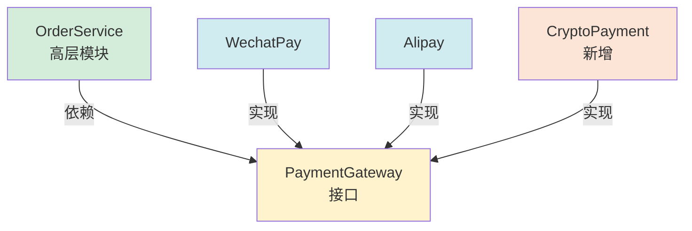

# [L3] OCP 的设计哲学：隔离变化点而非冻结代码

#### 一句话结论

OCP 的"对修改封闭"不是禁止改代码，而是通过抽象隔离变化点，让高层模块对低层变更免疫。

#### 体系讲解

**OCP 的根本误解**

"对扩展开放、对修改封闭"最常见的误读是"代码写完就不能动"。这是字面陷阱。

正确理解：**「封闭」是针对高层调用方而言的**——当业务规则变化时，高层策略模块无需改动，改的只是底层实现细节。实现手段是**抽象（接口/抽象类）+ 依赖倒置（DIP）**。

**第一步：识别变化点**

OCP 的前提是识别"什么会变、什么不会变"：

| 相对稳定（→ 抽象层） | 容易变化（→ 实现层） |
|---|---|
| 计算税费的触发时机 | 各国/地区的税率规则 |
| 发送通知的业务逻辑 | 通知渠道（邮件/短信/Push） |
| 订单处理的核心流程 | 支付方式（微信/支付宝/信用卡） |

不变的部分固化为抽象层，变化的部分留在实现层。新增一种支付方式时，只需新增实现类，高层模块零修改。

**OCP 与 DIP 的协同：DIP 是 OCP 的实现机制**

OCP 说"要隔离变化点"，DIP 说"高层不依赖低层，两者都依赖抽象"——没有某种抽象隔离，OCP 无法成立。



新增 `CryptoPayment` 时，`OrderService` 对此一无所知，不需改动 → OCP 成立。

**违反 OCP 的量化代价**

当 `OrderService` 用 `if/elseif` 直接内嵌支付逻辑时：

| 代价维度 | 具体表现 |
|---|---|
| 回归测试 | 每次新增支付方式都需重测 `OrderService` 全路径 |
| 单测耦合 | 测试 `OrderService` 必须覆盖所有支付分支，mock 成本随分支数线性增长 |
| 变更风险 | 修改一种支付方式的代码时，可能引入对其他分支的回归 |
| 圈复杂度 | if/else 链随业务线性增长，Cyclomatic Complexity 直接叠加 |

**OCP 的边界：不是所有地方都要预留扩展点**

过度应用 OCP 会引入"抽象税"——不必要的接口层让代码更难阅读和追踪。

判断标准：**变化点历史上发生过，或业务上有明确的多态预期** → 才值得隔离。没有历史信号的"预测式扩展"往往适得其反（违反 YAGNI）。实践上可以先写直接实现，等第二个具体变体出现时再提取接口（Rule of Three）。

#### 考察意图

考查候选人能否识破"封闭 = 不能修改代码"的字面陷阱，理解 OCP 是针对高层模块的隔离策略，而非冻结策略；进阶考查是否能说清 OCP 与 DIP 的协同关系，以及在"过度抽象"与"不够抽象"之间的工程判断。

#### 追问链

1. **DIP（依赖倒置）与 OCP 是什么关系？没有 DIP 能实现 OCP 吗？**  
   简答：DIP 是 OCP 的实现机制——高层依赖抽象而非具体实现，当具体实现变化时高层才能"对修改封闭"。技术上可以用服务定位器等替代手段，但 DIP 是最直接的方式。没有任何形式的抽象隔离，OCP 根本无法成立。

2. **违反 SRP（单一职责）为什么通常会同时违反 OCP？**  
   简答：若一个类承担多个职责（如 `OrderService` 同时负责订单逻辑和支付逻辑），每个职责的变化都触碰同一个类——变化点没有被隔离，任何一处变化都迫使高层"对修改开放"。SRP 识别职责边界，OCP 隔离职责的变化点，两者互为前提。

3. **如何判断某个扩展点是否值得用 OCP 抽象？**  
   简答：两个判断标准：① 过去是否发生过同类变化（历史信号）；② 业务上是否有明确的多态需求（如"支持多种支付方式"是产品需求）。两个条件都不满足时，提前抽象是过度设计；可先写直接实现，等第二个具体变体出现时再提取接口（Rule of Three 原则）。

4. **OCP 可以在哪些粒度应用？各粒度的实践方式有何不同？**  
   简答：① 类级别：用接口/继承扩展行为，不改原有类；② 模块/包级别：插件架构——新功能以新包插入，已有包对变化封闭；③ 系统级别：微服务——通过新服务添加能力，不修改旧服务。粒度越大，"封闭"的隔离成本越高，但保护的范围也越大；实践中主要在类和模块两个粒度应用。

#### 易错点

1. **"对修改封闭"= 代码写完不能动**：OCP 的"封闭"是针对**高层调用方**的。当低层实现变化时，高层不需改动才是目标。底层细节永远可以修改，甚至应该随业务修改。

2. **把 OCP 当银弹，为每个类都加接口**：缺乏历史变化信号的预防性抽象是过度设计，引入额外的阅读和间接调用成本。OCP 的前提是识别**真实的**变化点，而非假想的扩展场景。

3. **认为 OCP 和 DIP 是两个独立原则**：实践中 OCP 几乎必须借助 DIP 落地——依赖倒置创造了抽象层，让高层模块不随低层变化而变化。将两者割裂理解会导致"知道原则但不知道如何实现"。

#### 代码示例

```php
<?php

// ===== ❌ 违反 OCP：硬编码 if/else，新增支付方式必须改 OrderService =====

class OrderServiceBad
{
    public function pay(string $type, float $amount): void
    {
        if ($type === 'wechat') {
            echo "WeChat Pay: ¥{$amount}\n";
        } elseif ($type === 'alipay') {
            echo "Alipay: ¥{$amount}\n";
        }
        // 新增加密货币支付 → 必须修改此类，重新测试全路径 ❌
    }
}

// ===== ✅ 遵守 OCP + DIP：依赖抽象，扩展不改高层 =====

interface PaymentGateway
{
    public function charge(float $amount): void;
}

class WechatPay implements PaymentGateway
{
    public function charge(float $amount): void
    {
        echo "WeChat Pay: ¥{$amount}\n";
    }
}

class Alipay implements PaymentGateway
{
    public function charge(float $amount): void
    {
        echo "Alipay: ¥{$amount}\n";
    }
}

// 新增支付方式：只新增类，OrderService 零修改 ✅
class CryptoPayment implements PaymentGateway
{
    public function charge(float $amount): void
    {
        echo "Crypto Pay: ¥{$amount}\n";
    }
}

class OrderService
{
    public function __construct(private readonly PaymentGateway $gateway) {}

    public function pay(float $amount): void
    {
        $this->gateway->charge($amount);
    }
}

$service = new OrderService(new CryptoPayment());
$service->pay(99.00);
// OrderService 对 CryptoPayment 的存在一无所知，对它的修改也免疫
```
