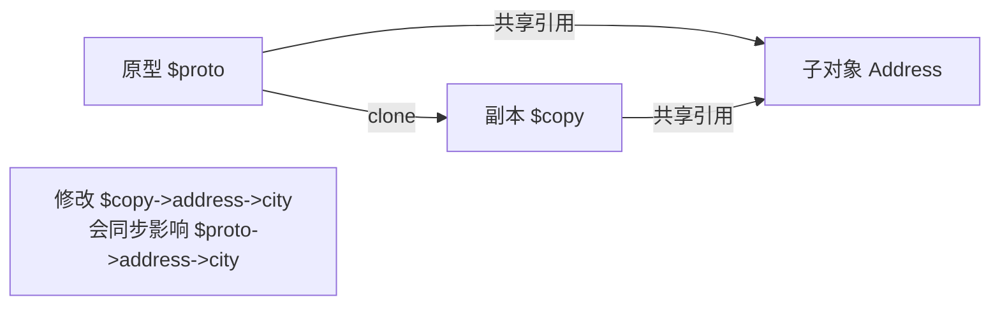

# [L2] PHP clone 与原型模式：浅拷贝与深拷贝的实现差异

#### 一句话结论

`clone` 触发浅拷贝，对象属性为引用类型时副本与原对象共享同一子对象；`__clone()` 是深拷贝的扩展钩子，原型模式正是以此为基础实现"以现有对象为模板快速创建新实例"。

#### 体系讲解

**原型模式的意图**

原型模式（Prototype）解决的问题：当创建对象的代价远高于复制对象时（如需要读取数据库、执行复杂计算），以一个已有实例为"原型"，通过复制快速产生新实例，并在副本上做差异修改。

适用场景：
- 复杂配置对象的多变体派生（同一基础配置，不同环境差异配置）
- 对象初始化成本高但复制成本低（如预热后的连接配置、解析后的模板对象）

**PHP `clone` 的浅拷贝行为**

`clone` 关键字复制对象时：
- 基础类型属性（int/string/float/bool/null）：值复制，副本与原对象独立
- 对象类型属性：复制引用（pointer），副本与原对象**共享同一子对象**
- 数组属性：值复制，但数组内若含对象元素，该元素仍是引用复制



**`__clone()` 魔术方法**

PHP 在执行 `clone` 之后、将控制权还给调用方之前，自动调用副本对象的 `__clone()`。开发者在此处手动对需要独立的子对象执行深拷贝：

```php
public function __clone(): void
{
    $this->address = clone $this->address; // 对子对象递归 clone
}
```

**深拷贝的三种实现方式对比**

| 方式 | 优点 | 缺点 |
|---|---|---|
| `__clone()` 递归 clone | 精确控制，语义清晰 | 每层子对象都要手动处理，层级深时繁琐 |
| `serialize` + `unserialize` | 自动递归，代码简洁 | 对象需实现 `__sleep()`/`__wakeup()`；含资源（如文件句柄）的对象不可用 |
| `json_encode` + `json_decode` | 简单 | 只适合纯数据对象；丢失类型信息，得到 stdClass |

#### 考察意图

考查候选人是否真正理解 PHP 对象赋值/复制的内存语义，以及是否能区分"何时必须深拷贝"；同时检验对原型模式意图（减少重复初始化成本）的理解，而非仅知道"`clone` 就是原型模式"。

#### 追问链

1. **PHP 对象赋值（`$b = $a`）和 `clone` 有什么区别？**
   简答：`$b = $a` 只复制对象引用（两个变量指向同一对象），修改 `$b` 的属性会影响 `$a`；`clone` 会创建一个新对象（新的 zval + 属性复制），浅拷贝层面上 `$b` 与 `$a` 是独立对象，但对象类型的属性仍共享。

2. **`serialize` + `unserialize` 实现深拷贝有什么限制？**
   简答：含资源类型的属性（数据库连接、文件句柄、curl handle）在序列化时会丢失；类需可序列化（不能有 `#[SensitiveParameter]` 或私有不可访问属性阻碍）；性能开销比递归 clone 更大，大对象图时尤为明显。

3. **原型模式与工厂方法模式的选型边界是什么？**
   简答：工厂方法每次从零构造新对象，适合构造成本固定且低的场景；原型模式以已有实例为起点复制，适合构造成本高但实例间差异小的场景。若需要"在不同环境配置中共享 80% 相同的字段，只改 20%"，原型更合适。

4. **PHP 中数组的 clone 行为是什么？**
   简答：数组本身是值类型，直接赋值即为值复制（写时复制 COW）；但数组内的对象元素仍然是引用。因此 `$copy->items = $this->items` 对数组是值复制，但数组内的对象元素依然共享。

#### 易错点

1. **认为 `clone` 等于深拷贝**：`clone` 只是浅拷贝；属性为对象时副本与原对象共享子对象。必须在 `__clone()` 中手动对需要独立的子对象执行 `clone`，才能实现真正的深拷贝。

2. **忘记 `__clone()` 是在副本上调用，而非原对象**：在 `__clone()` 中 `$this` 指向**新创建的副本**，直接对 `$this->subObject = clone $this->subObject` 操作的是副本的属性，不会影响原对象。

3. **认为"原型模式 = 随便 clone 一个对象"**：原型模式强调意图——以昂贵对象为模板减少重复初始化代价。若对象构造本身很廉价，`new` 比 `clone` 更清晰，强行使用原型模式属于过度设计。

#### 代码示例

```php
<?php

final class Address
{
    public function __construct(
        public string $city,
        public string $street,
    ) {}
}

final class UserProfile
{
    public function __construct(
        public string  $name,
        public Address $address,
        public array   $tags = [],
    ) {}

    public function __clone(): void
    {
        // address 是对象，需手动深拷贝，否则副本与原对象共享同一 Address 实例
        $this->address = clone $this->address;
        // $tags 是数组（值类型），PHP clone 已自动复制，无需额外处理
    }
}

$proto = new UserProfile('张三', new Address('北京', '长安街'), ['vip', 'active']);

$copy = clone $proto;
$copy->name           = '李四';
$copy->address->city  = '上海'; // 只修改副本的 city

echo $proto->name;           // 张三（不受影响）
echo $proto->address->city;  // 北京（不受影响，因为 __clone 做了深拷贝）

// 对比：不实现 __clone() 时的浅拷贝陷阱
class ShallowProfile
{
    public function __construct(
        public string  $name,
        public Address $address,
    ) {}
    // 无 __clone()
}

$a = new ShallowProfile('王五', new Address('广州', '天河路'));
$b = clone $a;
$b->address->city = '深圳';

echo $a->address->city; // 深圳 ← 原对象被污染！
```
