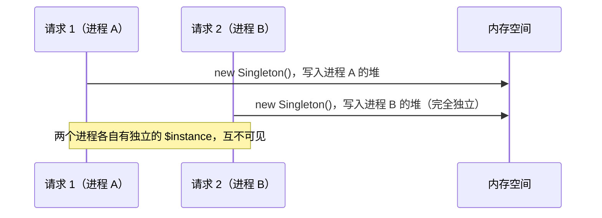

# [L2] PHP 单例模式为什么不需要处理线程安全？

#### 一句话结论

PHP 传统运行模式每个请求独占进程，进程间无共享内存，单例天然无竞态；Swoole 持久进程下则需警惕状态泄漏。

#### 体系讲解

**PHP 的 Share-Nothing 架构**

PHP-FPM 的默认运行模型是"每请求独立进程（share-nothing）"：

- 每个 HTTP 请求由一个独立的 PHP Worker 进程处理
- 进程间地址空间完全隔离，不存在跨请求的共享变量
- 请求结束后进程内存全部释放（或回收到进程池等待复用，但变量随之重置）

因此，单例对象的生命周期与请求等长，根本不存在两个请求竞争同一个 `$instance` 的场景。这与 Java/Go 常驻进程模型有本质区别——Java 中单例的 `instance` 字段在 JVM 生命周期内只有一份，多线程并发初始化才需要双重检查锁（DCL）。



**Swoole 持久进程下的陷阱** ⚠️ 需查证

Swoole 以多 Worker 进程 + 协程（coroutine）的方式运行，每个 Worker 进程处理多个请求的协程，进程不随请求结束而重置。此时单例的问题不是"线程安全"，而是"状态泄漏"：

- `getInstance()` 第一次调用后 `$instance` 常驻进程内存
- 后续所有经过该 Worker 的请求共享同一对象实例
- 若单例内含请求级状态（如当前用户 ID、数据库事务句柄），会在请求间互相污染

> Swoole 协程是协作式调度（单线程轮转），不存在传统意义的"线程竞态"，但共享实例的状态污染同样危险。

**选型建议**

| 运行环境 | 单例线程安全？ | 真正的风险 | 推荐做法 |
|---|---|---|---|
| PHP-FPM / CLI | 无需担心 | 无 | 正常使用 |
| Swoole Worker | 无竞态 | 请求间状态泄漏 | 避免含状态的单例；纯配置/无状态单例可用 |
| `parallel` 扩展 | 需要处理 | 真实的竞态 | 极少场景，按需加锁 |

#### 考察意图

考查候选人是否理解 PHP 运行模型（而非死记"PHP 是单线程"），能否区分"无线程安全问题"与"无状态泄漏风险"，以及是否了解 Swoole 等常驻进程框架带来的新问题。

#### 追问链

1. **PHP 说"单线程"准确吗？**
   简答：不完全准确。PHP-FPM 是多进程模型，并非单线程；每个进程内部是单线程执行。"单线程"的表述在 CLI 脚本场景下成立，但描述 FPM 架构时应说"share-nothing 多进程"。

2. **Java 单例为什么需要双重检查锁？PHP 为什么不需要？**
   简答：Java 应用是常驻 JVM 进程，多线程并发访问同一堆空间，`instance` 字段对所有线程可见，初始化期间存在竞态。PHP-FPM 进程间无共享堆，竞态条件的前提不成立。

3. **在 Laravel + Swoole（如 Octane）环境下，服务容器是单例吗？会有什么问题？**
   简答：Laravel Octane 默认会在每个请求前重新绑定部分服务（"Request 级别"服务），但容器本身是进程级单例。若开发者手动绑定了含请求状态的单例服务而未标记为 scoped，就会产生状态泄漏；Octane 为此提供了 `$this->app->scoped()` 解决方案。

4. **纯 PHP 如何实现一个标准的懒加载单例？**
   简答：静态属性 + 私有构造函数 + 禁止克隆/反序列化，见代码示例。

#### 易错点

1. **认为"PHP 是单线程所以不需要处理线程安全"**：这是不精确的表述。正确理由是 PHP-FPM 的 share-nothing 多进程架构，每请求独享进程，而非"PHP 没有多线程"。`parallel` 扩展就支持真正的多线程。

2. **在 Swoole 中照搬 FPM 的单例写法**：Swoole Worker 进程常驻，含状态的单例会在请求间共享，导致数据污染。应区分"进程级无状态单例"（安全）与"请求级有状态对象"（需要重建）。

3. **忘记禁止 clone 和反序列化**：完整的单例实现需要将 `__clone()` 和 `__wakeup()` 设为 private 或抛出异常，否则外部可通过这两条路径绕过限制创建多个实例。

#### 代码示例

```php
<?php

final class Config
{
    private static ?self $instance = null;
    private array $data = [];

    private function __construct()
    {
        $this->data = ['env' => 'production', 'debug' => false];
    }

    public static function getInstance(): static
    {
        if (static::$instance === null) {
            static::$instance = new static();
        }
        return static::$instance;
    }

    public function get(string $key, mixed $default = null): mixed
    {
        return $this->data[$key] ?? $default;
    }

    private function __clone() {}

    public function __wakeup(): never
    {
        throw new \RuntimeException('Config 不允许反序列化');
    }
}

// PHP-FPM：每次请求都是全新进程，getInstance() 重新初始化
// Swoole Worker：进程复用，getInstance() 返回同一对象 —— 此例无状态，安全
$config = Config::getInstance();
echo $config->get('env'); // production
```
