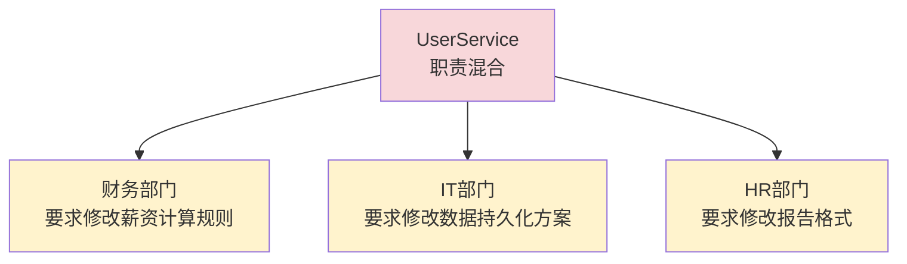

# [L3] SRP 的「变化理由」原则：如何量化职责边界

#### 一句话结论

SRP 不是"一个类只有一个方法"，而是"一个类只有一个变化的理由"——变化理由由利益相关方（actor）驱动，而非由功能数量决定。

#### 体系讲解

**SRP 的常见误读**

"单一职责"最常见的误读是：一个类只做"一件事"，因此方法越少越好。这个解读导致过度拆分，把本属同一变化轴的逻辑拆散，反而增加维护成本。

Robert C. Martin（SRP 的提出者）的原始定义是：

> **一个模块应该对一类且仅对一类 actor 负责。**

**Actor（利益相关方）是变化的驱动源**

"变化的理由"由驱动改动的 actor 决定。不同的 actor 有不同的关注点，他们提出的需求变化互相独立：



`UserService` 同时服务三个 actor，任何一个 actor 的需求都会触碰这个类。这是"有三个变化理由"的典型症状。

**识别职责边界的方法：问"谁会要求改这段代码？"**

| 如果这段代码变化，驱动方是谁？ | 职责归属 |
|---|---|
| 业务规则变了（财务/产品） | 领域逻辑层 |
| 存储方案变了（MySQL → MongoDB）| 持久化层 |
| 通知渠道变了（邮件 → 短信）| 通知层 |
| 展示格式变了（JSON → XML）| 序列化/视图层 |

每一个独立的驱动方 = 一个潜在的职责边界。

**违反 SRP 的量化代价**

| 代价维度 | 具体表现 |
|---|---|
| 变更影响面 | 修改持久化逻辑时，业务逻辑同在一个类，测试范围被迫扩大 |
| 测试成本 | 单元测试需要同时 mock 数据库、邮件服务、业务规则，耦合度高 |
| 变更频率 | 多个 actor 的需求交替触发修改，该类被改动的频率是单职责类的倍数 |
| OCP 失效 | 职责混合导致变化点无法隔离，高层策略无法对低层细节变化保持封闭（见追问1）|

**SRP 的边界：不是颗粒度越小越好**

SRP 不要求把每个方法拆成独立的类。判断标准：**同一 actor 驱动的逻辑应内聚在一起**，不同 actor 驱动的逻辑才需要分离。

过度拆分的信号：两个类的修改总是同步发生（它们实际服务于同一 actor）。

#### 考察意图

考查候选人能否给出 SRP 的精准定义（actor / reason to change），而不是"一个方法 = 一个职责"的表面理解；进阶考查是否能量化违反 SRP 的代价（测试成本、OCP 失效路径），以及识别"过度拆分"这一反向陷阱。

#### 追问链

1. **违反 SRP 为什么会导致 OCP 失效？能举一个具体路径吗？**  
   简答：OCP 要求高层对低层变化封闭，实现手段是隔离变化点。若 `UserService` 同时包含业务逻辑和持久化逻辑，当存储方案从 MySQL 切换为 MongoDB 时，业务逻辑层被迫跟着改动——变化点没有被隔离，OCP 因此失效。SRP 把职责分离到独立类，才有可能为每个变化点单独建立抽象，OCP 才能成立。

2. **如何判断一个类是否违反了 SRP？有没有可操作的量化方法？**  
   简答：三种信号：① 用"和（and）"才能描述这个类做什么（"处理业务逻辑**和**发送邮件"）；② 修改这个类时，与改动无关的方法也需要重新测试；③ Cyclomatic Complexity 居高不下，且复杂度来自多个不相关的分支路径。工具层面可以看 git blame 的变更频率：若一个类被多个不相关 Feature 的 commit 轮流修改，它大概率违反了 SRP。

3. **SRP 的粒度如何把握？拆到方法级别合适吗？**  
   简答：不合适。粒度的判断标准是 actor，而非代码行数或方法数。服务同一 actor 的多个方法（如 `calculateSalary()`、`calculateBonus()` 都由财务部门驱动）应内聚在同一个类中，这正是内聚性（cohesion）的体现。过度拆分会破坏内聚，导致"霰弹式修改"——一个需求变更需要同时改动多个类。

4. **SRP 与微服务的"单一职责"是同一概念吗？**  
   简答：思想相同，粒度不同。微服务的"单一职责"是 SRP 在系统级别的应用——一个服务对一类业务域负责，不同业务域的变化不会相互影响。但粒度映射不是线性的：一个微服务内部仍然应当在类级别遵守 SRP；一个类级别的 SRP 违反不等于要拆成两个微服务。

#### 易错点

1. **"一个类只有一个方法 = SRP"**：SRP 的核心是变化理由（actor），而非方法数量。一个有十个方法的类，若所有方法都由同一 actor 驱动，完全符合 SRP；反之，一个只有两个方法的类，若分别服务两个 actor，已经违反 SRP。

2. **过度拆分：把同一 actor 的逻辑拆散**：若 `EmailFormatter` 和 `EmailSender` 总是一起改、一起测，它们实际上服务于同一 actor（通知系统），强行分离违反内聚性，制造"霰弹式修改"反模式。

3. **认为 SRP 只是代码组织问题，与测试无关**：违反 SRP 的类测试成本显著更高——需要同时准备数据库、邮件服务等多个外部依赖的 mock，且任何一个依赖的变动都可能让测试失效。SRP 的重要收益之一就是让单元测试的隔离范围最小化。

#### 代码示例

```php
<?php

// ===== ❌ 违反 SRP：UserService 同时服务三个 actor =====

class UserServiceBad
{
    // actor①：业务规则（产品/财务驱动）
    public function calculateBonus(int $userId): float
    {
        // ... 薪资计算逻辑
        return 1000.0;
    }

    // actor②：持久化（IT/DBA 驱动）
    public function save(array $userData): void
    {
        // ... MySQL 写入逻辑
    }

    // actor③：通知（运营驱动）
    public function sendWelcomeEmail(string $email): void
    {
        // ... 邮件发送逻辑
    }
}
// 后果：修改邮件模板时，薪资计算的测试也要跑一遍 ❌

// ===== ✅ 遵守 SRP：按 actor 分离职责 =====

// actor①：业务规则 → 领域层
class BonusCalculator
{
    public function calculate(int $userId): float
    {
        return 1000.0;
    }
}

// actor②：持久化 → 基础设施层
class UserRepository
{
    public function save(array $userData): void
    {
        // MySQL 写入，将来换 MongoDB 只改这里
    }
}

// actor③：通知 → 通知层
class WelcomeEmailNotifier
{
    public function notify(string $email): void
    {
        // 邮件逻辑，将来换短信只改这里
    }
}

// 协调者：组合各职责，自身不含业务逻辑
class UserRegistrationService
{
    public function __construct(
        private readonly UserRepository       $repo,
        private readonly WelcomeEmailNotifier $notifier,
    ) {}

    public function register(array $userData): void
    {
        $this->repo->save($userData);
        $this->notifier->notify($userData['email']);
        // BonusCalculator 按需注入，此处不依赖
    }
}
// 修改邮件模板 → 只改 WelcomeEmailNotifier，BonusCalculator 的测试不受影响 ✅
```
