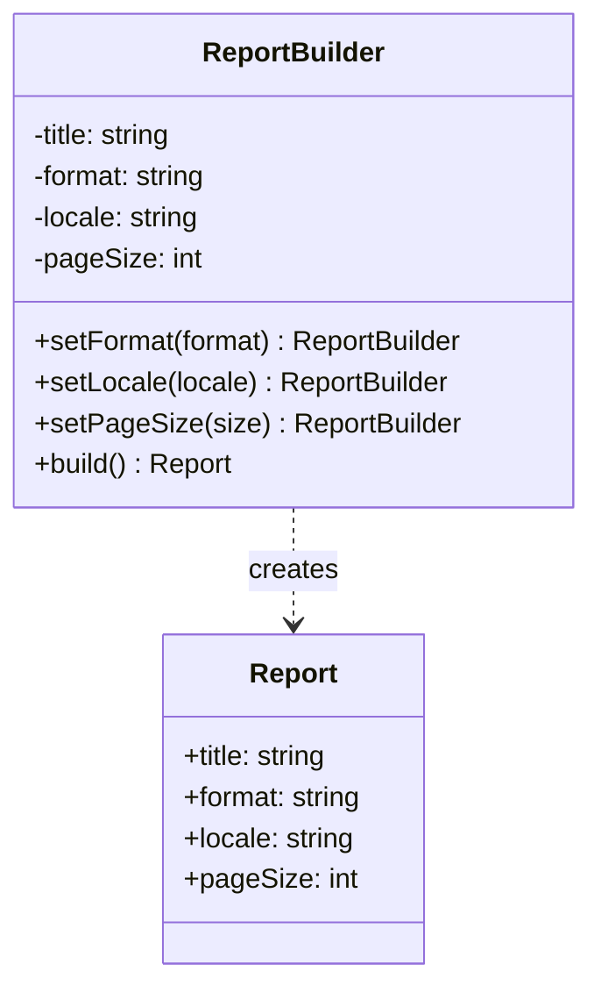

# [L2] 建造者模式如何解决复杂对象的构造问题？

#### 一句话结论

建造者模式将复杂对象的"构造步骤"与"最终产品"分离，解决构造参数爆炸问题，同时保证对象在 `build()` 后处于合法完整状态。

#### 体系讲解

**问题根源：伸缩构造函数反模式（Telescoping Constructor）**

当一个对象有多个可选参数时，常见的错误做法是重载多个构造函数：

```php
// 反模式：参数越来越多，难以阅读
new Report('Q1', 'PDF', true, false, 'zh-CN', 100, null);
// 第 5 个参数是语言？还是格式？调用方根本记不住
```

建造者模式以链式调用替代，使每个参数都有语义名称，可选参数按需设置。

**建造者 vs 工厂方法的选型关键**

| 维度 | 工厂方法 | 建造者 |
|---|---|---|
| 关注点 | **创建哪类**对象（类型/产品族决策） | **如何一步步组装**同一类复杂对象 |
| 参数特点 | 少量必填参数 | 多个可选参数，组合多样 |
| 返回时机 | 调用即返回完整对象 | `build()` 之前对象处于构造中间态 |
| 典型场景 | 多数据库驱动切换 | 查询构建器、HTTP 请求对象、报表配置 |

**建造者结构**



**Director 角色**

GoF 原始模式中有 `Director` 类负责编排构建步骤，PHP 实践中通常省略 Director，原因是：

- PHP 闭包和链式调用足够表达构建流程
- Director 引入额外的类层次，在参数组合不固定的场景下反而降低灵活性
- 当需要"预设构建流程"时，可用命名构造方法（Named Constructor）代替 Director

```php
// 用命名构造方法替代 Director
$mobileReport = ReportBuilder::forMobile()->setTitle('Q1')->build();
```

#### 考察意图

考查候选人能否识别"伸缩构造函数"是建造者模式要解决的核心问题，而非仅背定义；考察是否能与工厂方法做场景区分，并说清 `build()` 前后对象状态不同的含义。

#### 追问链

1. **建造者模式和直接使用数组/DTO 传参有什么区别？**
   简答：数组传参无类型约束，键名拼错在运行时才发现；建造者每个 setter 有明确签名，IDE 可补全，且可在 `build()` 中集中做完整性校验（必填字段是否缺失、参数组合是否合法），DTO 则只是数据容器，不含构建逻辑。

2. **`build()` 方法应该做哪些事情？**
   简答：聚合校验（检查必填字段、参数组合合法性）+ 构造最终对象。校验应放在 `build()` 而非各 setter 中，因为单个参数合法但组合可能非法；`build()` 是唯一能看到完整上下文的时机。

3. **PHP 中链式调用如何保证返回同一 Builder 实例？**
   简答：每个 setter 返回 `$this` 即可；若 Builder 需要不可变（immutable），则每个 setter 返回 `clone $this` 并修改副本，最终 `build()` 产出 Product。

4. **Laravel 的查询构建器（`DB::table()->where()->orderBy()->get()`）是建造者模式吗？**
   简答：是建造者模式的变体——`where()`/`orderBy()` 等方法逐步构建 SQL 查询对象，`get()`/`first()` 相当于 `build()` 触发执行；与标准建造者的差异在于 `get()` 同时执行了查询而非仅返回构建产物。

#### 易错点

1. **认为"有链式调用就是建造者模式"**：链式调用只是实现手段（Fluent Interface）。建造者的核心是"将构造步骤与产品分离"，且 `build()` 前对象处于中间态。jQuery 的链式调用直接操作已存在对象，不是建造者。

2. **在每个 setter 中做单项校验就认为完成了校验职责**：单字段合法不代表整体合法（如同时设了互斥的两个选项）。完整校验必须集中在 `build()` 中，此时才能看到对象的完整状态。

3. **混淆建造者与工厂方法的适用场景**：当问题是"选哪类对象"时用工厂；当问题是"这类对象有太多可选配置"时用建造者。两者可以组合使用：工厂决定使用哪个 Builder，Builder 完成内部装配。

#### 代码示例

```php
<?php

final class Report
{
    public function __construct(
        public readonly string $title,
        public readonly string $format,
        public readonly string $locale,
        public readonly int $pageSize,
    ) {}
}

final class ReportBuilder
{
    private string $format   = 'PDF';
    private string $locale   = 'zh-CN';
    private int    $pageSize = 20;

    public function __construct(private readonly string $title) {}

    public static function forMobile(string $title): self
    {
        return (new self($title))->setFormat('HTML')->setPageSize(10);
    }

    public function setFormat(string $format): self
    {
        $this->format = $format;
        return $this;
    }

    public function setLocale(string $locale): self
    {
        $this->locale = $locale;
        return $this;
    }

    public function setPageSize(int $size): self
    {
        $this->pageSize = $size;
        return $this;
    }

    public function build(): Report
    {
        if ($this->title === '') {
            throw new \InvalidArgumentException('title 不能为空');
        }
        return new Report($this->title, $this->format, $this->locale, $this->pageSize);
    }
}

// 标准用法
$report = (new ReportBuilder('Q1 财报'))
    ->setFormat('PDF')
    ->setLocale('en-US')
    ->setPageSize(50)
    ->build();

// 命名构造方法替代 Director
$mobileReport = ReportBuilder::forMobile('Q1 财报')->build();
```
