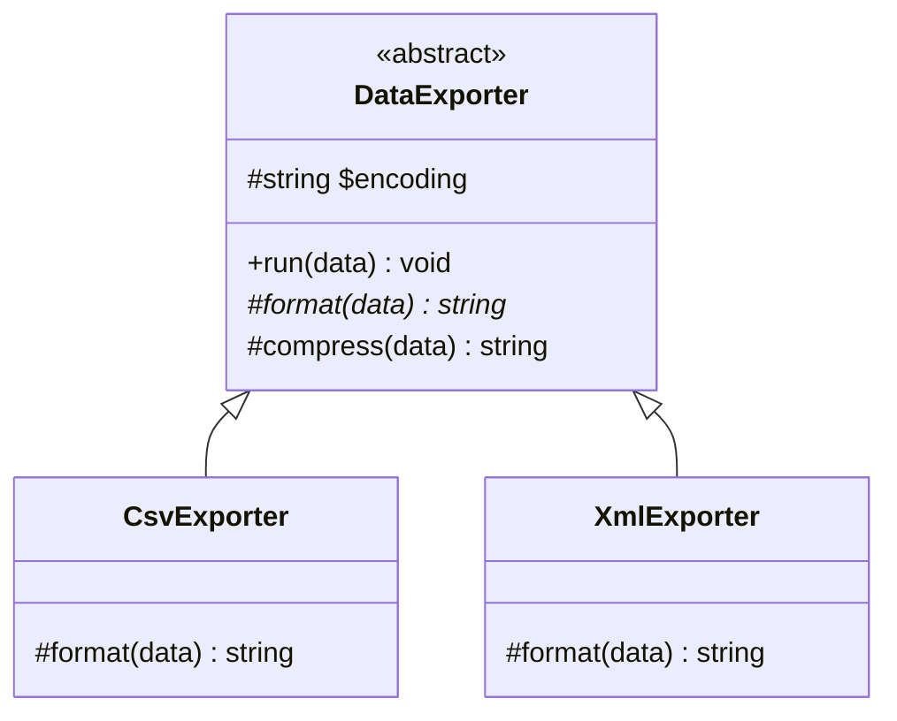
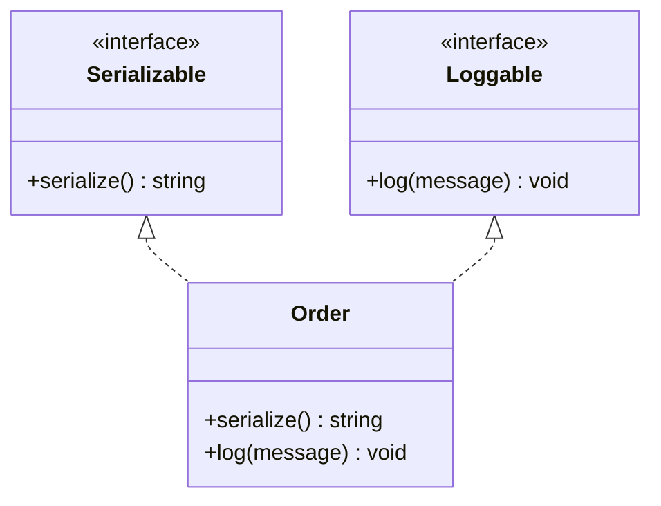

# [L3] 抽象类与接口的设计意图差异：PHP 中的选型原则

#### 一句话结论

抽象类描述"是什么"（共享状态+行为骨架），接口描述"能做什么"（行为契约），选型依据是"有无共享实现或状态"，而非"是否需要抽象"。

#### 体系讲解

**能力矩阵**

| 维度 | 抽象类 | 接口 |
|---|---|---|
| 实例属性 | ✅ | ❌ |
| 具体方法（默认实现）| ✅ | ❌（PHP 无 default 方法）|
| 多继承 | ❌ 单继承 | ✅ 类可实现多个接口 |
| 访问修饰符 | public / protected / private | 只能 public |
| 常量 | ✅ | ✅（PHP 8.1 起可 final）|
| 类型语义 | is-a（身份关系）| can-do（能力声明）|

**抽象类的设计意图：提供共享骨架**

当多个子类有**相同的实现逻辑**需要复用，且这些逻辑依赖**共享状态**时，使用抽象类。典型场景是**模板方法模式（Template Method）**：固定算法骨架由抽象类实现（具体方法），可变步骤留给子类（抽象方法）。



**接口的设计意图：声明行为契约**

当你要描述的是"能做什么能力"而非"是什么身份"时，用接口。接口的核心价值在于：

1. **多实现**：一个类可同时实现多个接口，不占用唯一的继承槽
2. **解耦调用方**：调用方依赖接口不依赖具体类（DIP 的基础）
3. **ISP 友好**：接口可细粒度设计，避免实现类被迫实现无关方法



**错误选型的代价**

| 错误模式 | 具体代价 |
|---|---|
| 用抽象类声明纯行为契约 | 锁死继承槽：实现类不能再继承其他类；不同语义的类被强制纳入同一继承树 |
| 试图在接口里写共享逻辑 | PHP 接口不支持具体实现，逻辑只能重复写入每个实现类，或被迫抽到 Trait |
| 为"以后可能扩展"而创建接口 | 无历史变化信号时过度抽象，引入阅读成本（违反 YAGNI）|

**实践决策树**

1. 有共享状态（属性）或共享具体实现，且子类都是"同一类事物" → **抽象类**
2. 描述行为契约，且可能有多个不相关类需要同一能力 → **接口**
3. 需要共享实现，但类已有父类或需要多重能力 → **接口 + Trait**（Trait 提供复用代码，接口提供类型契约）

#### 考察意图

考查候选人能否突破"两者都是抽象、用哪个差不多"的思维定式，清楚说明各自的设计意图边界；进阶考查是否理解错误选型导致的继承槽锁死问题，以及 Trait 在"接口 + 共享实现"场景中的配合方式。

#### 追问链

1. **模板方法模式为什么必须用抽象类而非接口？**  
   简答：模板方法的核心是"固定骨架（具体方法）+ 可变步骤（抽象方法）"，PHP 接口不支持具体实现，骨架逻辑无处安放。此外模板方法通常需要 `protected` 修饰符将内部步骤封装起来，而接口只允许 `public`，无法满足封装需求。

2. **ISP（接口隔离原则）如何影响接口的粒度设计？**  
   简答：ISP 要求按客户端需要裁剪接口——宁可多个小接口（`Serializable`、`Loggable`、`Cacheable`）让类按需实现，也不用一个大接口把所有方法塞在一起。错误选型为抽象类时 ISP 几乎无法成立：子类只能全量继承，无法选择性实现部分能力。

3. **Trait 和抽象类在共享实现上有何本质区别？何时该用 Trait 替代抽象类？**  
   简答：Trait 是代码复用机制（水平组合），不建立 is-a 类型关系，无法用于类型声明；抽象类建立继承树（is-a），提供类型多态。当需要"共享代码实现"但不需要类型约束，且类还要继承其他父类时，用 Trait。两者可配合：接口定义契约 + Trait 提供默认实现 + 类实现接口并 `use` Trait（PHP 版 Mixin 模式）。

4. **PHP 接口可以继承接口吗？实际设计中有何应用场景？**  
   简答：可以，`interface C extends A, B`。应用场景：框架中 `WritableRepository extends ReadableRepository`，调用方可针对不同能力声明依赖（只读 vs 读写），不必强制注入具备全部能力的实现——这也是 ISP 在接口继承层面的体现。

#### 易错点

1. **"两者都是抽象，用哪个差不多"**：抽象类锁死单继承槽，接口不提供具体实现，错误选型会导致继承树被锁死或逻辑分散重复。选型前先问："需要共享状态或共享实现吗？"

2. **用抽象类声明纯行为契约**：多个不相关类（`Order`、`User`、`Report`）都需要 `Serializable` 能力，但它们在语义上并非"同一类事物"，强制纳入同一继承树破坏语义，且占用了各自的继承槽。

3. **认为 Trait 可以完全替代抽象类**：Trait 没有类型语义，`function export(DataExporter $e)` 是有意义的类型约束，但无法用 Trait 达到同等效果。Trait 解决代码复用，抽象类解决类型层级+代码复用的组合需求。

#### 代码示例

```php
<?php

// ===== 抽象类：模板方法模式（共享骨架 + 可变步骤）=====

abstract class DataExporter
{
    public function __construct(protected string $encoding = 'UTF-8') {}

    final public function run(array $data): void
    {
        $formatted  = $this->format($data);
        $compressed = $this->compress($formatted);
        $this->send($compressed);
    }

    abstract protected function format(array $data): string;

    protected function compress(string $data): string
    {
        return gzencode($data);
    }

    protected function send(string $data): void
    {
        echo "Sending " . strlen($data) . " bytes [{$this->encoding}]\n";
    }
}

class CsvExporter extends DataExporter
{
    protected function format(array $data): string
    {
        return implode("\n", array_map(
            fn($row) => implode(',', $row),
            $data
        ));
    }
}

// ===== 接口 + Trait：行为契约 + 共享实现，不占继承槽 =====

interface Serializable
{
    public function serialize(): string;
}

trait JsonSerializableTrait
{
    public function serialize(): string
    {
        return json_encode($this->toArray(), JSON_THROW_ON_ERROR);
    }

    abstract protected function toArray(): array;
}

// Order 已继承 Model，无法再继承抽象类，但可实现接口 + use Trait
class Order extends Model implements Serializable
{
    use JsonSerializableTrait;

    protected function toArray(): array
    {
        return ['id' => 1, 'total' => 99.0];
    }
}

// 调用方仅依赖接口（DIP），不感知 Order 的具体类型
function persist(Serializable $item): void
{
    file_put_contents('/tmp/data.json', $item->serialize());
}
```
