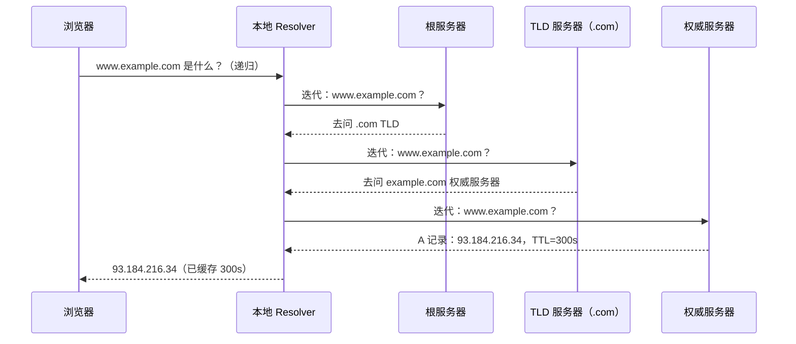

# [L2] DNS 解析流程与 CDN 接入原理

#### 一句话结论

DNS 递归委托解析，TTL 控缓存，CNAME 转交 CDN 就近调度。

#### 体系讲解

**1. DNS 解析的层级结构**

浏览器发起请求时，域名解析按以下顺序命中即止：

```
本地 hosts 文件 → 操作系统 DNS 缓存 → 本地 Resolver（ISP 或 8.8.8.8）
    → 根域名服务器（.）→ TLD 服务器（.com）→ 权威域名服务器
```

**2. 递归查询 vs 迭代查询**

两者并非互斥，而是发生在不同阶段：

| 阶段 | 类型 | 含义 |
|---|---|---|
| 客户端 → 本地 Resolver | **递归查询** | 客户端委托 Resolver 全权解析，只等最终结果 |
| 本地 Resolver → 根/TLD/权威 | **迭代查询** | Resolver 依次询问，每次只获得"下一步去哪问"的引用 |



**3. TTL 与缓存控制**

每条 DNS 记录都携带 TTL（秒），各级缓存按此失效：

| TTL 设置 | 影响 |
|---|---|
| 过大（如 86400s） | 缓存久，查询少；但 IP 变更最多需等 24 小时生效 |
| 过小（如 60s） | 生效快；但查询频繁，延迟高，Resolver 负担重 |

**发布变更最佳实践**：变更前 24 小时将 TTL 降至 300s，变更完成、验证无误后再调回大值。

**4. CDN 与 CNAME 接入原理**

直接配 A 记录时，所有用户解析到同一 IP；CDN 通过 CNAME 劫持解析流程，返回离用户最近的节点 IP：

```
普通模式：www.example.com  A  → 93.184.216.34（固定 IP）

CDN 模式：www.example.com  CNAME → www.example.com.cdn.net
          www.example.com.cdn.net  → CDN 智能 DNS（根据 GeoIP/负载）
                                  → 就近边缘节点 IP
```

**CNAME 使用限制**：
- CNAME 目标必须是域名，不能是 IP
- 根域名（`@`/裸域）不可配 CNAME（与 SOA/NS 记录冲突），需用 CNAME Flattening（部分 DNS 服务商支持）或 ALIAS 记录

**5. DNS 污染与防御**

DNS 污染（Cache Poisoning）：攻击者向 Resolver 注入伪造响应，使域名解析到恶意 IP，用户无感知地被劫持。

| 防御方案 | 原理 | 代价 |
|---|---|---|
| DNSSEC | 对 DNS 记录进行数字签名，Resolver 验签后才接受响应 | 部署复杂，增加响应体积，非所有解析器支持 |
| DoH（DNS over HTTPS） | DNS 查询走 HTTPS 加密通道，防中间人篡改 | 依赖 HTTPS，首次建连有握手延迟 |
| DoT（DNS over TLS） | DNS 查询走 TLS 加密通道（端口 853） | 防篡改，但不防监听其请求目标（SNI 可见） |

#### 考察意图

考察候选人能否区分递归与迭代查询的发生位置，理解 TTL 对线上变更节奏的影响，以及 CDN 依赖 CNAME 实现流量调度的底层逻辑——三者共同构成日常运维和架构设计的必备网络知识。

#### 追问链

1. **根域名服务器全球只有 13 个 IP，它们扛得住吗？**  
   "13 个"指 13 个逻辑标识（A-M），实际通过 Anycast 技术部署了数百个物理节点；同时递归 Resolver 大量缓存 TLD 信息，根服务器并不需要参与每次查询，实际负载远低于想象。

2. **为什么 CDN 用 CNAME 而不直接给 A 记录？**  
   A 记录是静态 IP，无法根据用户位置动态返回最优节点；CNAME 将解析权转交 CDN 自己的智能 DNS，CDN 可在最后一跳根据 GeoIP、节点健康状态、实时负载返回最优 IP，实现动态就近调度。

3. **TTL 为 0 是否意味着不缓存？实际会如何？**  
   RFC 定义 TTL=0 表示不缓存，但实际许多 Resolver 出于稳定性会强制设置一个最小缓存时间（如 30s），不严格遵循；同时频繁查询会显著增加解析延迟，极端低 TTL 并不推荐用于生产。

4. **PHP 如何在运行时验证域名是否接入了 CDN？**  
   调用 `dns_get_record($domain, DNS_CNAME)` 获取 CNAME 链，遍历每条记录的 `target` 字段，若后缀命中已知 CDN 域名（如 `cloudfront.net`、`fastly.net`）即可判定已接入。见代码示例中的 `isCdnEnabled()`。

#### 易错点

1. **混淆递归和迭代的发生位置**：递归发生在客户端到本地 Resolver 这一段（客户端只问一次，等 Resolver 搞定），迭代发生在 Resolver 向根/TLD/权威逐级查询这一段。面试常见失误是把两者全部描述成"客户端依次询问各级服务器"。

2. **以为 CNAME 可以指向 IP 或用于根域名**：CNAME 的目标必须是另一个域名，不能填 IP；根域名（如 `example.com`）无法配 CNAME，因为 RFC 规定 CNAME 不能与 SOA、NS 等记录共存。

3. **发布 DNS 变更时忘记提前降 TTL**：若 TTL=86400，变更后缓存中的旧记录最长存活 24 小时；正确做法是变更前至少 1 TTL 周期提前降低（如降至 300s），变更完成稳定后再调回。

#### 代码示例

```php
// 查询域名的完整 DNS 记录（含 CNAME 链）
function resolveDomain(string $domain): void
{
    $records = dns_get_record($domain, DNS_A | DNS_CNAME | DNS_AAAA);

    foreach ($records as $r) {
        $target = match ($r['type']) {
            'A'     => $r['ip'],
            'AAAA'  => $r['ipv6'],
            'CNAME' => '→ ' . $r['target'],
            default => '?',
        };
        echo sprintf("[%s] %s = %s  TTL=%ds\n", $r['type'], $r['host'], $target, $r['ttl']);
    }
}

resolveDomain('www.example.com');
// 示例输出：
// [CNAME] www.example.com = → www.example.com.cdn.net  TTL=300s
// [A]     www.example.com.cdn.net = 203.0.113.42        TTL=60s

// 判断域名是否已接入 CDN（简易检测）
function isCdnEnabled(string $domain, array $cdnSuffixes = ['cdn.net', 'cloudfront.net', 'fastly.net']): bool
{
    $cnames = dns_get_record($domain, DNS_CNAME);
    foreach ($cnames as $record) {
        foreach ($cdnSuffixes as $suffix) {
            if (str_ends_with($record['target'], $suffix)) {
                return true;
            }
        }
    }
    return false;
}
```
