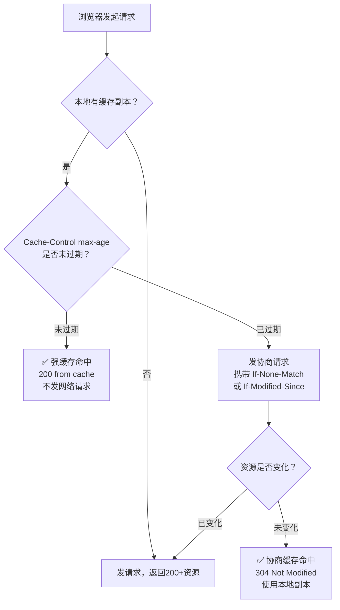

# [L1] HTTP 缓存机制：强缓存与协商缓存的区别

#### 一句话结论

强缓存命中直接用本地副本（200），协商缓存需向服务器验证资源是否变化（304）。

#### 体系讲解

HTTP 缓存分两个层级，按顺序命中：

**1. 强缓存（不发网络请求）**

浏览器检查本地缓存是否在有效期内，命中则直接返回 `200 (from cache)`，整个过程不产生任何网络请求。

| 响应头 | 规范版本 | 值示例 | 说明 |
|---|---|---|---|
| `Expires` | HTTP/1.0 | `Thu, 13 May 2026 12:00:00 GMT` | 绝对过期时间，受客户端时钟影响 |
| `Cache-Control: max-age` | HTTP/1.1 | `max-age=3600` | 相对有效期（秒），**优先级高于 Expires** |

**2. 协商缓存（发请求，由服务器判断）**

强缓存过期后，浏览器携带条件请求头向服务器验证资源是否变化：

| 请求头（浏览器发） | 对应响应头（服务器设） | 机制 |
|---|---|---|
| `If-None-Match: "abc123"` | `ETag: "abc123"` | 资源内容摘要（哈希），精度高 |
| `If-Modified-Since: Wed, ...` | `Last-Modified: Wed, ...` | 资源最后修改时间，精度到秒 |

- 资源未变：服务器返回 `304 Not Modified`（无 Body），浏览器继续使用本地缓存
- 资源已变：服务器返回 `200` + 新资源 + 新缓存头

**ETag 优先级高于 Last-Modified**：当两者同时存在，服务器优先以 ETag 判断。

**3. 完整缓存决策流程**



**4. Cache-Control 常用指令速查**

| 指令 | 含义 |
|---|---|
| `max-age=N` | 资源有效期 N 秒（强缓存） |
| `no-cache` | **不跳过协商缓存**，每次必须向服务器验证（常见误解：以为是"不缓存"） |
| `no-store` | 完全禁止缓存，不存储任何副本 |
| `public` | 允许代理服务器（CDN）缓存 |
| `private` | 只允许浏览器缓存，不允许代理缓存（含用户隐私数据时使用） |
| `must-revalidate` | 缓存过期后必须向服务器验证，不允许使用过期副本 |

#### 考察意图

考察候选人对 HTTP 缓存两级模型的理解——能否准确区分「强缓存直接命中」与「协商缓存向服务器确认」，并掌握 Cache-Control/ETag/Last-Modified 各自的优先级与适用场景，而非只知道「加 Cache-Control 可以缓存」。

#### 追问链

1. **`no-cache` 和 `no-store` 的区别是什么？**  
   `no-cache` 不是禁止缓存，而是禁止直接使用强缓存——每次请求必须经过协商缓存向服务器确认；`no-store` 才是彻底禁止，浏览器不存储任何响应副本，适用于银行流水等敏感数据。

2. **为什么 ETag 的优先级高于 Last-Modified？**  
   Last-Modified 精度只到秒：1 秒内多次修改无法感知变化；文件内容未变但时间戳变了（如重新部署）会导致缓存失效。ETag 基于内容摘要，内容不变则 ETag 不变，精度更高，误判更少。

3. **强缓存和协商缓存可以同时设置吗？两者如何配合？**  
   可以，也是最佳实践。典型组合：`Cache-Control: max-age=86400` + `ETag: "v2"`。有效期内走强缓存；过期后用 ETag 做协商验证，若未变则 304 续期，实现「零流量续命」。

4. **CDN 场景下缓存失效如何处理？**  
   CDN 节点也会缓存强缓存内容。常见方案：文件名加内容哈希（如 `app.a3f9bc.js`），内容变更时文件名变化，URL 不同则旧缓存自然失效，同时设置长 `max-age` 获得最佳缓存效果。

#### 易错点

1. **将 `no-cache` 误解为「不缓存」**：`no-cache` 依然会将响应存入缓存，只是每次使用前强制走协商验证。真正不缓存应使用 `no-store`。

2. **认为 304 等于「服务器返回了空响应」**：304 响应依然包含 Header（如新的 `Cache-Control`、`ETag`），只是没有 Body。浏览器收到 304 后会用本地缓存的 Body 拼成完整响应。

3. **混淆强缓存的 200 状态码**：强缓存命中返回的 `200 (from cache)` 与正常 200 在状态码上相同，区别在于 DevTools 中 Size 列显示 `(memory cache)` 或 `(disk cache)`，Network 面板可见请求未真正发出。

#### 代码示例

```php
// PHP 设置强缓存 + 协商缓存响应头（静态资源场景）
$filePath = '/var/www/html/assets/logo.png';
$etag     = '"' . md5_file($filePath) . '"';
$lastMod  = gmdate('D, d M Y H:i:s', filemtime($filePath)) . ' GMT';

// 协商缓存验证：RFC 7232 规定 ETag 优先，仅当 ETag 缺失时才回退到 Last-Modified
if (isset($_SERVER['HTTP_IF_NONE_MATCH'])) {
    if ($_SERVER['HTTP_IF_NONE_MATCH'] === $etag) {
        http_response_code(304);
        exit;
    }
} elseif (isset($_SERVER['HTTP_IF_MODIFIED_SINCE']) && $_SERVER['HTTP_IF_MODIFIED_SINCE'] === $lastMod) {
    http_response_code(304);
    exit;
}

// 首次请求：设置强缓存 + 协商缓存头
header('Cache-Control: public, max-age=86400');
header('ETag: ' . $etag);
header('Last-Modified: ' . $lastMod);
readfile($filePath);
```
