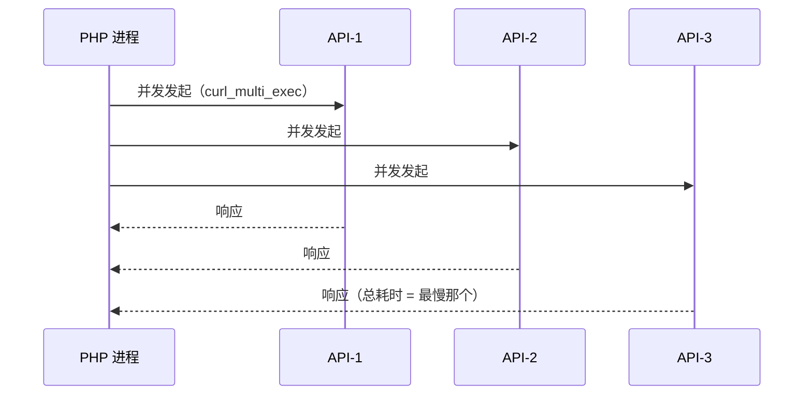

# [L2] PHP 网络并发与连接复用策略

#### 一句话结论

FPM 短连接高开销，并发请求与持久连接是网络 IO 的核心优化策略。

#### 体系讲解

**1. PHP-FPM 的短连接问题**

PHP-FPM 每个请求由一个 worker 进程处理，默认每次请求都会重新建立到 MySQL/Redis 等后端的 TCP 连接（三次握手 + 认证），请求结束后断开。多个串行的外部调用会叠加开销：

```
串行三次调用（默认）：总耗时 ≈ t(API1) + t(API2) + t(API3)
并发三次调用：        总耗时 ≈ max(t(API1), t(API2), t(API3))
```

**2. curl_multi：并发化 HTTP 请求**

`curl_multi_*` 系列函数让多个 HTTP 请求在同一个事件循环内并发执行，等全部就绪后统一收集结果：



注意：`curl_multi` 本质仍是**同步等待**——`curl_multi_exec` 循环直到所有请求完成，进程并未释放去处理其他请求。

**3. pconnect：进程级持久连接**

`pconnect`（PDO `ATTR_PERSISTENT`、`redis->pconnect()`）让连接在 FPM worker 进程生命周期内持续存活，下次请求直接复用，省去握手与认证开销。

**关键认知：pconnect 是进程私有的，不是连接池。**

| 特性 | pconnect | 连接池（Swoole） |
|---|---|---|
| 连接归属 | 绑定到单个 FPM worker 进程 | 池化，协程间共享 |
| 最大连接数 | = FPM worker 进程数 | 可独立配置上限 |
| PHP-FPM 兼容 | 原生支持，无需扩展 | 需 Swoole / 协程环境 |
| 状态污染风险 | 有（事务/会话变量残留） | 通过 get/release 机制管控 |
| 适用场景 | 传统 FPM 应用降低连接开销 | 高并发长连接服务 |

**4. stream_socket：低层级长连接**

`stream_socket_client()` 可建立 TCP/Unix socket 长连接，适合需要自定义协议或与非 HTTP 服务通信的场景（如自研消息队列、二进制协议服务）。在 FPM 下需配合持久化标志 `STREAM_CLIENT_PERSISTENT` 才能跨请求复用连接。

#### 考察意图

考察候选人能否从 PHP-FPM 的短连接模型出发，给出并发化（curl_multi）与复用化（pconnect/连接池）两种互补的优化手段，并清晰区分 pconnect 与连接池的本质差异——这是区分"会用 API"与"理解运行时模型"的关键分界线。

#### 追问链

1. **curl_multi 如何处理部分请求超时？不设超时会有什么问题？**  
   需为每个 handle 单独设置 `CURLOPT_TIMEOUT`；若不设，一个慢速下游会导致整个 `curl_multi_exec` 循环阻塞，拖慢所有并发请求的响应时间，FPM worker 进程被长时间占用，影响整体并发能力。

2. **FPM 使用 pconnect 后最多会建多少条数据库连接？**  
   最多 = FPM worker 进程数 × 每进程 pconnect 数量。若 FPM 配置 100 个 worker，MySQL 端就可能出现 100 条持久连接，需确认 `max_connections` 配置能承受，否则新连接会被拒绝。

3. **如何防止 pconnect 连接被上一请求"污染"？**  
   上一请求若开启事务未提交/回滚就返回，下一请求会在事务中操作，造成数据问题。防御方式：请求开始时检测事务状态并回滚（见代码示例）；或配置 MySQL `wait_timeout` 让服务端主动回收异常连接。

4. **Swoole 连接池与 pconnect 的核心区别是什么？**  
   pconnect 连接绑定进程，进程内同一时间只有一个请求在使用，无共享；Swoole 连接池在协程环境下允许同一进程内多个协程从池中借用/归还连接，N 个协程可共用 M（M < N）条连接，大幅降低连接总数。

#### 易错点

1. **以为 pconnect 是"连接池"**：pconnect 连接归属于 FPM worker 进程，进程间不共享；100 个 worker 意味着最多 100 条持久连接，与连接池"少量连接服务大量请求"的目标截然不同。

2. **curl_multi 未设置单句柄超时**：`curl_multi_exec` 的全局超时（`curl_multi_select` 参数）控制的是单次轮询等待时间，并非单个请求的总超时；必须对每个 handle 设置 `CURLOPT_TIMEOUT`，否则慢下游会无限拖延。

3. **pconnect 事务状态残留**：FPM worker 进程在请求异常退出时可能遗留未提交事务，下一请求复用同一连接时会继承事务上下文，造成写入逻辑错乱。每次请求开始时应主动检测并清理。

#### 代码示例

```php
// ① curl_multi 并发三个 HTTP 请求
$mh = curl_multi_init();
$handles = [];

foreach (['https://api1.example.com', 'https://api2.example.com', 'https://api3.example.com'] as $i => $url) {
    $ch = curl_init($url);
    curl_setopt_array($ch, [
        CURLOPT_RETURNTRANSFER => true,
        CURLOPT_TIMEOUT        => 5,     // 必须为每个 handle 单独设超时
    ]);
    curl_multi_add_handle($mh, $ch);
    $handles[$i] = $ch;
}

do {
    $status = curl_multi_exec($mh, $active);
    if ($active) curl_multi_select($mh);   // 让出 CPU，等待 IO 事件
} while ($active && $status === CURLM_OK);

$results = [];
foreach ($handles as $i => $ch) {
    $results[$i] = curl_multi_getcontent($ch);
    curl_multi_remove_handle($mh, $ch);
    curl_close($ch);
}
curl_multi_close($mh);

// ② PDO 持久连接（pconnect）+ 事务状态防污染
$pdo = new PDO('mysql:host=127.0.0.1;dbname=app', 'user', 'pass', [
    PDO::ATTR_PERSISTENT => true,   // 进程级复用，非连接池
]);

// 每次请求开始时清理可能遗留的事务
if ($pdo->inTransaction()) {
    $pdo->rollBack();
}
```
