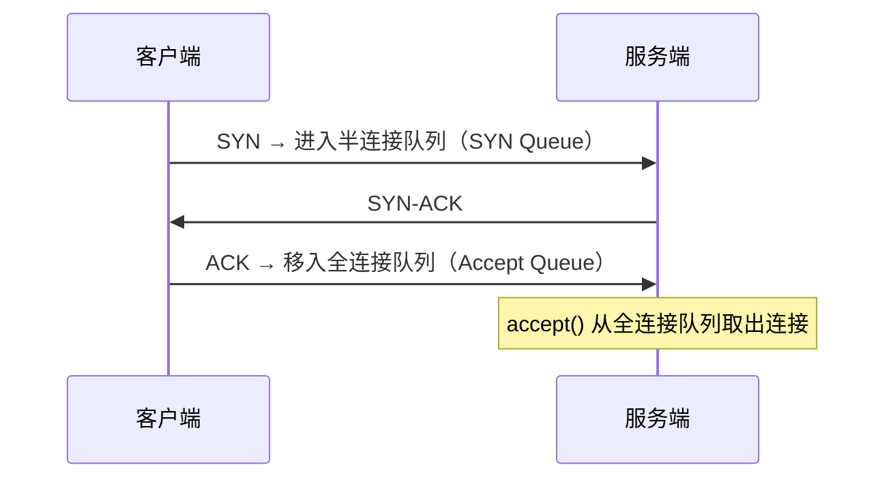

# [L2] TCP 粘包的成因与应用层拆包方案

#### 一句话结论

TCP 字节流无消息边界，应用层须用长度帧或分隔符协议自行拆包。

#### 体系讲解

**1. 为什么 TCP 会产生粘包？**

TCP 是面向字节流的传输层协议，内核不感知「消息」概念，只负责把字节可靠送达。两类常见原因：

- **发送侧合并**：Nagle 算法在有未确认数据时，将小包缓存并合并发送，一次发出多条消息
- **接收侧积压**：接收缓冲区累积了多条消息，一次 `recv()` 取到的数据跨越消息边界

因此，一次 `recv()` 可能拿到：**粘包**（多条完整消息连在一起）或**半包**（一条消息只收到部分）。这是字节流设计的本质，不是 TCP 的 bug。

**2. 三种标准拆包方案**

| 方案 | 原理 | 优点 | 缺点 | 典型场景 |
|---|---|---|---|---|
| 固定长度 | 每条消息固定 N 字节 | 实现最简单 | 数据不足需补齐，空间浪费 | 硬件传感器、定长指令集 |
| 分隔符 | 用特殊字节（如 `\n`）标记消息末尾 | 简单直观，适合文本 | 数据本身含分隔符时需转义 | HTTP 报文头、SMTP、Redis 协议 |
| 长度前缀帧 | Header 记录 Body 长度，先读 Header 再读 Body | 通用高效、无歧义，支持二进制 | 需处理帧解析逻辑 | 自定义 RPC、WebSocket、Protobuf |

**3. TCP 可靠传输其他机制速览**

| 机制 | 作用 |
|---|---|
| 超时重传 | 计时器到期未收到 ACK，重新发送；RTT 动态估算超时时间 |
| 快速重传 | 收到 3 个重复 ACK 时立即重传，无需等待超时计时器 |
| 流量控制（滑动窗口） | 接收方在 ACK 中通告可用缓冲区大小 `rwnd`，防止压垮接收方 |
| 拥塞控制（慢启动 / 拥塞避免） | 发送方维护 `cwnd`，动态探测网络承载上限，防止压垮链路 |

实际发送量 = `min(rwnd, cwnd)`，两者共同约束。

**4. 半连接队列与 SYN Flood**



**SYN Flood** 通过海量伪造 SYN 报文塞满半连接队列，使合法连接无法进入。防御手段：

- **SYN Cookie**：服务端不分配队列资源，将时间戳、MSS 编码进 ISN 返回；客户端 ACK 携带该序列号，服务端从中解码还原状态，半连接队列永不耗尽
- 调大 `tcp_max_syn_backlog` 增加队列容量（治标不治本）
- 结合上游 DDoS 清洗（流量侧防御）

#### 考察意图

考察候选人对 TCP「字节流」本质的理解，能否从协议设计层面解释粘包成因，并给出工程可落地的拆包方案——这是 PHP 网络编程（Swoole/Socket 长连接服务）必须具备的基础能力，同时检验对流控、拥塞控制与 SYN Flood 防御的系统性认知。

#### 追问链

1. **Nagle 算法和粘包有什么关系？如何关闭它？**  
   Nagle 算法在有未确认数据时合并小包再发，加剧粘包并增加延迟。对延迟敏感场景（游戏、实时 RPC）可设置 `TCP_NODELAY` 禁用：PHP 中使用 `socket_set_option($sock, SOL_TCP, TCP_NODELAY, 1)`。注意：关闭 Nagle 只减少合并，接收侧仍可能积压，拆包逻辑仍不可省略。

2. **流量控制和拥塞控制的区别是什么？**  
   流量控制针对「接收方能处理多少」，由接收方通过 ACK 中的窗口字段 `rwnd` 告知发送方；拥塞控制针对「网络链路能承载多少」，由发送方自行维护 `cwnd` 动态探测。前者端到端，后者感知网络状态；两者共同决定实际发送速率。

3. **SYN Cookie 有什么代价？**  
   开启后服务端无法在握手阶段协商 TCP 选项（如 Window Scale、SACK），因为状态没有保存在队列中；同时每个 SYN 需要额外 CPU 计算哈希，高并发下 CPU 开销略增。适合作为突发 DDoS 时的临时开关，平时建议配合其他防御措施使用。

4. **超时重传和快速重传各在什么场景触发？哪个更及时？**  
   超时重传：计时器到期（RTO，通常数百毫秒级）仍未收到 ACK；触发慢，但任何丢包都能覆盖。快速重传：收到 3 个相同 ACK（表明后续包已到但某包缺失），无需等待 RTO，响应更快，适合随机丢包场景。两者配合，快速重传为主、超时重传兜底。

#### 易错点

1. **以为粘包是 TCP 的 bug**：粘包是字节流协议的必然结果，不是缺陷。HTTP/1.1 用 `\r\n\r\n` + `Content-Length` 解决，WebSocket 用帧格式解决，本质都是应用层划定消息边界。

2. **混淆流量控制与拥塞控制**：两者都限制发送速率，但控制对象和信息来源截然不同。流量控制由接收方驱动，拥塞控制由发送方自主探测网络状态；面试常见失误是把两者描述成同一机制。

3. **以为关闭 Nagle 算法就能解决粘包**：Nagle 只影响发送侧合并，接收缓冲区积压同样会导致粘包。关闭 Nagle 可降低延迟，但不能替代应用层拆包协议设计。

#### 代码示例

```php
// Swoole 长度前缀帧拆包：4 字节大端 uint32 存放 body 长度
$server = new Swoole\Server('0.0.0.0', 9501);

$server->set([
    'open_length_check'     => true,        // 启用自动拆包
    'package_length_type'   => 'N',         // 4 字节无符号大端整数
    'package_length_offset' => 0,           // 长度字段在包头的偏移
    'package_body_offset'   => 4,           // body 从第 4 字节开始
    'package_max_length'    => 1024 * 1024, // 单包上限 1 MB，防内存耗尽
]);

$server->on('receive', function (Swoole\Server $server, int $fd, int $reactorId, string $data) {
    // Swoole 已自动完成拆包，$data 是完整一帧
    $bodyLen = unpack('N', substr($data, 0, 4))[1];
    $body    = substr($data, 4, $bodyLen);
    echo "收到: {$body}" . PHP_EOL;

    $reply = 'pong';
    $server->send($fd, pack('N', strlen($reply)) . $reply);
});

$server->start();

// 客户端发送示例（演示封帧逻辑）
function sendFrame(\Swoole\Coroutine\Client $client, string $body): void
{
    $client->send(pack('N', strlen($body)) . $body);
}
```
