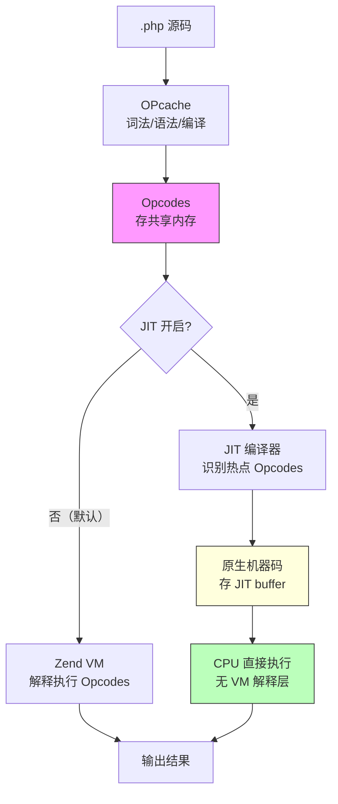

# [L3] PHP JIT 是什么？Tracing 与 Function 两种模式有何区别？

#### 一句话结论

JIT 将热点 Opcodes 编译为机器码绕过 Zend VM，CPU-bound 场景收益显著，I/O-bound 的 Web 请求提升有限。

#### 体系讲解

**JIT 在 PHP 编译链路中的位置**

OPcache 将 PHP 代码编译为 Opcodes 并缓存，Zend VM 仍然是**解释执行**这些 Opcodes。JIT 在 OPcache 之上再进一步，将频繁执行的 Opcodes 动态编译为 CPU 直接可执行的**原生机器码（native code）**，绕过 Zend VM 的解释开销。



JIT 是 OPcache 的一部分，依赖 OPcache 已开启且使用 [DynASM](https://luajit.org/dynasm.html)（LuaJIT 的动态汇编器）生成机器码（来源：[php.watch/versions/8.0/JIT](https://php.watch/versions/8.0/JIT)）。

**开启 JIT 的前提条件**

JIT 在 PHP 8.0+ 中存在但**默认关闭**。真正的开关是 `opcache.jit_buffer_size`，默认为 `0`（即禁用）：

```ini
opcache.enable=1
opcache.jit_buffer_size=128M   ; 非 0 才真正启用 JIT
opcache.jit=tracing            ; 选择模式（默认 tracing，PHP 8.4 改为 disable）
```

> ⚠️ 需查证：以下 JIT 模式参数值来源于 [php.watch/versions/8.0/JIT](https://php.watch/versions/8.0/JIT) 及 [php.net/manual/en/opcache.configuration.php](https://www.php.net/manual/en/opcache.configuration.php)。

**两种 JIT 模式**

`opcache.jit` 接受字符串别名或 4 位 CRTO 数字（来源同上）：

| 参数值 | 等价 CRTO | 编译粒度 | 触发策略 |
|---|---|---|---|
| `tracing`（PHP 8.0–8.3 默认） | `1254` | **热路径（trace）**：跟踪执行路径，只编译反复执行的代码片段 | 边执行边分析，动态识别热路径后编译 |
| `function` | `1205` | **整个函数**：以函数为单位编译 | 函数被调用达到阈值后整体编译 |

- **Tracing JIT**：更激进。分析具体的代码执行路径（trace），可以跨函数边界优化，能利用运行时类型信息做更深度的 speculative optimization。编译开销更高，但热路径性能收益更大。
- **Function JIT**：相对保守。以函数为单位，无法跨越函数边界做类型推断优化。编译开销更低，适合函数粒度规律清晰的代码。

> ⚠️ 需查证：两种模式的性能差异因代码特征不同而差异显著，以上描述为原理层面的定性对比，具体 benchmark 数字参见 [php.watch/articles/jit-in-depth](https://php.watch/articles/jit-in-depth)，本题不引用具体百分比。

**PHP 8.4 的变化**

PHP 8.4 将 `opcache.jit` 默认值从 `tracing` 改为 `disable`（来源：[php.watch/versions/8.4/opcache-jit-ini-default-changes](https://php.watch/versions/8.4/opcache-jit-ini-default-changes)）。这意味着即使设置了 `jit_buffer_size`，也需要显式将 `opcache.jit` 设为 `tracing` 或 `function` 才能生效。

**JIT 的适用场景判断**

JIT 对性能的提升取决于代码是否 **CPU-bound**：

| 场景类型 | 典型示例 | JIT 收益 |
|---|---|---|
| CPU-bound | 数学密集计算（图像处理、机器学习推理、密码学、大数据转换） | **显著**：CPU 成为瓶颈，原生机器码大幅减少执行周期数 |
| I/O-bound | 典型 PHP-FPM Web 请求（数据库查询、Redis 操作、HTTP 调用） | **有限**：大多数时间在等待 I/O，CPU 执行时间占比本就极低，JIT 优化的部分对总响应时间贡献很小 |

绝大多数 PHP Web 应用是 I/O-bound 的——一个包含 2 次 SQL + 1 次 Redis 的接口，总时间 80% 在等待外部 I/O，PHP 代码本身执行时间占比极低，JIT 只能优化这极低占比的部分。

**为何 PHP JIT 对 Web 的提升有限（与 JVM JIT 的对比）**

Java/Go 的 JIT 能做更激进的优化（内联、逃逸分析、类型特化），原因之一是静态类型系统让编译器在编译时已知类型信息。PHP 是动态类型语言，变量类型在运行时才确定，Tracing JIT 虽然利用了运行时类型观察做 speculative optimization，但当类型发生变化时需要 deoptimize，限制了优化深度。

#### 考察意图

- 考察候选人是否理解 JIT 在 PHP 编译链路中的位置，而非仅知道「JIT 让 PHP 更快」
- 验证是否能清晰说明 Tracing vs Function 两种模式的本质差异
- 考察对「CPU-bound vs I/O-bound 场景」的判断能力，避免盲目开启 JIT 以为能提升 Web 性能

#### 追问链

1. 开启 JIT 需要哪两个 ini 配置同时满足？只设置其中一个会怎样？

   简答：需要 `opcache.jit_buffer_size > 0` 且 `opcache.jit` 不为 `disable`/`off`。只设置 `jit_buffer_size` 而 `jit=disable`（PHP 8.4 新默认值）不会生效；只设置 `opcache.jit=tracing` 而 `jit_buffer_size=0`（PHP 8.0–8.3 的真实情况）也不会生效——`jit_buffer_size` 是 JIT 实际运行的内存开关。

2. 在 PHP-FPM 的典型 Web 请求场景下，为什么 JIT 对响应时间提升有限？

   简答：Web 请求的瓶颈通常在 I/O：MySQL 查询需要几毫秒到几十毫秒，Redis 操作需要几百微秒，而 PHP 代码本身的 CPU 执行时间可能只占总耗时的 5%–20%。JIT 只能优化 CPU 执行部分，再大的提升倍数作用在 5% 上，对总响应时间的绝对改善也非常有限。JIT 更适合像图像生成、数学计算等 CPU 占比超过 60% 的场景。

3. Tracing JIT 中的「speculative optimization」是什么意思？deoptimize 什么时候发生？

   简答：Tracing JIT 会观察热路径中变量的实际类型，假设后续执行类型不变（例如 `$x` 总是 `int`），据此生成更激进的机器码。若后续运行时类型不符（`$x` 突然变成 `string`），JIT 会触发 deoptimize，回退到 Zend VM 解释执行，并可能重新 profile。这是动态语言 JIT 的核心挑战，也是 PHP JIT 与 JVM JIT 存在差距的根本原因之一。

4. PHP 8.4 将 `opcache.jit` 默认值改为 `disable` 的原因是什么？

   简答：官方将此解释为「降低默认副作用」。JIT 开启后可能使某些 edge case 行为发生变化（如调试工具兼容性），对典型 Web 场景收益又有限，因此 PHP 8.4 选择保守地将默认值改为 `disable`，让开发者有意识地选择开启（来源：[php.watch/versions/8.4/opcache-jit-ini-default-changes](https://php.watch/versions/8.4/opcache-jit-ini-default-changes)）。

#### 易错点

1. **以为设置了 `opcache.jit=tracing` 就开启了 JIT**：`opcache.jit` 只是选择模式，`opcache.jit_buffer_size=0`（PHP 8.0–8.3 的默认值）才是真正的"关闭"开关。许多候选人只知道配置模式参数，不清楚 buffer size 才是 JIT 实际生效的必要条件。

2. **在 I/O-bound 的 Web 应用中期望 JIT 大幅提升 QPS**：这是最高频的误解。对于数据库操作密集的业务接口，开启 JIT 的效果通常可忽略不计，甚至因额外的内存占用（jit_buffer_size）和偶发的 deoptimize 开销有轻微副作用。应先通过 profiling 确认 CPU 是否是瓶颈，再考虑 JIT。

3. **混淆 OPcache 与 JIT 的作用层级**：OPcache 解决的是「避免重复编译」问题（编译链路级别优化）；JIT 解决的是「Opcodes 解释执行开销」问题（执行层级优化）。两者是叠加关系，JIT 必须依赖 OPcache 工作，但 OPcache 不依赖 JIT。

#### 代码示例

```ini
; php.ini — JIT 配置示例（来源：php.net/manual/en/opcache.configuration.php）

; 最小化开启（选 tracing 模式）
opcache.enable=1
opcache.jit_buffer_size=128M
opcache.jit=tracing            ; 等价于 1254，PHP 8.4 需显式设置

; 或使用 function 模式（更保守）
opcache.jit=function           ; 等价于 1205

; PHP 8.4 默认关闭，需显式开启：
; opcache.jit=disable          ; PHP 8.4 新默认值，不会编译任何代码
```

```php
<?php
// 判断 JIT 是否实际运行
$status = opcache_get_status();
$jit = $status['jit'] ?? null;

if ($jit) {
    echo "JIT 启用: " . ($jit['enabled'] ? '是' : '否') . "\n";
    echo "JIT Buffer 大小: " . round($jit['buffer_size'] / 1024 / 1024) . " MB\n";
    echo "JIT Buffer 已用: " . round($jit['buffer_used'] / 1024 / 1024, 1) . " MB\n";
} else {
    echo "JIT 未启用或 PHP < 8.0\n";
}
```
