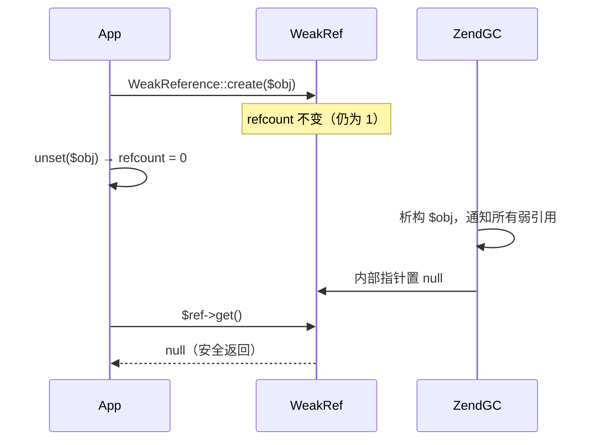

# [L3] WeakReference 与 WeakMap 如何避免引用计数陷阱？

#### 一句话结论

弱引用不增加 refcount，持有对象但不阻止 GC 回收，是解决"容器持有导致对象无法析构"这类隐性内存泄漏的标准工具。

#### 体系讲解

**原理层：强引用持有的陷阱**

PHP 对象生命周期由 zval 的 `refcount` 字段控制：每次赋值/传参 +1，超出作用域 -1，降为 0 时立即析构。只要有一个强引用存在，对象就不会被回收：

```php
$a = new Listener(); // refcount = 1
$emitter->attach($a); // refcount = 2（emitter 持有强引用）
unset($a);            // refcount = 1 → 对象仍存活！
// $a 早已"用完"，但因 emitter 持有，永远无法被 GC
```

这在 EventEmitter、IoC 容器、缓存层等长生命周期组件中极易出现，是 PHP 长期运行（CLI/Swoole）场景内存持续增长的常见根因。

**机制层：WeakReference 如何绕过 refcount**

`WeakReference::create($obj)`（PHP 7.4+）在引擎层面**不增加目标对象的 refcount**。
来源：[PHP 官方文档](https://www.php.net/manual/en/class.weakreference.php)原文：*"creating weak references does not increase the refcount of the object being referenced"*。

当对象的 refcount 降为 0 被析构时，引擎负责将所有指向它的弱引用内部指针置为 `null`。调用 `$ref->get()` 时：

- 对象仍存活 → 返回对象
- 对象已被回收 → 返回 `null`

这让持有方能"感知存亡"，却不会"阻止消亡"。

**WeakMap（PHP 8.0+）**

WeakMap 是以**对象为 key 的弱引用哈希表**：key 不增加 refcount，key 对象被 GC 时对应键值对**自动删除**，无需手动清理。

> 来源：[PHP RFC: Weak Maps](https://wiki.php.net/rfc/weak_maps)

注意：WeakMap 的自动清理能力依赖引擎内置的析构回调机制，**无法**用 `WeakReference` + `spl_object_id` 组合等价实现（原因见易错点 2）。

四种持有方式对比：

| 方式 | 对 key/value 的 refcount 影响 | key 对象回收后 | 典型场景 |
|---|---|---|---|
| 普通数组（`spl_object_id` 为 key） | value 为对象时 +1 | 键值对残留，ID 可被复用 | 对象生命周期与容器完全绑定 |
| `SplObjectStorage` | key +1 | 键值对残留，需手动 `detach` | 需遍历全部对象时 |
| `WeakReference` | 0（单对象弱持有） | `get()` 返回 null | 可选持有单个对象，感知其存亡 |
| `WeakMap` | 0（key 为弱引用） | 条目自动删除 | 对象元数据缓存、memoization |

**结论层：选型决策树**

```
需要"可选持有单个对象，感知其存亡"
  └─ WeakReference（PHP 7.4+）

需要"以对象为 key 存储附加数据，对象销毁时自动清理"
  └─ WeakMap（PHP 8.0+）

需要"持有对象并阻止其被回收"
  └─ 强引用（普通变量赋值）
```

典型应用场景：
- **框架 EventEmitter**：用 WeakReference 存储 listener，listener 的生命周期完全由业务侧控制
- **ORM hydration 缓存**：用 WeakMap 存储实体的 hydration 元数据，实体销毁时元数据自动清理
- **memoization**：对昂贵计算结果按对象缓存，不阻止对象回收



#### 考察意图

验证候选人是否真正理解 PHP 内存模型（refcount 机制），而非仅停留在 API 用法层面；同时考察是否具备识别"强引用持有导致内存泄漏"的实战经验，以及在框架/库设计中做出正确引用选型的能力。

#### 追问链

1. **WeakReference 和直接保存 `spl_object_id()` 作为键有什么区别？**

   `spl_object_id()` 返回整数，对象回收后 ID **可被新对象复用**，旧键值对不会自动清理，再次使用时可能指向错误对象；WeakReference 由引擎保证安全置 null，不存在 ID 复用问题，`get()` 结果始终可信。

2. **WeakMap 的 key 为什么只能是对象，不能是标量？**

   弱引用语义依赖对象的"身份标识"（内存地址/引用计数），标量是值语义、按内容比较，没有"唯一存活实例"的概念，无法建立弱引用关系，引擎层面没有对标量的析构通知机制。

3. **观察者模式中 listener 用强引用存储会有什么后果？如何用 WeakReference 修复？**

   EventEmitter 持有 listener 的强引用，业务代码 `unset($listener)` 后对象仍因 emitter 而存活，造成内存泄漏。改用 WeakReference 后，listener 的生命周期完全由业务控制，emitter 调用前做 `$ref->get() !== null` 检查即可自动跳过已销毁的 listener。

4. **WeakMap 在迭代过程中某个 key 对象被 GC，会发生什么？**

   PHP 会跳过该条目，不抛出异常。但这意味着迭代结果可能与预期不一致，对 WeakMap 有强一致性迭代需求的场景需额外注意。

5. **WeakReference 在循环引用场景下能替代 GC 的循环检测算法吗？**

   不能。WeakReference 只解决"外部容器强持有"问题；循环引用（A 强引用 B，B 强引用 A）中两者 refcount 都不为 0，GC 的标记清除算法依然必要。WeakReference 可辅助**主动打破**部分循环（将其中一条边改为弱引用），但这需要在设计阶段有意识地介入，不是自动的。

#### 易错点

1. **误以为 WeakReference 能防止对象析构**：语义恰好相反——它不阻止析构。`$ref->get()` 返回 `null` 是正常结果，使用前**必须**做 null 检查，否则会抛出 `Call to a member function on null`。

2. **用 `spl_object_id` + `WeakReference` 组合替代 WeakMap**：这种组合只能避免 ID 复用问题，但**无法自动清理**旧条目——数据在对象销毁后仍残留于数组，仅在下次访问同 ID 时才被淘汰，长期运行下依然产生内存泄漏，且实现复杂度远高于直接使用 WeakMap。

3. **在 PHP 8.0 以下项目中使用 WeakMap**：WeakMap 要求 PHP 8.0+，WeakReference 要求 PHP 7.4+。在跨版本项目中未做运行时版本检查，直接使用会导致 `Class "WeakMap" not found` 错误。

#### 代码示例

```php
<?php
// 演示 1：WeakReference 基本行为
$obj = new stdClass();
$obj->name = 'demo';
$ref = WeakReference::create($obj);

var_dump($ref->get()); // object(stdClass)#1
unset($obj);           // refcount → 0，立即析构
var_dump($ref->get()); // NULL

// 演示 2：WeakMap 作为对象元数据缓存（PHP 8.0+）
$map = new WeakMap();

$user = new stdClass();
$map[$user] = ['hydrated_at' => time(), 'dirty' => false];

echo count($map); // 1

unset($user);     // $user 析构，WeakMap 自动清理对应条目
echo count($map); // 0 ← 无需手动 unset

// 演示 3：EventEmitter 用 WeakReference 避免强引用泄漏
class WeakEmitter
{
    /** @var WeakReference[] */
    private array $listeners = [];

    public function on(object $listener): void
    {
        $this->listeners[] = WeakReference::create($listener);
    }

    public function emit(string $event): void
    {
        foreach ($this->listeners as $ref) {
            $listener = $ref->get();
            if ($listener !== null) {
                $listener->handle($event);
            }
            // $listener 已被业务 unset → get() 返回 null，自动跳过
        }
    }
}
```
