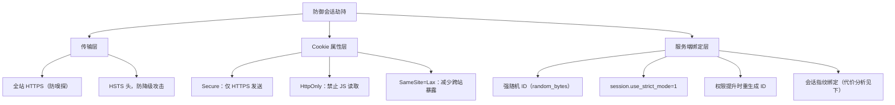

# [L2] Session 劫持攻击向量与防护

#### 一句话结论

> 会话劫持通过网络嗅探、XSS 或 Session ID 预测窃取合法会话；防御需覆盖传输层（HTTPS）、Cookie 属性与服务端会话绑定三个层次。

---

#### 体系讲解

**1. 攻击向量分类**

| 攻击向量 | 原理 | 前提条件 |
|---|---|---|
| **网络嗅探** | 抓取明文 HTTP 流量中的 Cookie 头 | 同局域网 / 开放 WiFi / HTTP（非 HTTPS） |
| **XSS 窃取** | JS 读取 `document.cookie` 并外传 | 站点存在 XSS 漏洞 + Cookie 未设 HttpOnly |
| **Session ID 预测** | 利用弱随机数生成器推算合法 ID | 服务端使用低熵随机数（如 `rand()`） |
| **跨子域 Cookie 泄露** | 读取宽 Domain Cookie | Cookie Domain 设置为 `.example.com`，子域存在漏洞 |
| **URL 中的 Session ID** | 日志/Referer 头泄露 ID | 服务端接受 URL 传参形式的 Session ID |

**2. 防御层次**



**3. 服务端会话绑定的代价权衡**

服务端可在 Session 中存储客户端指纹，每次请求校验一致性：

| 绑定维度 | 防御效果 | 代价与副作用 |
|---|---|---|
| **IP 地址绑定** | 防止异网段劫持 | 移动网络 NAT 切换、企业代理、CDN 后用户 IP 频繁变化，易导致正常用户掉线 |
| **User-Agent 绑定** | 增加一定指纹熵 | 浏览器静默升级后 UA 变化，导致用户被强制登出；攻击者可伪造 UA |
| **自定义 Token（双重 Cookie）** | 配合 HttpOnly Cookie 实现无状态验证 | 需前端配合在请求头传递；XSS 若能操控请求头则失效 |

> 实际工程中很少单独使用 IP 绑定；通常以"异常 IP 变化触发重认证"（允许小幅变化）替代硬绑定，平衡安全与体验。

**4. Session ID 强度要求**

PHP 默认使用 CSPRNG 生成 Session ID，安全性足够，但需确认：

- `session.entropy_length`（旧版 PHP < 7.1）是否足够长
- PHP 7.1+ 默认使用 `random_bytes()` 级别的随机性，`session.sid_length` 默认 26（建议 32+）
- 禁止开发代码中出现 `session_id(md5(time()))` 等低熵写法

**5. 与会话固定的区别**

| 维度 | 会话固定（Session Fixation） | 会话劫持（Session Hijacking） |
|---|---|---|
| 攻击时机 | 认证**之前** | 认证**之后** |
| 攻击者行为 | 主动植入已知 ID | 被动获取合法 ID |
| 核心防御 | 登录后重生成 Session ID | 阻止 ID 通过各渠道泄露 |

---

#### 考察意图

考察候选人能否从传输层、Cookie 属性层、服务端机制三个维度系统描述防御方案，以及是否了解 IP/UA 绑定等方案的代价与局限，避免给出不加权衡的"一律绑定 IP"结论。

---

#### 追问链

1. **全站启用 HTTPS 后还需要担心 Session 劫持吗？**  
   仍需担心。HTTPS 解决了网络嗅探，但 XSS 注入可在浏览器本地窃取 Cookie（与传输层无关）；Session ID 预测与 URL 泄露也与 HTTPS 无关。防御需多层叠加，HTTPS 只是必要条件而非充分条件。

2. **`session.use_strict_mode` 如何减轻劫持风险？**  
   开启后，服务端收到一个本地记录中不存在的 Session ID 时，会拒绝并重新生成合法 ID 返回给客户端。这阻止了攻击者通过暴力猜测或构造 Session ID 来创建一个服务端认可的会话，降低预测攻击的成功率。

3. **如何在不影响用户体验的前提下检测会话异常？**  
   不采用硬绑定，而是记录 Session 创建时的 IP 段（/24）和 UA 摘要，每次请求计算"漂移分"：IP 跨网段 +2 分，UA 变化 +3 分，累计超过阈值则要求重新认证（而非立即失效）。同时结合登录时间、地理位置异常检测，触发邮件/短信二次验证而非静默拒绝。

---

#### 易错点

1. **认为绑定 IP 是标准做法**：IP 绑定在移动网络（NAT 频繁变化）、企业代理场景下会造成大量误伤，导致用户频繁掉线。工程上更常见的是"异常 IP 触发重认证"而非硬绑定。

2. **认为 HTTPS 已经足够，忽略 Cookie 属性**：未设 `HttpOnly` 时，XSS 仍可在 HTTPS 环境下读取并外传 Session Cookie；未设 `Secure` 时，同站点的 HTTP 子页面仍会明文发送 Cookie。

3. **在 URL 中传递 Session ID**：`session.use_only_cookies = 0`（默认）时，PHP 会在 URL 中透传 `PHPSESSID`，导致 Session ID 出现在浏览器历史记录、服务端日志、Referer 头中，大幅扩展泄露面。应设 `session.use_only_cookies = 1`。

---

#### 代码示例

```php
<?php
// php.ini 推荐配置
// session.use_only_cookies   = 1  // 禁止 URL 中传 Session ID
// session.use_strict_mode    = 1  // 拒绝服务端未记录的 Session ID
// session.cookie_httponly    = 1
// session.cookie_secure      = 1
// session.cookie_samesite    = Lax
// session.sid_length         = 48 // 提高 Session ID 熵值

session_start();

// 权限提升（登录/sudo 操作）后重生成 Session ID
function elevateSession(): void
{
    $data = $_SESSION;            // 保存当前 Session 数据
    session_regenerate_id(true);  // 生成新 ID，删除旧文件
    $_SESSION = $data;            // 将原数据迁移到新 Session
    $_SESSION['elevated_at'] = time();
}

// 简单会话指纹校验（非硬绑定，仅检测 UA 大版本变化）
function validateSessionFingerprint(): bool
{
    $currentUA = substr($_SERVER['HTTP_USER_AGENT'] ?? '', 0, 100);
    if (!isset($_SESSION['_fp_ua'])) {
        $_SESSION['_fp_ua'] = $currentUA;
        return true;
    }
    return $_SESSION['_fp_ua'] === $currentUA;
}
```
