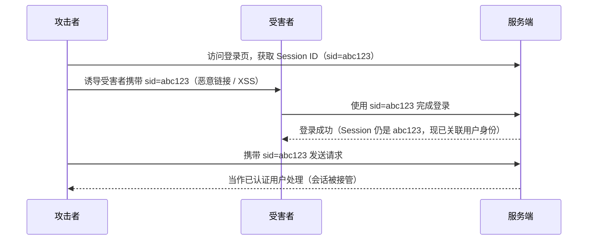

# [L2] Session 固定攻击与防御

#### 一句话结论

> 攻击者预先植入已知 Session ID，待受害者登录后接管会话；登录成功后立即调用 `session_regenerate_id(true)` 是核心防御。

---

#### 体系讲解

**1. 攻击原理**

会话固定（Session Fixation）不同于会话劫持——攻击者不需要"偷"走会话 ID，而是在认证发生**之前**将一个已知 ID"送"给受害者，再等待该 ID 被提升为已认证会话。



关键漏洞：服务端在用户认证成功后**没有**更换 Session ID，导致攻击者预先知道的 ID 升级为合法身份凭证。

**2. 攻击者植入 Session ID 的常见手段**

| 手段 | 说明 | 依赖条件 |
|---|---|---|
| URL 参数 | `https://example.com/login?PHPSESSID=abc123` | 服务端接受 URL 中的 Session ID |
| XSS 注入 | 通过脚本设置 `document.cookie` | 站点存在 XSS 漏洞 |
| 子域 Cookie 写入 | 攻击者控制 `evil.example.com`，写入 `.example.com` 域 Cookie | Cookie Domain 设置过宽 |

**3. 防御机制**

| 防御措施 | 说明 |
|---|---|
| **登录后重生成 Session ID** | `session_regenerate_id(true)` 生成新 ID 并删除旧 Session 文件（`true` 参数不可省略） |
| **禁止 URL 传递 Session ID** | `session.use_only_cookies = 1`，服务端拒绝接受 `GET/POST` 中的 Session ID |
| **禁止客户端指定 Session ID** | `session.use_strict_mode = 1`，服务端拒绝不在服务端记录中的 Session ID |
| **Cookie 安全属性** | `HttpOnly` + `Secure` 减少 XSS 或明文传输带来的 Cookie 操控风险 |

> `session.use_strict_mode` 是根本性防御：服务端只承认自己颁发的 Session ID，攻击者伪造的 ID 无法被激活。PHP 7.1+ 默认关闭，需显式启用。

---

#### 考察意图

考察候选人是否能区分会话固定（预植入已知 ID）与会话劫持（窃取已有 ID）的本质差异，以及是否理解 `session_regenerate_id(true)` 的 `true` 参数和 `use_strict_mode` 的必要性。

---

#### 追问链

1. **`session_regenerate_id()` 和 `session_regenerate_id(true)` 有什么区别？**  
   不带参数（或 `false`）只更换 Session ID，旧 Session 数据文件仍保留在服务器上，攻击者在短时间窗口内仍可使用旧 ID 访问。`true` 参数会同时**删除旧 Session 文件**，彻底切断旧 ID 的可用性。

2. **`session.use_strict_mode` 能单独防御会话固定吗？**  
   能应对大多数场景。开启后，服务端收到一个在服务端记录中不存在的 Session ID 时，会拒绝并重新生成新 ID，攻击者预植入的 ID 永远不会被服务端"激活"。但仍需配合 `use_only_cookies` 防止 URL 传入，两者互补。

3. **子域写入 Cookie 场景下如何防御？**  
   将 Session Cookie 的 `Domain` 设置为精确域名（如 `example.com`）而非通配符（`.example.com`），并收紧子域信任边界。同时开启 `__Host-` Cookie 前缀（需 HTTPS + Path=/），浏览器会强制忽略来自子域的同名 Cookie 覆盖。

---

#### 易错点

1. **`session_regenerate_id()` 调用时机错误**：应在**认证成功后、Session 数据写入前**立即调用。若在写入用户信息后才调用，新旧 Session 之间存在数据不一致窗口。

2. **省略 `true` 参数**：`session_regenerate_id()` 默认不删除旧 Session 文件，在高并发场景下旧 ID 在一定时间内仍有效，给攻击留下时间窗口。

3. **混淆会话固定与会话劫持**：会话固定是攻击者**主动植入**已知 ID，然后等待提权；会话劫持是攻击者**被动获取**已认证的 ID。两者防御重点不同：固定攻击靠"登录后换 ID"，劫持靠"阻断 ID 泄露路径"。

---

#### 代码示例

```php
<?php
// php.ini 推荐配置（或 ini_set 在代码中设置）
// session.use_only_cookies = 1   // 拒绝 URL 中的 Session ID
// session.use_strict_mode = 1    // 拒绝服务端未记录的 Session ID
// session.cookie_httponly = 1
// session.cookie_secure = 1

session_start();

function login(string $username, string $password): bool
{
    if (!validateCredentials($username, $password)) {
        return false;
    }

    // 认证成功后立即重生成 Session ID，true = 删除旧 Session 文件
    session_regenerate_id(true);

    $_SESSION['user_id']      = getUserId($username);
    $_SESSION['authenticated'] = true;
    $_SESSION['login_at']     = time();

    return true;
}
```
