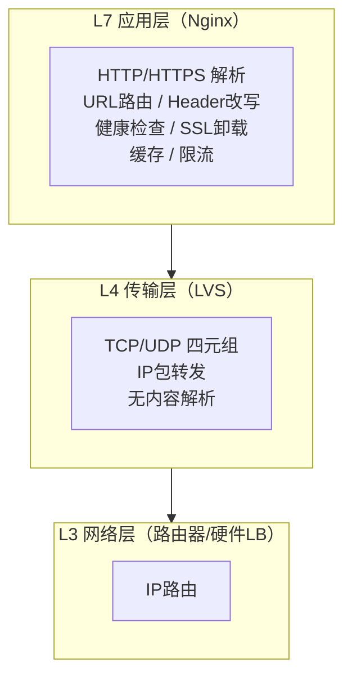
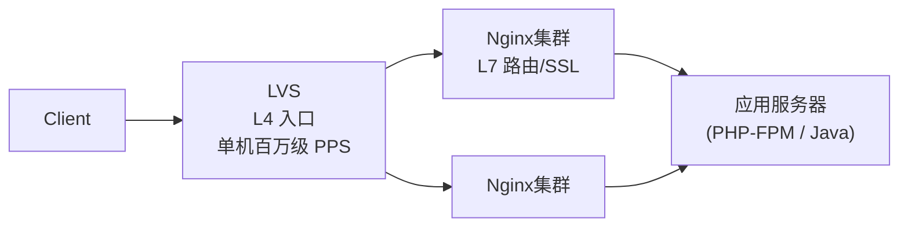

# [L3] LVS 与 Nginx 负载均衡的层级差异与选型依据

#### 一句话结论

LVS 工作在 L4（传输层），仅转发 IP 包不解析内容，性能极高但无法感知 HTTP 语义；Nginx 工作在 L7（应用层），能路由、改写、缓存，但每连接需全量协议栈处理。

#### 体系讲解

**OSI 层级对应**



**LVS 三种转发模式原理**

| 模式 | 原理 | 优点 | 缺点 |
|---|---|---|---|
| NAT | Director 修改目标 IP，响应经 Director 返回 | 后端无需特殊配置 | Director 是响应瓶颈 |
| DR（Direct Routing）| 修改目的 MAC 地址，响应直接从 RS 返回客户端 | Director 仅处理请求包，带宽压力小 | 同一二层网络，RS 需配置 VIP |
| TUN（IP Tunneling）| 在原 IP 包外再封装一层 IP 头 | 跨三层网络 | RS 需支持 IP 隧道解封 |

生产最常用 **DR 模式**：Director 只改写以太网帧的目标 MAC，RS 直接将响应发给客户端，Director 不经手响应流量，吞吐量约等于网卡线速。

**LVS 调度算法**

| 算法 | 适用场景 |
|---|---|
| rr（Round Robin）| 后端性能均等 |
| wrr（Weighted RR）| 异构后端 |
| lc（Least Connection）| 长连接场景 |
| sh（Source Hash）| 需会话保持（Session Sticky）|

**Nginx L7 能力增量**

Nginx 在 L4 之上提供 L7 路由能力，代价是每个连接需完整经历 TCP 握手 → HTTP 解析 → upstream 转发 → 响应回传，但换来：

- 基于 URL/Header/Cookie 的细粒度路由
- SSL/TLS 终止（后端只需 HTTP）
- 请求级健康检查（通过 HTTP 状态码判断，而非 TCP 连通性）
- 缓存（`proxy_cache`）、限流（`limit_req`）、压缩（`gzip`）

**典型架构分层**



LVS 在最前端做 L4 分流，Nginx 集群做 L7 处理，LVS 自身无状态且工作在内核模块（`ipvs`），理论转发能力远高于 Nginx。

**性能对比维度**

| 维度 | LVS（DR 模式）| Nginx（反代）|
|---|---|---|
| 工作位置 | Linux 内核 netfilter/ipvs | 用户态进程 |
| 连接感知 | 四元组（src IP:Port → dst IP:Port）| 完整 HTTP 请求 |
| SSL 处理 | ❌ 不支持（仅转发密文）| ✅ 支持终止 |
| 内容路由 | ❌ | ✅ |
| 单机连接处理能力 | 极高（内核路径短）| 高（用户态，有上下文切换）|
| 后端健康检查粒度 | TCP 连通性 | HTTP 状态码级别 |

#### 考察意图

考察候选人能否从网络模型层级（L4 vs L7）出发，解释两者性能差异的根因（内核路径 vs 用户态协议栈），以及在实际架构中如何分层组合，而非简单描述"LVS 更快"。

#### 追问链

**Q1：为何 LVS DR 模式中 Director 不处理响应流量，而 NAT 模式需要？**
> DR 模式只修改目标 MAC 地址，RS 收到包后发现目标 MAC 是自己（同时在 lo 上配置了 VIP），处理完直接用自己的真实 IP 回包给客户端。NAT 模式中目标 IP 是 Director 的 VIP，RS 响应必须经 Director 做 DNAT 反向转换（将源 IP 改回 VIP），Director 因此承担全部出站流量。

**Q2：LVS 如何实现会话保持（Session Sticky）？与 Nginx 的 ip_hash 有何本质区别？**
> LVS 通过 `sh`（Source Hash）算法将同一源 IP 固定映射到同一 RS；Nginx `ip_hash` 也是源 IP 哈希，但发生在 L7，Nginx 已完整解析 HTTP 请求。两者效果类似，但 Nginx 还可用 `sticky cookie` 基于 HTTP Cookie 做更精细的会话绑定，LVS 无法感知 Cookie。

**Q3：什么场景下应该绕过 LVS 直接用 Nginx 做入口？**
> 小规模场景（峰值 QPS < 5 万，单台 Nginx 足够）、需要 SSL 卸载/URL 路由/限流/缓存等 L7 功能时，直接用 Nginx 即可，引入 LVS 徒增运维复杂度。LVS 价值在于：单台 Nginx 成为瓶颈、需要对 Nginx 集群本身做高可用（LVS+Keepalived），或需要跨机房四层分流时。

**Q4：Nginx stream 模块与 LVS 在 L4 代理上有何差异？**
> `nginx stream` 模块让 Nginx 具备 TCP/UDP 四层代理能力，但仍运行在用户态，每个连接需经历进程调度；LVS ipvs 运行在内核 netfilter 框架中，包转发路径极短。高流量 L4 转发场景下 LVS 吞吐量仍远高于 Nginx stream，但 Nginx stream 配置更简单，适合中小规模或需要 SNI 分流的场景。

#### 易错点

1. **混淆"LVS 性能更高"的根因**：LVS 快的本质是工作在内核态、路径短（不解析内容），而非"硬件更好"；理解这一点才能解释为何 Nginx stream 做 L4 代理性能仍低于 LVS。
2. **忽略 LVS DR 模式对网络拓扑的要求**：DR 模式要求 Director 与 RS 在同一二层网络（同 VLAN/子网），跨路由器无法使用，此时只能选 TUN 或 NAT 模式。
3. **认为 LVS 和 Nginx 二选一**：实际生产多为分层组合——LVS 做 L4 入口高可用，Nginx 集群做 L7 处理；两者并非竞争关系。

#### 代码示例

```bash
# LVS DR 模式配置示例（ipvsadm 命令）
# Director 上：创建虚拟服务，添加真实服务器
ipvsadm -A -t 10.0.0.100:80 -s rr           # 创建 VIP:Port，轮询调度
ipvsadm -a -t 10.0.0.100:80 -r 10.0.0.1:80 -g  # 添加 RS，-g = DR 模式
ipvsadm -a -t 10.0.0.100:80 -r 10.0.0.2:80 -g

# RS 上：在 lo 配置 VIP（抑制 ARP 广播）
ip addr add 10.0.0.100/32 dev lo
echo 1 > /proc/sys/net/ipv4/conf/lo/arp_ignore
echo 2 > /proc/sys/net/ipv4/conf/lo/arp_announce
```

```nginx
# Nginx L7 反代：URL 路由分流
upstream api_backend {
    server 10.0.0.1:8080;
    server 10.0.0.2:8080;
}
upstream static_backend {
    server 10.0.0.3:8080;
}

server {
    listen 80;
    location /api/ {
        proxy_pass http://api_backend;
    }
    location /static/ {
        proxy_pass http://static_backend;
    }
}
```
