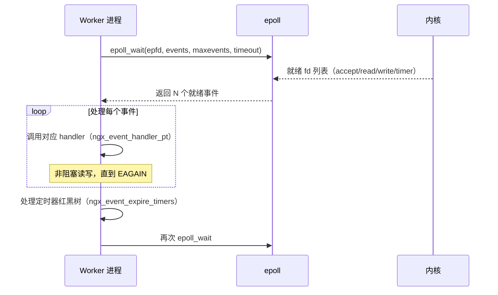

# [L3] Nginx 的 event-driven 模型与 epoll 多路复用原理

#### 一句话结论

Nginx 以单线程事件循环 + epoll ET 模式驱动海量并发，避免了线程上下文切换开销。

#### 体系讲解

**IO 多路复用演进**

传统 `select`/`poll` 每次调用都需将整个 fd 集合从用户态复制到内核态，并以 O(n) 扫描就绪 fd，随连接数增大性能急剧下降。Linux 2.5.44 引入的 `epoll` 通过以下三个系统调用解决这一问题：

| 调用 | 作用 |
|---|---|
| `epoll_create` | 在内核创建 eventpoll 对象，返回 epfd |
| `epoll_ctl` | 将 fd + 感兴趣事件注册/修改/删除到红黑树 |
| `epoll_wait` | 阻塞等待，内核将就绪 fd 写入预分配的就绪链表后返回 |

内核只需在 fd 就绪时通过回调将其加入就绪链表，`epoll_wait` 的复杂度降为 O(就绪数) 而非 O(总连接数)。

**LT 与 ET 模式对比**

| 模式 | 触发时机 | 未读完数据时 | 适用场景 |
|---|---|---|---|
| LT（水平触发）| fd 可读/可写时持续通知 | 下次 `epoll_wait` 继续返回该 fd | 编程简单，select/poll 默认语义 |
| ET（边缘触发）| fd 状态**变化**时仅通知一次 | 不再通知，须循环读至 EAGAIN | 减少系统调用次数，Nginx 默认使用 |

Nginx 在 ET 模式下，每次事件触发后必须循环调用 `recv`/`send` 直到返回 `EAGAIN`，否则数据会滞留在内核缓冲区中造成连接"假死"。

**Nginx 事件循环主流程**



**关键数据结构**

- `ngx_cycle_t`：全局上下文，持有 epfd 与连接池 `connections`
- `ngx_connection_t`：每连接对象，含 read/write `ngx_event_t`
- `ngx_event_t.handler`：函数指针，事件就绪时回调

Worker 进程启动后调用 `ngx_process_events_and_timers`，在单线程内交替处理网络事件与定时器，无锁、无线程切换，CPU 亲和性极佳。

**为何比多线程模型高效**

- 线程栈默认 8 MB，万连接需 80 GB 内存；Nginx 连接对象约 232 字节，万连接仅约 2.3 MB（⚠️ 需查证：具体字节数依版本/配置而变化）
- 无锁竞争：每个 Worker 独立持有 epfd，仅 accept 争抢通过 `accept_mutex` 串行化

#### 考察意图

考察候选人对 Nginx 高并发根因的理解深度——能否从 IO 模型层面（epoll 内核数据结构、LT/ET 语义）解释"为何 Nginx 用少量进程撑起数万并发"，而非停留在"异步非阻塞"的口号层面。

#### 追问链

**Q1：epoll 为何比 select 更适合高并发？**
> select 使用 bitmap 存储 fd 集合，上限 1024（FD_SETSIZE），每次调用需全量拷贝到内核并 O(n) 扫描；epoll 用红黑树维护注册 fd，就绪链表仅包含活跃 fd，且无需重复注册，复杂度 O(就绪数)。

**Q2：Nginx 使用 ET 模式，若 recv 未循环读完会发生什么？**
> ET 模式下状态变化仅触发一次事件，未读完的数据留在内核 socket 缓冲区，epoll_wait 不再通知该 fd。客户端等待响应而 Nginx 等待下一次事件，形成死锁。因此 Nginx 必须在事件处理中循环读写至 EAGAIN。

**Q3：多个 Worker 同时监听同一 epfd 会有 accept 惊群问题吗？Nginx 如何解决？**
> Linux 3.9 前，epoll 存在惊群：一个连接到来时多个 Worker 的 epoll_wait 同时返回，但只有一个成功 accept，其余徒劳唤醒。Nginx 通过 `accept_mutex`（进程级互斥锁）在同一时刻只让一个 Worker 将 listen fd 加入自己的 epfd，从而串行化 accept。Linux 3.9+ 的 `SO_REUSEPORT` 允许多个 socket 绑定同一端口，内核负载均衡分发，可彻底消除惊群，Nginx 1.9.1 起支持 `reuseport` 指令。

**Q4：epoll 在 NUMA 架构下有什么额外优化空间？**
> epoll_wait 返回的就绪 fd 所属内存页可能跨 NUMA 节点，结合 `worker_cpu_affinity` 将 Worker 绑定到特定 CPU 核，减少跨节点内存访问延迟；同时配合 `SO_REUSEPORT` 使每个 Worker 只处理本 NUMA 节点网卡中断，降低跨节点流量。

#### 易错点

1. **混淆 LT/ET 触发语义**：误以为 ET 会在数据未读完时继续通知，实际上 ET 只在状态**变化边沿**触发一次，必须循环读至 EAGAIN。
2. **误认为 Nginx 完全无锁**：Worker 间争抢 accept 时需要 `accept_mutex`，并非全程无锁；`SO_REUSEPORT` 模式下才真正消除 accept 级别的竞争。
3. **将 epoll 与异步 IO（AIO）混淆**：epoll 是 IO **就绪**通知机制，数据仍需应用层调用 read/recv 拷贝；真正的异步 IO（如 `io_uring`）由内核完成拷贝后再通知，两者语义不同。

#### 代码示例

以下 Nginx 配置片段展示 epoll 与 reuseport 的启用方式：

```nginx
# nginx.conf
events {
    use epoll;            # 显式指定 epoll（Linux 默认已选择，此处为演示）
    worker_connections 10240;
    multi_accept on;      # 单次 epoll_wait 返回后尽量批量 accept
}

http {
    server {
        # Linux 3.9+：SO_REUSEPORT，每个 Worker 独立 listen fd
        listen 80 reuseport;
    }
}
```

```nginx
# 绑定 CPU 亲和性，4 核示例
worker_processes 4;
worker_cpu_affinity 0001 0010 0100 1000;
```
