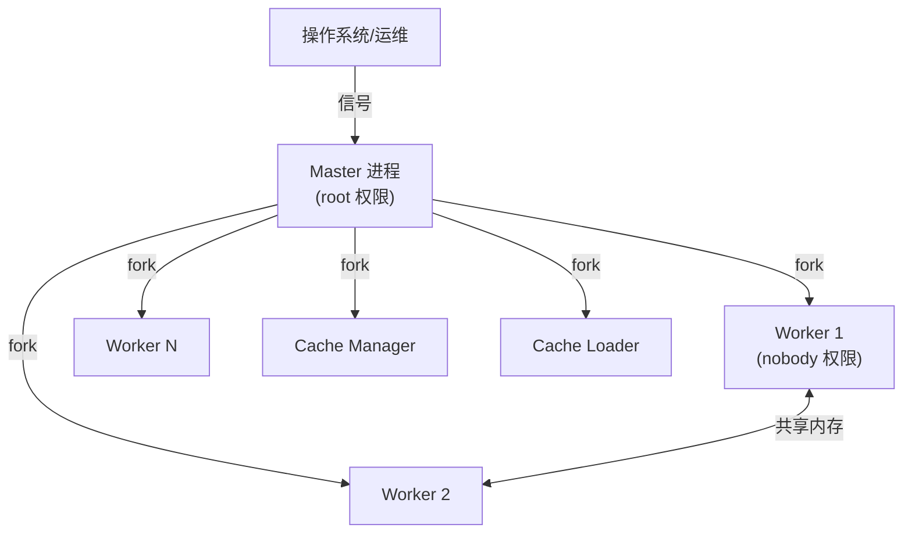
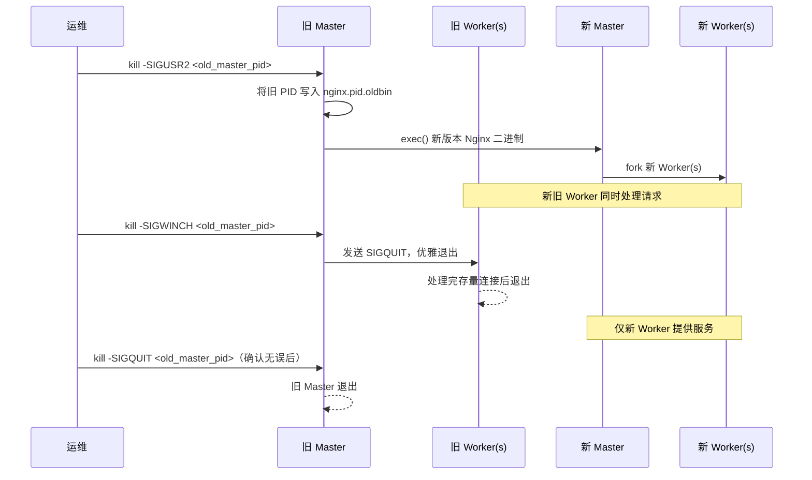

# [L3] Nginx master/worker 进程架构与信号处理机制

#### 一句话结论

Master 管理生命周期与信号路由，Worker 独立处理请求，信号驱动热升级实现零停机部署。

#### 体系讲解

**进程角色分工**



| 进程 | 职责 | 权限 |
|---|---|---|
| Master | 解析配置、绑定端口、fork/管理子进程、响应信号 | root（需 <1024 端口时）|
| Worker | 独立事件循环处理网络连接，互不共享 fd 状态 | 降权至 `worker_user` |
| Cache Manager | 管理磁盘缓存过期淘汰 | 降权 |
| Cache Loader | 启动时将磁盘缓存元数据加载到共享内存 | 降权 |

Master 进程不处理任何请求，职责单一：监控子进程退出（`waitpid`）、传递信号、读取配置。

**核心信号语义**

| 信号 | 对 Master 的作用 | 对 Worker 的作用 |
|---|---|---|
| `SIGHUP` | 重载配置（fork 新 Worker，旧 Worker 优雅退出） | - |
| `SIGQUIT` | 优雅关闭（等待当前连接处理完） | 同左 |
| `SIGTERM` | 快速关闭 | 立即退出 |
| `SIGUSR1` | 重新打开日志文件（日志切割） | - |
| `SIGUSR2` | 启动新 Master 进程（热升级 Step 1） | - |
| `SIGWINCH` | 让旧 Worker 优雅退出（热升级 Step 2） | - |

**热升级（Zero-downtime Upgrade）流程**



关键细节：
- `SIGUSR2` 触发后，旧 Master 调用 `execve` 加载新二进制，但**继承了所有已打开的 fd**（包括 listen socket），因此新旧 Worker 可同时 accept 请求。
- 旧 Master 的 PID 文件被重命名为 `nginx.pid.oldbin`，新 Master 写入 `nginx.pid`，运维可随时回滚（向旧 Master 发 `SIGHUP` 重新 fork 旧版 Worker）。

**Worker 崩溃恢复**

Master 通过 `waitpid(-1, WNOHANG)` 非阻塞轮询子进程退出状态；Worker 异常退出（非 `SIGQUIT`）时，Master 自动 fork 新 Worker 替补，保持 `worker_processes` 数量恒定。

#### 考察意图

考察候选人对 Nginx 生产运维核心机制的理解——能否解释"不停机发布"背后的信号序列与 fd 继承原理，以及 Master 职责单一设计对可靠性的意义。

#### 追问链

**Q1：`nginx -s reload` 与直接 `kill -SIGHUP` 有何区别？**
> `nginx -s reload` 本质是读取 `nginx.pid` 获取 Master PID，然后发送 `SIGHUP`，两者效果完全相同。`-s` 是便捷封装，避免手动查找 PID。

**Q2：热升级过程中若新版本配置有误导致新 Master 启动失败，如何回滚？**
> 旧 Master 仍在运行（PID 记录在 `nginx.pid.oldbin`），向旧 Master 发送 `SIGHUP` 让其重新 fork 旧版 Worker；同时发送 `SIGTERM`/`SIGQUIT` 关闭已启动的新 Master 即可完成回滚。这也是热升级"可逆"的核心保障。

**Q3：`worker_processes auto` 如何确定进程数？与 CPU 绑定有何关系？**
> `auto` 模式下 Nginx 调用 `sysconf(_SC_NPROCESSORS_ONLN)` 获取在线 CPU 核数，将 Worker 数设为等量。配合 `worker_cpu_affinity auto` 可让每个 Worker 绑定到对应核，减少调度器迁移带来的 cache miss，提升 L1/L2 缓存命中率。

**Q4：Worker 进程间如何共享数据（如限流计数器）？**
> Worker 间不共享进程地址空间，通过 `ngx_slab_pool_t` 管理的**共享内存区**（`zone`）交换数据。`limit_req_zone`、`limit_conn_zone` 等指令会在共享内存中维护红黑树或哈希表，访问时使用自旋锁（`ngx_shmtx_t`）保证原子性。

#### 易错点

1. **误认为 Master 处理请求**：Master 仅做进程管理，所有网络 IO 均由 Worker 完成；混淆后会错误估算 `worker_processes` 对性能的影响。
2. **误解 `SIGQUIT` 与 `SIGTERM` 的区别**：`SIGQUIT` 是优雅退出（等待连接关闭），`SIGTERM` 是立即终止；热升级中用 `SIGWINCH` 让旧 Worker 优雅退出而非 `SIGTERM`，否则会中断存量请求。
3. **忽略 fd 继承是热升级的核心**：热升级能做到"无缝"的根本原因是 `execve` 后 listen socket fd 被新进程继承，新旧进程短暂共享端口，而非通过某种"请求迁移"机制。

#### 代码示例

```nginx
# 进程与信号相关核心配置
worker_processes auto;           # 等于在线 CPU 核数
worker_cpu_affinity auto;        # 每 Worker 绑定一个核

# 共享内存区（供限流 Worker 间共享计数）
http {
    limit_req_zone $binary_remote_addr zone=api:10m rate=100r/s;

    server {
        location /api/ {
            limit_req zone=api burst=200 nodelay;
        }
    }
}
```

```bash
# 热升级操作示例（假设旧 Master PID = 1234）
kill -SIGUSR2 1234          # Step 1: 启动新 Master + 新 Worker
kill -SIGWINCH 1234         # Step 2: 旧 Worker 优雅退出
# 观察旧 Worker 全部退出后：
kill -SIGQUIT 1234          # Step 3: 退出旧 Master（完成升级）
# 若需回滚：
kill -SIGHUP 1234           # 旧 Master 重新 fork 旧版 Worker
```
