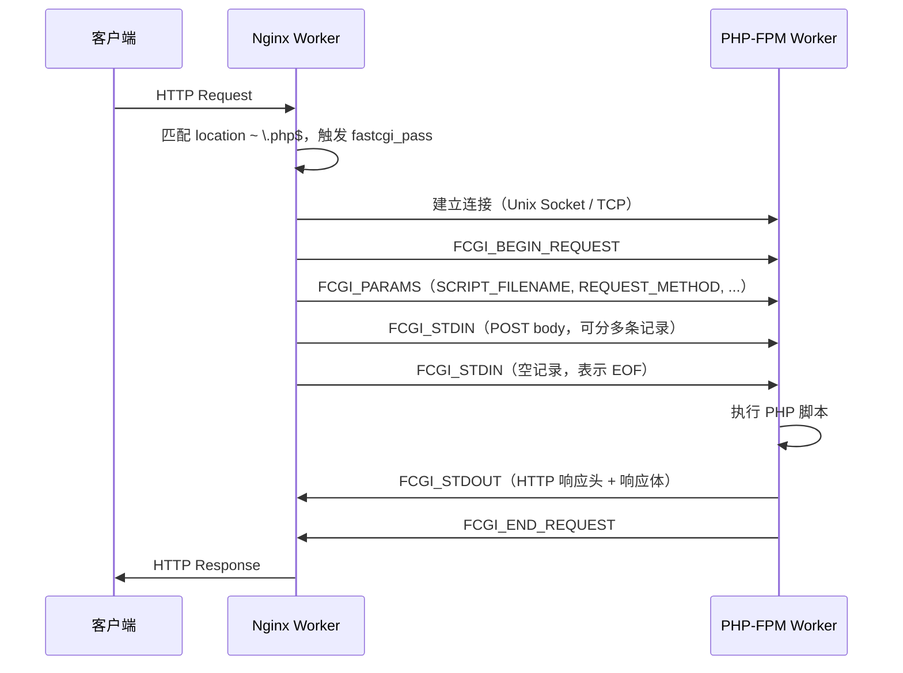

# [L3] Nginx 与 PHP-FPM 的 FastCGI 通信原理与 Unix Socket vs TCP 选型

#### 一句话结论

Nginx 通过 FastCGI 协议将请求序列化后转发给 PHP-FPM；同机部署时 Unix Socket 比 TCP 延迟低约 10-15%（⚠️ 需查证：具体数字受内核版本与负载影响），跨机必须用 TCP。

#### 体系讲解

**FastCGI 协议栈**

FastCGI 是在 CGI 基础上演进的二进制协议，解决了 CGI"每请求 fork 进程"的性能问题，通过长连接复用进程。

FastCGI 消息由固定 8 字节头 + 可变长度内容组成：

```
+--------+--------+--------+--------+--------+--------+--------+--------+
|version | type   |  requestIdB1  |  requestIdB0  | contentLengthB1    |
+--------+--------+--------+--------+--------+--------+--------+--------+
| contentLengthB0 | paddingLength |  reserved     |   content ...      |
+--------+--------+--------+--------+--------+--------+--------+--------+
```

关键记录类型（`type` 字段）：

| type | 名称 | 方向 | 含义 |
|---|---|---|---|
| 1 | FCGI_BEGIN_REQUEST | Nginx→FPM | 开始一次请求 |
| 4 | FCGI_PARAMS | Nginx→FPM | 传递 CGI 环境变量（REQUEST_METHOD、SCRIPT_FILENAME 等）|
| 5 | FCGI_STDIN | Nginx→FPM | POST body |
| 6 | FCGI_STDOUT | FPM→Nginx | 响应头 + 响应体 |
| 3 | FCGI_END_REQUEST | FPM→Nginx | 请求结束，含退出码 |

**完整通信时序**



**Unix Socket vs TCP 延迟权衡**

| 维度 | Unix Domain Socket | TCP（127.0.0.1）|
|---|---|---|
| 通信路径 | 内核 VFS 层直接内存拷贝 | 完整 TCP 协议栈（校验和、序号、ACK）|
| 延迟 | 更低（省略网络协议栈开销）| 略高（loopback 走 TCP 状态机）|
| 吞吐 | 同等或略优 | 略低 |
| 跨机支持 | ❌ 不支持 | ✅ 支持 |
| backlog 压力 | 受 `listen.backlog` 限制 | 受 `net.core.somaxconn` 限制 |
| 连接数上限 | 受文件描述符限制 | 受端口号 + fd 双重限制 |
| 推荐场景 | Nginx 与 FPM 同宿主机 | 容器化/跨主机部署 |

Unix Socket 本质上是内核中的一个 inode，两端通过 `struct unix_sock` 共享一个环形缓冲区，省去了 IP 层封装、路由查找、校验和计算等步骤。

**Nginx 侧关键配置路径**

```
fastcgi_pass → upstream（连接池） → connect → send PARAMS → recv STDOUT
```

`fastcgi_keep_conn on` 启用连接复用（HTTP Keep-Alive 的 FastCGI 对应版本），避免每请求重新建立连接。`fastcgi_buffer_size` / `fastcgi_buffers` 控制响应缓冲，影响是否触发临时文件写入。

#### 考察意图

考察候选人能否在"Nginx 转发 PHP 请求"这个日常操作背后，说清 FastCGI 二进制协议结构、记录类型语义，以及 Unix Socket/TCP 的内核级差异，而非停留在"配置 fastcgi_pass 即可"的操作层面。

#### 追问链

**Q1：Nginx 与 PHP-FPM 之间使用的是 HTTP 协议吗？**
> 不是。Nginx 与 PHP-FPM 之间使用 FastCGI 协议（二进制帧格式），HTTP 协议仅存在于客户端与 Nginx 之间。Nginx 将 HTTP 请求解析后，按 FastCGI 规范序列化为 PARAMS + STDIN 记录发给 FPM，FPM 返回 STDOUT 后 Nginx 再组装成 HTTP 响应。

**Q2：`fastcgi_param SCRIPT_FILENAME` 为何是必传参数？**
> SCRIPT_FILENAME 告诉 PHP-FPM 需要执行哪个 PHP 文件的绝对路径，FPM 据此做安全边界检查（`security.limit_extensions`、`chroot`）。缺少该参数会导致 FPM 返回空响应或 502，这也是常见配置错误之一。

**Q3：Unix Socket 文件权限配置错误会导致什么问题？如何排查？**
> Nginx Worker 以 `www-data`/`nobody` 身份运行，若 Unix Socket 文件的 owner/group 与 Nginx Worker 用户不匹配，`connect()` 会返回 `EACCES`（权限拒绝），Nginx 日志显示 `(13: Permission denied) while connecting to upstream`。排查步骤：`ls -la /run/php/php-fpm.sock` 检查权限，FPM 配置中设置 `listen.owner`、`listen.group`、`listen.mode`。

**Q4：高并发下 Unix Socket 的 backlog 队列打满会有什么现象？如何调优？**
> 当 FPM 所有 Worker 繁忙时，新连接进入 listen backlog 队列；队列满后 `connect()` 返回 `ECONNREFUSED`，Nginx 日志出现 `connect() to unix:/...sock failed (111: Connection refused)`。调优方向：增大 FPM `listen.backlog`（受 `/proc/sys/net/core/somaxconn` 约束），同时增加 FPM `pm.max_children` 或切换到 `pm = ondemand`/`dynamic` 模式。

#### 易错点

1. **误认为 Nginx 与 FPM 通过 HTTP 通信**：实际使用 FastCGI 二进制协议，与 HTTP 协议头完全不同；混淆后在抓包分析时会找不到 HTTP 格式的请求内容。
2. **Unix Socket 文件权限被忽视**：仅关注 FPM pool 配置而忘记设置 `listen.owner/group`，导致 Nginx 无权访问 socket 文件，产生 502 错误。
3. **认为 Unix Socket 在所有场景都更快**：Unix Socket 仅在同机部署时有优势；容器化环境中若 Nginx 与 FPM 不在同一 Pod/宿主机，Unix Socket 根本无法使用，必须切换为 TCP。

#### 代码示例

```nginx
# nginx.conf - 使用 Unix Socket 转发到 PHP-FPM
server {
    listen 80;
    root /var/www/html;
    index index.php;

    location ~ \.php$ {
        fastcgi_pass unix:/run/php/php8.2-fpm.sock;  # Unix Socket
        # fastcgi_pass 127.0.0.1:9000;               # TCP 备选
        fastcgi_index index.php;
        fastcgi_param SCRIPT_FILENAME $document_root$fastcgi_script_name;
        include fastcgi_params;                       # 其余标准 CGI 变量
        fastcgi_keep_conn on;                         # 连接复用
        fastcgi_buffer_size 128k;
        fastcgi_buffers 4 256k;
    }
}
```

```ini
; php-fpm.conf pool 配置（www.conf）
[www]
listen = /run/php/php8.2-fpm.sock
listen.owner = www-data
listen.group = www-data
listen.mode  = 0660
listen.backlog = 511        ; 与 somaxconn 对齐
pm = dynamic
pm.max_children = 50
```
