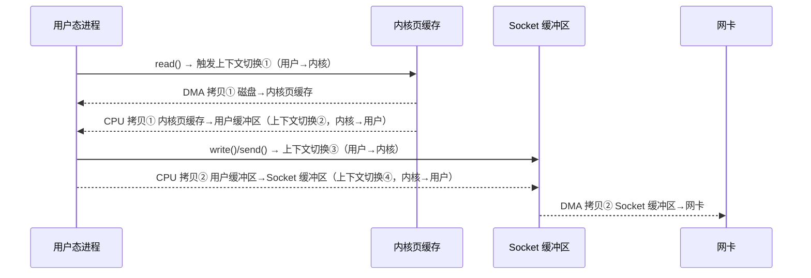
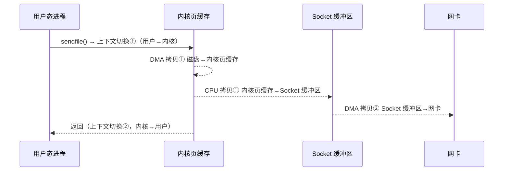

# [L3] Nginx 零拷贝与 sendfile 系统调用原理

#### 一句话结论

`sendfile` 让文件数据在内核态直接从页缓存传到 socket 缓冲区，消除了用户态拷贝与两次上下文切换，是 Nginx 高效静态文件服务的底层支撑。

#### 体系讲解

**传统文件传输的四次拷贝**

不使用 `sendfile` 时，传输一个文件需要：



共 **4 次数据拷贝**（2 次 DMA + 2 次 CPU）、**4 次上下文切换**。

**sendfile 的优化路径**

`sendfile(out_fd, in_fd, offset, count)` 在 Linux 2.1 引入，调用后内核直接将页缓存中的数据拷贝到 socket 缓冲区：



仅 **3 次数据拷贝**（2 次 DMA + 1 次 CPU）、**2 次上下文切换**，用户态缓冲区完全不参与。

**sendfile + DMA Scatter-Gather（真正零拷贝）**

Linux 2.4 内核 + 支持 Scatter-Gather DMA 的网卡（`MSG_SENDFILE` 配合 `net.core.sendfile_gather`）可进一步消除 CPU 拷贝：内核只将页缓存的文件描述符（fd + offset + length）追加到 socket 缓冲区，网卡 DMA 引擎直接从页缓存读取数据发送，**CPU 拷贝降为 0**。

| 方式 | DMA 拷贝 | CPU 拷贝 | 上下文切换 |
|---|---|---|---|
| 传统 read+write | 2 | 2 | 4 |
| sendfile（无 SG）| 2 | 1 | 2 |
| sendfile + SG DMA | 2 | 0 | 2 |

**Nginx 中的相关指令**

| 指令 | 说明 |
|---|---|
| `sendfile on` | 启用 `sendfile()` 系统调用（默认 off）|
| `tcp_nopush on` | 配合 `sendfile`，尽量填满 TCP 段后再发送（减少小包）|
| `tcp_nodelay on` | 禁用 Nagle 算法，最后一包立即发送；通常与 `tcp_nopush` 搭配 |
| `aio threads` | 大文件（>= `directio` 阈值）时用线程池异步 IO，避免阻塞 Worker |
| `directio 512k` | 超过此大小的文件绕过页缓存，直接 IO，适合超大文件避免污染缓存 |

**适用场景与限制**

- `sendfile` 适合**静态文件**（HTML/图片/视频）直接传输，不适合需要在应用层修改内容的场景（如模板渲染、动态压缩）
- 若 Nginx 需要对内容做 `gzip` 压缩，数据必须经过用户态，`sendfile` 无法使用——Nginx 会在压缩后再写 socket，退回传统路径
- 在 macOS 上 `sendfile` 语义不同（`sendfile` 是 BSD 版本，参数有差异），跨平台移植时需注意

#### 考察意图

考察候选人能否从内核 IO 路径（页缓存、DMA、上下文切换）层面解释 Nginx 静态文件服务高性能的根因，理解"零拷贝"不是字面上的"没有任何拷贝"，而是消除了 CPU 参与的用户态数据拷贝。

#### 追问链

**Q1：`sendfile` 与 `mmap + write` 相比，各自的优劣是什么？**
> `mmap` 将文件页映射到用户态地址空间，`write()` 时仍需 CPU 将 mmap 区域拷贝到 socket 缓冲区，共 2 次 CPU 拷贝但减少了一次用户态缓冲区分配；`sendfile` 在内核态完成所有操作，仅 1 次 CPU 拷贝（无 SG）或 0 次（有 SG）。`sendfile` 在纯文件传输场景更优；`mmap` 适合需要在用户态随机读写文件内容（如数据库 buffer pool）的场景。

**Q2：为何 `tcp_nopush` 通常与 `sendfile` 配合使用？**
> `sendfile` 可能因文件碎片化产生多次调用，每次发出小 TCP 段。`tcp_nopush`（对应 TCP_CORK 选项）让内核积累数据直到 MSS 满或显式 flush，减少 TCP 小包数量，降低 ACK 次数和包头开销。发送完成后 Nginx 会关闭 `TCP_CORK` 让最后一包立即发出，配合 `tcp_nodelay` 消除 Nagle 算法延迟。

**Q3：大文件（如 4GB 视频）用 `sendfile` 有什么潜在问题？**
> 大文件会被长时间 pin 在页缓存，可能挤占其他文件的缓存空间（缓存污染）。此时可用 `directio` 指令让大文件绕过页缓存（O_DIRECT），直接 DMA 到 socket，避免缓存污染；但 O_DIRECT 要求 IO 对齐（512B 倍数），且不能与 `sendfile` 同时对同一文件生效。Nginx 的 `aio threads` + `directio` 组合用于大文件异步 IO 场景。

**Q4：容器化环境（Docker）中 `sendfile` 是否有效？**
> 取决于文件系统。若容器使用 OverlayFS（Docker 默认），`sendfile` 在某些内核版本下会退化（OverlayFS 不支持 `splice` 底层调用），导致 Nginx 自动回退到 `read + write` 路径。可通过将静态文件挂载为 `tmpfs` 或 volume（native FS）来规避，或升级到支持 OverlayFS sendfile 的内核版本（≥ 5.10）。

#### 易错点

1. **将"零拷贝"理解为"没有任何数据拷贝"**：DMA 拷贝（磁盘/网卡 ↔ 内存）始终存在，"零"指消除的是 CPU 参与的内存间拷贝（内核页缓存 → 用户缓冲区）；混淆后会对性能提升幅度产生错误预期。
2. **对动态响应也启用 `sendfile` 的误区**：PHP 生成的动态 HTML 存在于用户态内存（非文件 fd），无法使用 `sendfile`；`sendfile` 仅对从磁盘文件 fd 直接发送的场景有效。
3. **忽略 `directio` 与 `sendfile` 的互斥关系**：当文件大小 ≥ `directio` 阈值时，Nginx 会禁用 `sendfile` 并使用 O_DIRECT + 线程池，两者不能对同一请求同时生效；混淆后可能导致配置预期与实际行为不一致。

#### 代码示例

```nginx
# 静态文件服务的零拷贝最优配置
http {
    sendfile        on;         # 启用 sendfile()
    tcp_nopush      on;         # 积累满 MSS 再发（配合 sendfile）
    tcp_nodelay     on;         # 最后一包立即发出

    # 大文件（≥512k）绕过页缓存 + 异步 IO 线程池
    aio             threads;
    directio        512k;
    output_buffers  2 1m;

    server {
        listen 80;
        root /var/www/static;

        location ~* \.(jpg|png|mp4|js|css)$ {
            expires 30d;
            add_header Cache-Control "public, immutable";
            # gzip 与 sendfile 互斥：静态预压缩替代动态 gzip
            gzip_static on;     # 优先发送 .gz 预压缩文件
        }
    }
}
```
