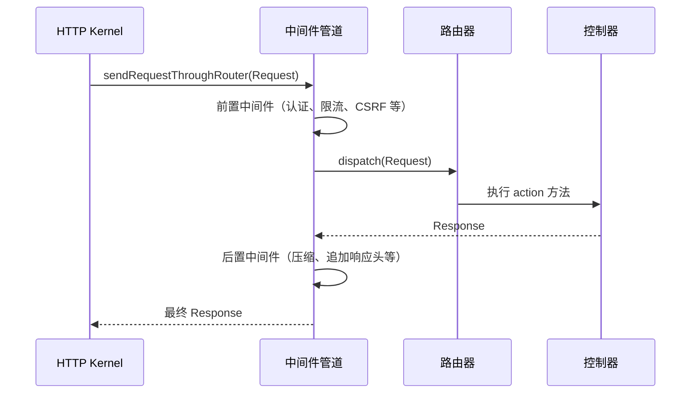

# [L2] PHP 框架请求生命周期与各阶段职责

#### 一句话结论

从入口文件到 Response 发送，框架将请求处理拆分为 bootstrap、中间件管道、路由分发、Terminate 四个阶段，各阶段职责单一、可替换。

#### 体系讲解

以 Laravel 为代表的现代 PHP 框架，将一次 HTTP 请求的处理过程分为以下阶段：

**阶段一：入口文件初始化**

`public/index.php` 是所有请求的唯一入口（配合 Nginx/Apache rewrite 规则）。它做三件事：加载 Composer autoloader、创建 `Application`（IoC 容器）实例、将 `Request` 交给 HTTP Kernel 处理。

**设计意图**：单一入口将所有流量汇聚到同一处，便于统一鉴权、日志记录、异常兜底等横切关注点，避免每个 PHP 文件重复初始化。

---

**阶段二：Bootstrappers 阶段**

HTTP Kernel 在处理请求前，依次运行一组 Bootstrapper 类：

| 顺序 | Bootstrapper | 职责 |
|------|-------------|------|
| 1 | LoadEnvironmentVariables | 加载 `.env` |
| 2 | LoadConfiguration | 读取 `config/` 目录 |
| 3 | HandleExceptions | 注册全局异常处理器 |
| 4 | RegisterFacades | 注册 Facade 别名 |
| 5 | RegisterProviders | 调用所有 `ServiceProvider::register()` |
| 6 | BootProviders | 调用所有 `ServiceProvider::boot()` |

**设计意图**：严格顺序保证依赖就绪。`register()` 只做容器绑定，`boot()` 在所有 Provider 完成注册后才执行，因此可以安全依赖其他已绑定服务，避免循环依赖问题。

---

**阶段三：中间件管道 + 路由分发**

请求经过全局中间件栈（前置处理），再由路由器匹配对应路由，执行路由中间件组，最终调用控制器方法并返回 Response：



中间件分三层叠加：全局中间件（`Kernel::$middleware`）→ 路由中间件组（`$middlewareGroups`，如 `web`/`api`）→ 路由专属中间件（单条路由 `->middleware()`）。

---

**阶段四：Response 发送与 Terminate**

`Response::send()` 将 HTTP 头与响应体写入输出缓冲并刷新后，框架调用所有实现 `TerminableMiddleware` 接口的中间件的 `terminate()` 方法。典型用途：会话存储、慢请求日志落盘、队列任务推送。

**设计意图**：Terminate 在响应已发送后运行，不占用用户感知的响应时间，同时仍能访问完整的 Request/Response 上下文。

#### 考察意图

- 验证候选人对框架整体结构的掌握程度，而非死记接口名称
- 重点验证：能否说清 bootstrap 各步骤"为什么要按此顺序"、中间件前置/后置的本质区别、Terminate 的适用场景与限制

#### 追问链

1. **`ServiceProvider::register()` 和 `boot()` 为什么要分两步执行？**  
   答：`register()` 只做容器绑定，此时其他 Provider 可能尚未注册；`boot()` 在全部 `register()` 完成后才调用，可以安全依赖任何已绑定的服务（路由、事件等）。若在 `register()` 中调用 `Route::`，因路由服务可能未就绪而报错。

2. **全局中间件、路由中间件组、路由专属中间件的执行顺序是什么？**  
   答：三层均以洋葱模型嵌套执行——外层（全局）先入后出，内层（专属）后入先出。前置逻辑按 全局→组→专属 顺序执行，后置逻辑按专属→组→全局顺序执行。

3. **Terminate 中间件与 PHP 析构函数相比有何优势？**  
   答：Terminate 是框架统一调度的钩子，执行时 Request/Response 上下文仍然完整可用；析构函数依赖 PHP GC 时机，顺序不可控，且无法获取当前请求的上下文对象。

4. **如果某个 ServiceProvider 的 `boot()` 方法抛出异常，会怎样？**  
   答：Bootstrap 阶段未捕获的异常会进入已注册的全局异常处理器（HandleExceptions Bootstrapper），通常渲染为 500 页面返回，后续 Provider 的 `boot()` 不会被调用。

#### 易错点

1. **在 `register()` 中调用依赖其他服务的操作**：如 `Route::`、`Event::` 等应放在 `boot()` 中；在 `register()` 阶段这些服务可能尚未绑定，会触发 BindingResolutionException。

2. **误以为中间件只在"调用控制器前"执行**：`$next($request)` 调用后的代码属于后置逻辑，许多开发者忽略这一点，导致在前置阶段修改了响应头却在后置阶段被覆盖，或日志记录了错误的 Response 状态。

3. **在 Terminate 中尝试修改响应内容**：`terminate()` 执行时响应体已发送，此时修改 Response 对象不会产生任何效果，Terminate 只适用于清理类操作（日志、队列推送等）。

#### 代码示例

```php
<?php

namespace App\Providers;

use App\Events\PaymentCompleted;
use App\Listeners\SendReceipt;
use App\Models\Order;
use App\Payment\PaymentGateway;
use App\Payment\StripeGateway;
use Illuminate\Support\ServiceProvider;

class PaymentServiceProvider extends ServiceProvider
{
    public function register(): void
    {
        // 仅做绑定，不依赖其他 Provider 是否已就绪
        $this->app->singleton(PaymentGateway::class, function ($app) {
            return new StripeGateway(
                $app['config']['services.stripe.key'],
            );
        });
    }

    public function boot(): void
    {
        // 所有 Provider 均已 register，可安全使用路由/事件服务
        $this->app['router']->bind('order', function (string $value) {
            return Order::findOrFail($value);
        });

        $this->app['events']->listen(
            PaymentCompleted::class,
            SendReceipt::class,
        );
    }
}
```
