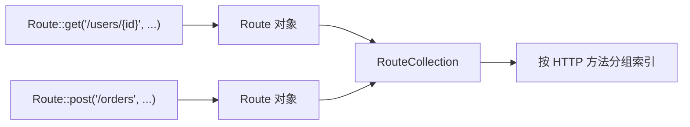
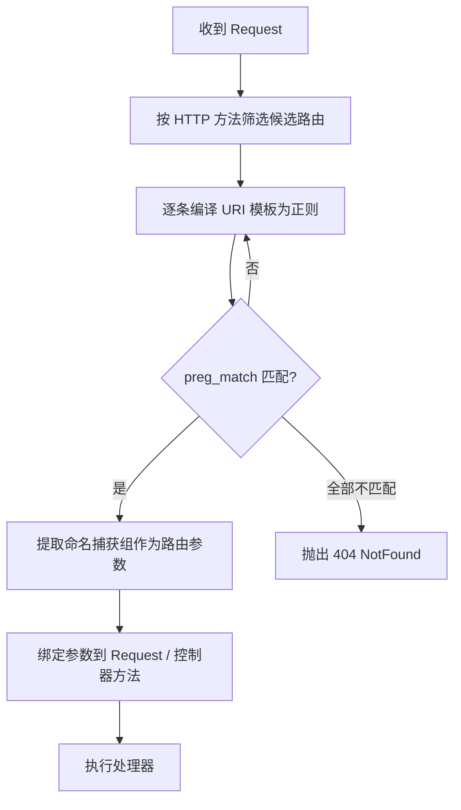

# [L2] PHP 框架路由注册、匹配与参数提取机制

#### 一句话结论

路由注册时仅存储定义，请求到来时将 URI 模板编译为带命名捕获组的正则，通过 `preg_match` 完成匹配并从捕获组中提取参数。

#### 体系讲解

框架路由系统分为**注册阶段**和**分发阶段**，两阶段职责明确分离：

---

**注册阶段：构建 RouteCollection**

应用启动时（bootstrap 阶段），框架加载路由文件，将每条路由定义存入 `RouteCollection`：



此阶段**不做正则编译**，只存储 URI 模板、HTTP 方法、中间件列表、处理器等元信息。分离的原因是：应用可能定义数百条路由，若启动时全部编译为正则，会增加不必要的初始化开销。

---

**分发阶段：编译 → 匹配 → 提取**

每次请求到来，路由器按以下流程处理：



---

**URI 模板编译规则**

框架将 `{param}` 占位符替换为带命名捕获组的正则子模式：

| URI 模板 | 参数约束 | 编译后正则片段 |
|---------|---------|--------------|
| `{id}` | 无（默认） | `(?P<id>[^/]+)` |
| `{id}` | `->where('id', '[0-9]+')` | `(?P<id>[0-9]+)` |
| `{slug?}` | 可选参数 | `(?P<slug>[^/]+)?` |

完整路由 `/users/{id}/posts/{slug}` 编译后：

```
#^/users/(?P<id>[0-9]+)/posts/(?P<slug>[^/]+)$#uD
```

命名捕获组是参数提取的关键——`preg_match` 成功后，`$matches` 数组中的字符串键即为路由参数名，无需额外解析。

---

**路由缓存：生产环境性能优化**

`php artisan route:cache` 将所有路由序列化为一个 PHP 文件，跳过注册阶段的文件加载和路由对象构建，使路由解析速度提升数倍。

**设计意图**：开发环境无缓存保证路由改动实时生效；生产环境开启缓存将启动耗时从毫秒级降到微秒级。缓存文件包含已序列化的 RouteCollection，但**不包含预编译的正则**（正则仍在分发时按需编译）。

#### 考察意图

- 验证候选人是否理解"注册与分发分离"的设计，而非将两个阶段混为一谈
- 考察对正则命名捕获组这一关键技术点的掌握
- 进阶考察：路由缓存的作用范围、参数约束的执行时机

#### 追问链

1. **为什么要用命名捕获组（`(?P<name>...)`）而不是普通捕获组？**  
   答：命名捕获组让 `$matches` 中同时包含数字索引和字符串键，框架只需遍历字符串键即可得到参数名 → 参数值的映射，无需维护额外的"参数名顺序"数组，代码更健壮。

2. **路由参数约束（`where()`）在哪个阶段生效？**  
   答：在分发阶段的正则编译步骤中生效，约束值会替换默认的 `[^/]+` 子模式。注册阶段只是将约束条件存储在 Route 对象上，不做验证。因此约束失败等同于路由未匹配，触发 404 而非 422。

3. **路由缓存后，新增路由不生效是什么原因？**  
   答：缓存文件序列化了注册阶段的 RouteCollection 快照，新增路由不会自动同步到缓存。需执行 `php artisan route:cache` 重新生成，或 `route:clear` 清除缓存。

4. **框架如何处理路由命名（`->name()`）和反向生成 URL（`route()`）？**  
   答：`name()` 将路由以别名为键额外存入 RouteCollection 的命名路由索引；`route()` 辅助函数通过别名查找路由后，将参数填入 URI 模板的 `{param}` 占位符，得到完整 URL，这是一个字符串替换操作，与匹配阶段相反。

#### 易错点

1. **误以为路由匹配是字符串比较**：框架本质上是正则匹配，`/users/123` 能命中 `/users/{id}` 是因为 `{id}` 被编译为 `[^/]+`，而不是框架做了字符串分割和位置比对。理解这一点才能正确使用 `where()` 约束。

2. **路由约束失败抛出 404 而非 422**：`->where('id', '[0-9]+')` 约束嵌入正则，非数字 ID 的请求不会匹配该路由（视作路由不存在），而非参数校验失败。若需要语义正确的 422 响应，应在控制器/FormRequest 中做参数验证。

3. **生产环境忘记运行 `route:cache` 导致性能未提升**：部署流程中遗漏缓存步骤，或每次部署后执行了 `route:clear` 但没有重新 `route:cache`，导致生产环境每次请求都重新加载路由文件。

#### 代码示例

```php
<?php

use Illuminate\Support\Facades\Route;

// 注册阶段：存储定义，参数约束仅记录，不做编译
Route::get('/users/{id}/posts/{slug}', [PostController::class, 'show'])
    ->name('user.post.show')
    ->where('id', '[0-9]+')
    ->where('slug', '[a-z0-9-]+');

// 等价于框架内部的编译逻辑（示意，非框架源码）
function compileUriToRegex(string $uri, array $wheres = []): string
{
    $pattern = preg_replace_callback(
        '/\{(\w+)\??}/',
        function (array $m) use ($wheres): string {
            $name    = rtrim($m[1], '?');
            $subPat  = $wheres[$name] ?? '[^/]+';
            $optional = str_ends_with($m[0], '?}') ? '?' : '';
            return '(?P<' . $name . '>' . $subPat . ')' . $optional;
        },
        $uri
    );

    return '#^' . $pattern . '$#uD';
}

// 编译结果：#^/users/(?P<id>[0-9]+)/posts/(?P<slug>[a-z0-9-]+)$#uD
$regex = compileUriToRegex(
    '/users/{id}/posts/{slug}',
    ['id' => '[0-9]+', 'slug' => '[a-z0-9-]+']
);

// 分发阶段：匹配并提取命名捕获组
$requestUri = '/users/42/posts/hello-world';
if (preg_match($regex, $requestUri, $matches)) {
    $params = array_filter($matches, 'is_string', ARRAY_FILTER_USE_KEY);
    // ['id' => '42', 'slug' => 'hello-world']
}

// 反向生成 URL（与匹配方向相反）
$url = route('user.post.show', ['id' => 42, 'slug' => 'hello-world']);
// → https://example.com/users/42/posts/hello-world
```
