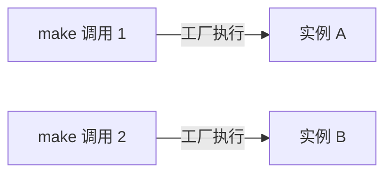
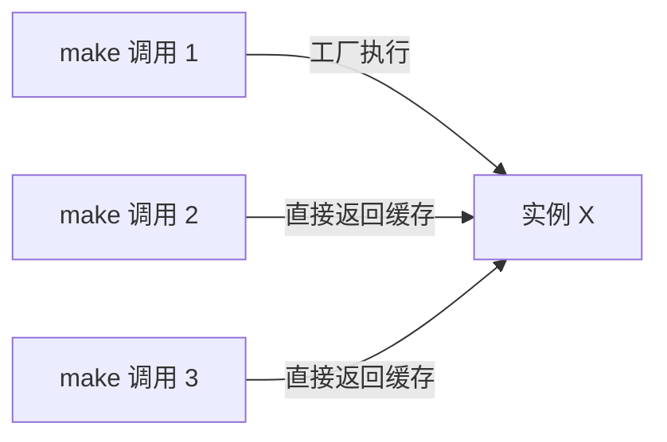

# [L2] 服务容器 bind/singleton/instance 的用法与选型

#### 一句话结论

`bind` 每次解析返回新实例，`singleton` 首次解析后全局复用，`instance` 绑定已有对象；选型取决于服务是否需要共享状态。

#### 体系讲解

Laravel 服务容器提供四个核心 API，它们的本质差异在于**实例的生命周期**：

| 方法 | 返回新实例 | 全局共享 | 适用场景 |
|------|-----------|---------|---------|
| `bind()` | 每次 `make()` | ✗ | 无状态服务、携带请求上下文的对象 |
| `singleton()` | 仅首次 `make()` | ✓ | 数据库连接、缓存驱动、配置对象 |
| `instance()` | 从不（已有对象） | ✓ | 测试 Mock 注入、预构建对象 |
| `make()` | — | — | 解析绑定，是消费端 API |

---

**`bind()`：每次都创建新实例**

适合**无状态**或**每次调用需要独立上下文**的服务。例如，每次生成报告时都需要一个干净的 `ReportGenerator`，避免上次调用的内部状态污染当前结果。



---

**`singleton()`：首次创建后缓存**

适合**有状态且可全局共享**的服务。数据库连接池、缓存驱动若每次都重新实例化，会产生大量无谓的连接开销。



**选型决策**：判断这个服务是否可以安全地被所有调用方共享——若它持有请求级别的数据（如当前登录用户），则不应使用 `singleton`，否则会造成数据泄漏。

---

**`instance()`：注入已有对象**

直接将已构建好的对象绑定到容器，后续所有 `make()` 均返回该对象。最常见于**测试**：将 Mock 对象注入容器，替换真实服务：

```php
$this->app->instance(MailService::class, Mockery::mock(MailService::class));
```

也用于将 PHP 超全局变量等外部对象适配为容器可管理的服务。

---

**`make()`：解析绑定**

`make()` 是消费端 API，按以下优先级解析：已绑定的工厂 → 已缓存的 singleton → 反射自动构建（未绑定时）。支持传入运行时参数覆盖构造函数参数。

---

**上下文绑定（Contextual Binding）**

同一接口在不同类中需要不同实现时，使用上下文绑定替代多个 `bind()`，保持容器配置的集中性：

```php
app()->when(AdminController::class)
    ->needs(StorageInterface::class)
    ->give(S3Storage::class);

app()->when(GuestController::class)
    ->needs(StorageInterface::class)
    ->give(LocalStorage::class);
```

#### 考察意图

- 验证候选人能否根据服务的**状态特征**选择正确的绑定方式，而非随意使用 `singleton`
- 考察对依赖注入容器"生命周期管理"这一核心价值的理解
- 进阶考察：测试场景下如何利用 `instance()` 解耦外部依赖

#### 追问链

1. **什么情况下不能用 `singleton`，必须用 `bind`？**  
   答：当服务持有请求级别的可变状态（如当前用户 ID、事务上下文、临时文件句柄）时，使用 `singleton` 会导致跨请求状态污染。在 Swoole/FPM 长驻进程环境中，这类问题尤为突出。

2. **`singleton` 与 PHP 传统单例模式（`getInstance()`）有何本质区别？**  
   答：传统单例在类内部硬编码了唯一性，无法被替换，测试困难；容器的 `singleton` 将唯一性控制权交给容器，类本身保持普通类的设计，测试时可通过 `instance()` 注入 Mock，完全可替换。

3. **`make()` 传入第二个参数 `$parameters` 有什么用？**  
   答：可在解析时覆盖构造函数参数，适用于需要运行时值（如用户 ID、动态配置）的场景，避免为了传参而额外定义工厂方法：`app()->make(OrderProcessor::class, ['orderId' => 42])`。

4. **`scoped()` 与 `singleton()` 的区别是什么？（Laravel 9+）**  
   答：`scoped()` 绑定在单次请求/任务生命周期内共享（Octane 环境下每次请求重置），而 `singleton()` 在进程整个生命周期内共享。在 Swoole/RoadRunner 等长驻进程框架中，`scoped()` 是替代 `singleton()` 管理请求级单例的推荐选择。

#### 易错点

1. **对有状态服务使用 `singleton` 造成数据污染**：例如将持有"当前请求用户"的 `AuthContext` 对象绑定为 singleton，在 Swoole 等复用进程的场景下，第一个请求的用户信息会泄漏到下一个请求。

2. **混淆 `bind` 与 `singleton` 的性能影响**：不必要地对所有服务都使用 `bind`，会在高频调用场景下产生大量对象实例化开销；但也不能为了"省事"对所有服务都用 `singleton`，需根据状态特征决策。

3. **忽略 `instance()` 的优先级**：`instance()` 绑定会覆盖同名的 `bind()`/`singleton()` 绑定，因此在测试中注入 Mock 后，若忘记在 `tearDown` 中清理，会影响后续测试用例的容器状态。

#### 代码示例

```php
<?php

use Illuminate\Contracts\Foundation\Application;

// bind: 每次 make() 执行工厂，返回全新实例（无状态服务）
app()->bind(CsvExporter::class, function (Application $app) {
    return new CsvExporter(
        delimiter: $app['config']['export.csv_delimiter'],
    );
});

// singleton: 首次 make() 后缓存，适合共享的重量级资源
app()->singleton(SearchClient::class, function (Application $app) {
    return new ElasticsearchClient(
        hosts: $app['config']['search.hosts'],
    );
});

// instance: 绑定已有对象，测试中常用于注入 Mock
$mock = Mockery::mock(PaymentGateway::class);
$mock->shouldReceive('charge')->andReturn(true);
app()->instance(PaymentGateway::class, $mock);

// make: 解析依赖，支持传入运行时参数覆盖构造函数
$exporter = app()->make(CsvExporter::class);
$processor = app()->make(OrderProcessor::class, ['batchSize' => 500]);

// 上下文绑定: 同接口在不同调用方中注入不同实现
app()->when(BackupCommand::class)
    ->needs(StorageInterface::class)
    ->give(S3Storage::class);

app()->when(LocalDevCommand::class)
    ->needs(StorageInterface::class)
    ->give(LocalStorage::class);
```
